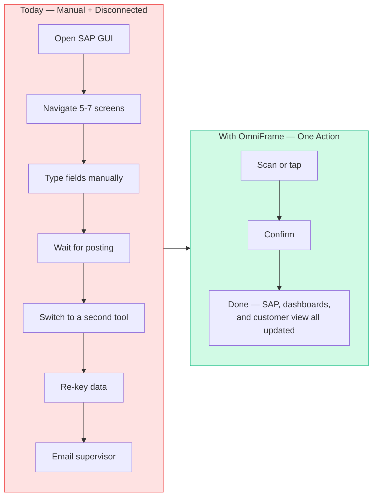
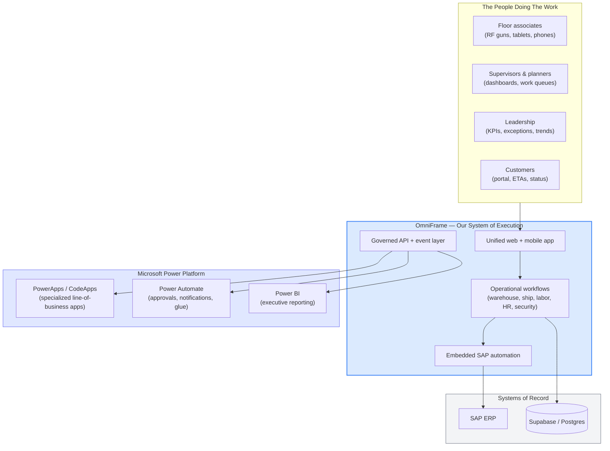

# OmniFrame — Executive Talking Points

**Audience:** Senior Vice President, executive stakeholders, organizational leadership, and customer-facing conversations
**Purpose:** High-level positioning, integration narrative, and operational impact talking points
**Last updated:** May 26, 2026

---

## 1. The One-Sentence Pitch

> **OmniFrame is our single operational platform — one connected system that runs warehouse, shipping, labor, security, and analytics in real time, fully integrated with SAP and ready to plug into the Microsoft ecosystem we already use.**

If you only remember one thing from this document, that is it.

---

## 2. The Headline Number

> **A full shipment used to take roughly nine minutes of manual screen-clicking inside SAP. With OneBox Ship inside OmniFrame, that same shipment completes in roughly 42 seconds.**

That is not a marginal improvement. It is **~92% faster — more than a 12× speedup on a single transaction that we run thousands of times per week.**

### Why this matters in conversation

| Talking point | What it means |
|---|---|
| **9 minutes → 42 seconds per shipment** | One shipper now does the work that used to take ~12 shippers. |
| **Hours back in every shift** | The time isn't "saved on paper" — it shows up as faster docks, fewer late trucks, and more capacity without adding headcount. |
| **No more SAP screen gymnastics** | The team stops memorizing transaction codes and clicking through six screens. They press one button. |
| **Same answer, every time** | Manual SAP entry produces inconsistent data. OmniFrame eliminates the variability because the system, not the human, drives SAP. |

**Use this number first. It anchors every other conversation.**

---

## 3. What OmniFrame Actually Is

**OmniFrame is the operational backbone of the business.** It is a single web and mobile platform that the entire organization works inside — floor associates, supervisors, planners, HR, security, and leadership — and it is the single point of integration to SAP and to every other operational system we depend on.

It is **not** another dashboard. It is **not** another reporting tool. It is the application people *do their job in*.

### Said simply, depending on the audience

**To another executive:**
> "OmniFrame is our enterprise execution layer. It sits between our people and SAP, runs the entire warehouse and shipping floor in real time, and gives us a single, governed surface to add anything new the business needs — without bolting on another tool."

**To an operations leader:**
> "OmniFrame is the application your team works in. RF guns, supervisor screens, dashboards, shipping, putaway, cycle counts, work queues — it's all one app. SAP gets updated automatically as your team works. No double entry, no waiting for batch jobs."

**To a customer:**
> "OmniFrame is the platform that runs our facility. It's how we give you real-time visibility into your orders, accurate ETAs, and quality you can trust — because every scan, every move, and every shipment is live in our system the moment it happens."

**To an IT or PowerApps team:**
> "OmniFrame is our system of execution. It exposes a clean API and event surface that any Microsoft Power Platform application — PowerApps, Power Automate, Power BI, or a CodeApp — can sit on top of without re-implementing the SAP integration or the operational logic."

---

## 4. How OmniFrame Improves Current Operations

The improvement isn't theoretical. It comes from collapsing work that today is spread across multiple disconnected steps.

### The "before and after" pattern, at a glance

### Where the time actually comes from

| Where time is lost today | How OmniFrame eliminates it |
|---|---|
| **Navigating between SAP screens** | Operators see one screen built for one job. The platform drives SAP behind the scenes. |
| **Switching between SAP, Excel, email, Power BI** | One application covers all operational workflows. No tool-switching. |
| **Re-keying the same data into multiple systems** | Data is captured once and propagated everywhere. |
| **Waiting for nightly or hourly data refreshes** | Everything is real-time. Supervisors see what just happened, not what happened last hour. |
| **Tribal knowledge of T-codes and field orders** | New employees are productive on day one. The system enforces the correct flow. |
| **Manual reconciliation and "why doesn't this match?" investigations** | The platform is the single source. Numbers match because there is only one place they come from. |

### Representative operational wins (use these as examples)

| Operation | Manual / SAP today | With OmniFrame | Improvement |
|---|---|---|---|
| **Full shipment (pick → pack → ship → SAP confirmed)** | ~9 minutes | ~42 seconds | **~92% faster** |
| **Goods receipt against PO** | 2 – 5 minutes, 7+ screens | 15 – 30 seconds, 1 scan | **~85% faster** |
| **Cycle count line** | 3 – 5 minutes across multiple T-codes | 30 – 60 seconds in one screen | **~80% faster** |
| **Transfer order confirmation** | 1 – 3 minutes | 10 – 20 seconds | **~85% faster** |
| **Putaway** | 2 – 4 minutes | 20 – 40 seconds | **~83% faster** |

> **Use this table when someone asks "where does the time actually come from?" The answer is: it comes from every operation, not just one.**

---

## 5. The Integration Story — Why This Fits the Microsoft Ecosystem

This is the part the SVP will want to lean into when talking about future direction. The message is simple: **OmniFrame doesn't compete with the Microsoft Power Platform. It is the operational engine the Microsoft Power Platform was built to connect to.**

### How the pieces fit together

### The talking points for the integration narrative

1. **OmniFrame is the single point of connection to SAP.** Every team, every app, every dashboard goes through it. We don't build the SAP plumbing five different times for five different tools — we build it once, in OmniFrame, and everything else benefits.

2. **PowerApps and CodeApps can sit *on top of* OmniFrame, not next to it.** When a department needs a specialized form, a quick approval app, or a niche workflow, the Power Platform team builds it in PowerApps or as a CodeApp and consumes OmniFrame's API. They don't have to learn SAP. They don't have to build a database. They get a clean, governed surface to build against.

3. **Power BI stays where it belongs — reporting.** Power BI is excellent at executive dashboards and historical reporting. OmniFrame is the *operational* surface that captures the data in the first place and runs the live decisions. The two complement each other — and OmniFrame eliminates the lag and the rekeying that has historically made Power BI feel one step behind reality.

4. **Power Automate handles the glue.** Notifications, approvals, cross-system handoffs — the things Microsoft does best — keep happening in Power Automate, just now triggered by real events from OmniFrame instead of polled spreadsheets.

5. **One investment, many consumers.** The work we do once in OmniFrame — SAP integration, operational logic, real-time data — becomes the foundation every Microsoft-side application in the business can leverage. That is the leverage story.

### Said simply

> "OmniFrame is where the work actually happens. PowerApps, CodeApps, Power Automate, and Power BI are how the rest of the business consumes that work. One platform doing the heavy lifting, many applications benefiting from it."

---

## 6. Why OmniFrame Should Be the Platform of Choice

This is the strategic argument. It is the answer to *"why this and not another low-code app?"*

### The current state — multiple disconnected layers

We are currently running on a stack of Power BI dashboards, low-code and no-code apps, spreadsheets, and direct SAP access. That works at small scale, but it produces a familiar set of problems:

- **Every new need becomes a new tool.** The tool count grows. Integrations multiply.
- **The same data lives in five places.** Reconciliation becomes a full-time job.
- **No-code apps hit a ceiling.** When the business asks for something genuinely complex — real-time orchestration, deep SAP integration, multi-step workflows with state — the low-code platforms cannot deliver, and we build a workaround.
- **There is no consistent user experience.** Every department has a different app, a different login, a different way of doing the same thing.
- **Governance is hard.** Auditing, permissions, and security live in each tool separately.

### The OmniFrame model — one platform, many capabilities

OmniFrame is built as a **vast, extensible infrastructure** — not a single-purpose app. It is designed from the ground up to absorb new capabilities without adding new platforms.

| Dimension | Multiple low-code tools | OmniFrame |
|---|---|---|
| **Connections to SAP** | One per tool, each maintained separately | **One — shared by everything** |
| **User experience** | Different per app, different per department | **Consistent across the business** |
| **Data model** | Fragmented, duplicated | **Unified, governed, single source** |
| **Real-time capability** | Limited by the low-code platform | **Native — built on a real-time architecture** |
| **Mobile / RF / desktop** | Each tool handles a subset | **All three from one codebase** |
| **Ceiling on complexity** | Hits the wall quickly | **No ceiling — anything the business needs we can build** |
| **Total cost to evolve** | Grows with every new tool | **Compounds in our favor** |

### The talking points for "why this is the platform of choice"

1. **One platform, one investment, one source of truth.** Every dollar we put into OmniFrame benefits every department and every customer. That's not true of a per-department tool.

2. **No ceiling on what we can build.** OmniFrame is a real engineering platform — not a low-code template. If the business asks for it, we can build it. We are not waiting on a vendor roadmap.

3. **The integration work compounds.** Every new SAP transaction, every new data feed, every new operational workflow we add becomes available to *everything* — including future PowerApps and CodeApps the Microsoft team builds on top.

4. **It already runs the floor.** OmniFrame is not a proposal or a prototype. It is the live application driving real shipments, real receipts, and real labor today. Every day it runs in production it gets stronger.

5. **It is the place to standardize.** Bringing future workloads onto OmniFrame *reduces* total system count instead of growing it. That is the opposite direction from where we have been heading, and it is the direction every modern enterprise is moving.

---

## 7. Talking Points by Audience

Use these as ready-to-go phrases. They are written to be spoken, not read.

### Talking to other executives / leadership

- *"OmniFrame is how we collapse the operational stack. One platform connects the entire business — warehouse, shipping, labor, security, customer-facing visibility — and one platform connects to SAP. Everything else, including our Microsoft Power Platform investments, sits on top of it."*

- *"The 9-minute shipment is now a 42-second shipment. Multiply that across thousands of shipments a week and we are buying back capacity we used to have to hire for."*

- *"This is the application of choice for the business because it has no ceiling. The low-code tools have served us, but they cap out the moment we ask them to do something genuinely operational. OmniFrame doesn't cap out — we keep building on it."*

### Talking to operations leaders and supervisors

- *"Your team stops fighting SAP. They scan, they confirm, they move on. The platform takes care of every screen, every code, every field your team used to memorize."*

- *"You see what is happening on your floor in real time — not after the overnight refresh. If a shipment is late, if a count is off, if someone is on break, you see it the moment it happens."*

- *"Training a new person used to take days. Now it takes hours. The system enforces the right flow."*

### Talking to customers

- *"When you place an order with us, every step of it — from the pick to the pack to the truck — is live in our system the moment it happens. That is why our ETAs are accurate and our exception alerts are early."*

- *"We invest in our internal operations because that's how we keep our promises to you. OmniFrame is the platform that lets us do that."*

- *"We don't run on spreadsheets and reports that lag a day behind. We run on a real-time operational platform."*

### Talking to the Microsoft / Power Platform / IT team

- *"OmniFrame exposes a clean API and event layer. Anything you want to build in PowerApps, CodeApps, or Power Automate can sit on top of it without re-implementing the SAP integration."*

- *"We've done the hard part once. You get to consume it many times."*

- *"Power BI keeps doing what Power BI is best at — reporting. OmniFrame feeds it real-time, accurate data so the reports finally match reality."*

---

## 8. Likely Questions — and Strong Answers

**Q: "Isn't this just another piece of software we have to maintain?"**
A: It replaces multiple pieces of software, not adds to them. The direction of travel is *fewer* tools, not more. Every workflow we move onto OmniFrame is one less integration and one less tool the business has to think about.

**Q: "What happens to our Power BI dashboards and our low-code apps?"**
A: Power BI keeps doing what it's great at — executive reporting and historical analysis — and OmniFrame finally feeds it clean, real-time data. The low-code apps that genuinely serve a niche department can keep running, and we now have a clean way for them to talk to SAP through OmniFrame instead of through a fragile point-to-point connection.

**Q: "How does this fit with PowerApps and CodeApps?"**
A: PowerApps and CodeApps become the *consumer* of OmniFrame's API. When a department needs a custom form, a specialized approval, or a quick line-of-business app, the Power Platform team builds it on top of OmniFrame's data and workflows. They get to focus on the business logic, not the SAP plumbing.

**Q: "Is this risky? What if it goes down?"**
A: OmniFrame is built on a modern, redundant, cloud-native architecture with health checks, automated failover, and observability across every layer. It is significantly more resilient than the patchwork of manual SAP entry and standalone tools it replaces.

**Q: "Why not just buy something?"**
A: We did look. No commercial product covers our specific combination of warehouse, shipping, labor, security, customer portal, and SAP integration in one system at our scale. Every commercial option would have required us to integrate, customize, and still bolt on tools for the gaps. OmniFrame is purpose-built for our operation, owned by us, and evolves as fast as the business does.

**Q: "How fast can we add a new capability?"**
A: Fast. OmniFrame is built on a modular, feature-based architecture. Adding a new operational workflow is days-to-weeks, not months-to-quarters. That speed is part of why this is the platform of choice.

**Q: "What about security and governance?"**
A: One platform means one place to govern. Single sign-on, role-based access, audit logging, and SAP-grade controls are enforced consistently across every workflow — instead of being re-implemented (and re-debated) per tool.

---

## 9. The Three Numbers to Repeat

If you only walk away with three things, these are them:

| # | The number | What to say |
|---|---|---|
| 1 | **9 minutes → 42 seconds** | "We took a 9-minute manual shipment process down to 42 seconds. That is the kind of impact OmniFrame delivers on every operation we put on it." |
| 2 | **One platform, every department** | "Warehouse, shipping, labor, security, HR, customer-facing — they all run inside OmniFrame. One login, one experience, one source of truth." |
| 3 | **One connection to SAP, many consumers** | "We built the SAP integration once. Every team and every Microsoft Power Platform app the business builds gets to use it without re-doing the work." |

---

## 10. The Strategic Vision (in plain language)

> **Today, the business runs on a patchwork of dashboards, spreadsheets, low-code apps, and manual SAP entry. Tomorrow, the business runs on OmniFrame — with PowerApps and CodeApps consuming its API for specialized needs, Power BI consuming its data for executive reporting, and our operational teams working entirely inside it. One platform. One integration to SAP. One experience for our people. One real-time view for our customers. That is the direction, and we are already well down the road.**

---

## Appendix — Where the Numbers Come From

| Claim | Source |
|---|---|
| 9 minutes → 42 seconds for full shipment | Direct measurement of the OneBox Ship workflow vs. the legacy SAP manual process in production |
| 80–90% faster on receipts, counts, putaway, transfers | See `docs/SAP_INTEGRATION_EXECUTIVE_OVERVIEW.md` for the per-transaction breakdown |
| Productivity, training, accuracy improvements | See `docs/SAP_INTEGRATION_EXECUTIVE_OVERVIEW.md` and the underlying industry benchmarks referenced there |
| Architecture and integration model | See `docs/SAP_INTEGRATION_ARCHITECTURE.md` and `docs/CODEBASE_ANALYSIS.md` |

