# SAP ECC 6.0 Integration -- Basis Questionnaire & Readiness Checklist

**From:** OneBox AI Integration Team
**To:** [Customer] SAP Basis / Security Team
**Date:** _______________
**Project:** Warehouse Operations Integration (OneBox AI <-> SAP ECC 6.0)

---

## Purpose

OneBox AI connects to SAP ECC via **RFC (Remote Function Call)** using the SAP NW RFC SDK and PyRFC library. We need the information below to configure, test, and secure the connection. Please complete each section and return to your OneBox AI project contact.

---

## Integration Security Architecture

```mermaid
flowchart TB
    subgraph USER_ZONE["End User Zone"]
        BROWSER["Browser / RF Terminal<br/>React SPA"]
    end

    subgraph ONEBOX_DMZ["OneBox Cloud (Managed Hosting)"]
        direction TB

        subgraph EDGE["Edge Security Layer"]
            HTTPS["🔒 HTTPS / TLS 1.2+<br/>HSTS Enforced"]
            CORS["🔒 CORS Origin Allowlist<br/>Explicit domains only"]
            TRUSTED["🔒 Trusted Host Middleware<br/>*.onebox-ai.com"]
            RATE["🔒 Rate Limiter<br/>Per-IP throttling"]
        end

        subgraph APP_SECURITY["Application Security Layer"]
            SEC_HEADERS["🔒 Security Headers<br/>CSP, X-Frame-Options DENY,<br/>X-Content-Type nosniff,<br/>XSS Protection"]
            SEC_MONITOR["🔒 Security Monitoring<br/>Suspicious pattern detection<br/>IP + User-Agent logging"]
            REQ_ID["🔒 Request ID Tracing<br/>Unique ID per request"]
        end

        subgraph AUTH_LAYER["Authentication & Authorization"]
            SUPABASE_AUTH["🔒 Supabase Auth<br/>JWT Token Validation"]
            ROLE_CHECK["🔒 Role-Based Access<br/>Admin required for /raw-call<br/>Authenticated for all SAP ops"]
            ORG_SCOPE["🔒 Organization Scoping<br/>Multi-tenant isolation<br/>RLS on sap_connections"]
        end

        subgraph API_LAYER["FastAPI Backend"]
            SESSION["🔒 Session Middleware<br/>Secure cookie, httponly"]
            SAP_ROUTER["SAP API Router<br/>/api/sap/*"]
            AUDIT_LOG["🔒 Audit Logger<br/>sap_operation_logs table<br/>user, IP, params, result,<br/>timestamp, duration"]
        end

        subgraph SAP_GW["SAP Gateway Microservice"]
            SAP_SERVICE["SAPService<br/>Singleton + Connection Pool"]
            CRED_STORE["🔒 Credential Storage<br/>encrypted_password in DB<br/>Env vars for defaults<br/>Never in source control"]
            PYRFC["PyRFC Library<br/>SAP NW RFC SDK 7.50"]
        end
    end

    subgraph NETWORK_ZONE["Network Security Boundary"]
        FIREWALL["🔒 Firewall Rules<br/>Source IP allowlisted<br/>Destination port 33xx only"]
        SAP_ROUTER_NET["🔒 SAP Router<br/>/H/x.x.x.x/S/3299/H/<br/>Encrypted hop routing"]
    end

    subgraph CUSTOMER_SAP["Customer SAP ECC 6.0 (On-Premise)"]
        direction TB

        subgraph SAP_AUTH["SAP Authentication"]
            RFC_USER["🔒 Dedicated RFC User<br/>Type COMM / SYS<br/>Non-dialog, no shared IDs"]
            S_RFC["🔒 S_RFC Auth Object<br/>Function-level allowlist"]
            PWD_POLICY["🔒 Password Policy<br/>Rotation, lockout threshold"]
        end

        subgraph SAP_AUTHZ["SAP Authorization"]
            S_TABU["🔒 S_TABU_DIS<br/>Table read restrictions"]
            M_MSEG["🔒 M_MSEG_BWA<br/>Movement type restrictions"]
            L_TCODE["🔒 L_TCODE<br/>WM transaction auth"]
        end

        subgraph SAP_FUNC["RFC Function Modules"]
            STFC["STFC_CONNECTION<br/>(test)"]
            RFC_READ["RFC_READ_TABLE<br/>(read only)"]
            BAPI_GR["BAPI_GOODSMVT_CREATE<br/>(goods receipt)"]
            Z_FUNCS["Z_RFC_* Custom Modules<br/>(TO create/confirm, GR)"]
            BAPI_COMMIT["BAPI_TRANSACTION_COMMIT<br/>BAPI_TRANSACTION_ROLLBACK"]
        end

        subgraph SAP_DATA["SAP Data Layer"]
            WM_TABLES["Classic WM Tables<br/>T300, T301, LQUA, LTAK"]
            SAP_AUDIT["🔒 SAP Security Audit Log<br/>SM20 / RSAU_READ_LOG"]
        end
    end

    %% Flow
    BROWSER -->|"① HTTPS + JWT Token"| HTTPS
    HTTPS --> CORS --> TRUSTED --> RATE
    RATE --> SEC_HEADERS --> SEC_MONITOR --> REQ_ID
    REQ_ID --> SUPABASE_AUTH
    SUPABASE_AUTH -->|"② Validate JWT"| ROLE_CHECK
    ROLE_CHECK -->|"③ Check role + org"| ORG_SCOPE
    ORG_SCOPE --> SESSION --> SAP_ROUTER
    SAP_ROUTER -->|"④ Log operation"| AUDIT_LOG
    SAP_ROUTER --> SAP_SERVICE
    SAP_SERVICE -->|"⑤ Retrieve creds"| CRED_STORE
    CRED_STORE --> PYRFC
    PYRFC -->|"⑥ RFC Protocol<br/>port 33xx"| FIREWALL
    FIREWALL -->|"⑦ SAP Router hop"| SAP_ROUTER_NET
    SAP_ROUTER_NET -->|"⑧ RFC Logon"| RFC_USER
    RFC_USER --> S_RFC
    S_RFC -->|"⑨ Auth check per function"| SAP_FUNC
    SAP_FUNC --> SAP_DATA
    SAP_DATA --> SAP_AUDIT

    %% Styling
    classDef secure fill:#dcfce7,stroke:#16a34a,stroke-width:2px,color:#14532d
    classDef warn fill:#fef9c3,stroke:#ca8a04,stroke-width:2px,color:#713f12
    classDef zone fill:#f0f9ff,stroke:#0284c7,stroke-width:1px
    classDef sapzone fill:#fdf4ff,stroke:#a855f7,stroke-width:1px
    classDef netzone fill:#fff7ed,stroke:#ea580c,stroke-width:2px

    class HTTPS,CORS,TRUSTED,RATE,SEC_HEADERS,SEC_MONITOR,REQ_ID secure
    class SUPABASE_AUTH,ROLE_CHECK,ORG_SCOPE,SESSION secure
    class AUDIT_LOG,CRED_STORE secure
    class FIREWALL,SAP_ROUTER_NET netzone
    class RFC_USER,S_RFC,PWD_POLICY,S_TABU,M_MSEG,L_TCODE secure
    class SAP_AUDIT secure
```

### Security Control Points (numbered in diagram)

| # | Control Point | Layer | Owner | Description |
|---|---|---|---|---|
| **1** | HTTPS + JWT | Transport | OneBox | TLS 1.2+ with HSTS; browser sends Supabase JWT in Authorization header |
| **2** | JWT Validation | Application | OneBox | Supabase verifies token signature, expiry, and issuer |
| **3** | Role + Org Scope | Application | OneBox | RBAC enforced per endpoint; org isolation via `organization_id` FK + RLS |
| **4** | Audit Logging | Application | OneBox | Every SAP operation logged to `sap_operation_logs` (user, IP, params, result, duration) |
| **5** | Credential Retrieval | Application | Shared | Encrypted password from DB or env var; never in source control or logs |
| **6** | RFC Protocol | Network | Shared | Binary RFC over TCP port `33xx`; firewall restricts source IPs |
| **7** | SAP Router | Network | Customer | Encrypted hop routing; filters by SAP router permission table |
| **8** | RFC Logon | SAP | Customer | Dedicated COMM user authenticates; lockout after N failures |
| **9** | Function Auth | SAP | Customer | `S_RFC` object restricts which function modules the RFC user can call |

### Additional Security Layers (not shown as flow steps)

| Control | Layer | Description |
|---|---|---|
| **CORS** | Edge | Only approved OneBox domains can make API requests |
| **Rate Limiting** | Edge | Per-IP throttling prevents brute-force or DoS |
| **Security Headers** | Edge | CSP, X-Frame-Options DENY, nosniff, XSS protection |
| **Security Monitoring** | Application | Detects path traversal, `.env` probes, scanner signatures |
| **Request ID** | Application | Every request gets unique ID for end-to-end tracing |
| **S_TABU_DIS** | SAP | Table-level read authorization (limits `RFC_READ_TABLE` scope) |
| **M_MSEG_BWA** | SAP | Movement type restrictions on goods movements |
| **SM20 Audit Log** | SAP | SAP's own security audit trail for RFC activity |
| **Password Policy** | SAP | Rotation schedule + lockout threshold on RFC user |

---

## Section 1 -- System Connectivity (required)

| # | Item | Your Value | Notes |
|---|------|------------|-------|
| 1.1 | **Application Server Host** (`ashost`) | | IP or FQDN of the target ECC instance |
| 1.2 | **System Number** (`sysnr`) | | Usually `00` or `01` |
| 1.3 | **Client** (`client`) | | e.g. `100`, `200`, `800` |
| 1.4 | **SAP Router String** (`saprouter`) | | e.g. `/H/x.x.x.x/S/3299/H/` -- leave blank if direct |
| 1.5 | **System ID (SID)** | | 3-character SID |
| 1.6 | **Environment** | DEV / QA / PRD | Which landscape(s) will be connected? |
| 1.7 | **Language** | | Default `EN` |
| 1.8 | **Message Server Host** (`mshost`) -- _optional_ | | Only if load-balanced logon groups are required |
| 1.9 | **Logon Group** (`group`) -- _optional_ | | Only if using message server |

---

## Section 2 -- RFC User Account (required)

| # | Item | Your Value | Notes |
|---|------|------------|-------|
| 2.1 | **RFC Username** | | Dedicated system/communication user (type `COMM` or `SYS`) |
| 2.2 | **Password delivery method** | | Secure channel (e.g. encrypted email, vault link) |
| 2.3 | **Password rotation policy** | | e.g. 90-day, on-demand |
| 2.4 | **User lock-out threshold** | | Failed login attempts before lock |
| 2.5 | **IP / network restrictions on user?** | Yes / No | If yes, provide allowed source CIDR(s) |

---

## Section 3 -- Authorization & Roles (required)

The RFC user needs the following minimum authorization objects. Please confirm each is assigned or provide the equivalent composite role name.

| # | Auth Object | Fields / Values | Confirmed? |
|---|-------------|-----------------|------------|
| 3.1 | **S_RFC** | `RFC_TYPE = FUGR`; `RFC_NAME` = function groups listed in 3.7 | [ ] |
| 3.2 | **S_TABU_DIS** | Table groups for `T300`, `T301`, `T001L`, `LQUA`, `LTAK` (read) | [ ] |
| 3.3 | **S_TCODE** (if dialog-restricted) | Not required for RFC-only user | [ ] N/A |
| 3.4 | **M_MSEG_BWA** | Movement types: `101`, `501`, `999` (as applicable) | [ ] |
| 3.5 | **B_USERSTAT** / **B_BAPI_MTYPE** | Goods movement posting authorization | [ ] |
| 3.6 | **L_TCODE** | WM transaction authorization for TO create/confirm | [ ] |
| 3.7 | **Allowed RFC Function Modules** (full list): | | |
| | `STFC_CONNECTION` | Connection test | [ ] |
| | `BAPI_USER_GET_DETAIL` | User info retrieval | [ ] |
| | `RFC_READ_TABLE` | Generic table read | [ ] |
| | `RFC_FUNCTION_SEARCH` | Function discovery | [ ] |
| | `RFC_GET_FUNCTION_INTERFACE` | Interface introspection | [ ] |
| | `BAPI_GOODSMVT_CREATE` | Goods receipt posting | [ ] |
| | `BAPI_TRANSACTION_COMMIT` | Commit LUW | [ ] |
| | `BAPI_TRANSACTION_ROLLBACK` | Rollback LUW | [ ] |
| | `Z_RFC_GOODS_RECEIPT` (V1) | Custom GR wrapper -- see Sec 4 | [ ] |
| | `Z_RFC_GOODS_RECEIPT_V2` | Enhanced GR wrapper -- see Sec 4 | [ ] |
| | `Z_RFC_WM_TO_CREATE` | Transfer Order creation -- see Sec 4 | [ ] |
| | `Z_RFC_WM_TO_CONFIRM` | Transfer Order confirmation -- see Sec 4 | [ ] |

---

## Section 4 -- Custom Function Modules (action required)

OneBox AI warehouse workflows require the following **custom Z-function modules** in the target ECC system. If they do not already exist, ABAP specifications and source code will be provided by the OneBox team for import via transport.

| Function Module | Purpose | Exists in System? | Transport # |
|---|---|---|---|
| `Z_RFC_GOODS_RECEIPT` (V1) | GR posting wrapper around `BAPI_GOODSMVT_CREATE` | [ ] Yes / [ ] No | |
| `Z_RFC_GOODS_RECEIPT_V2` | Enhanced GR with cost center + vendor support | [ ] Yes / [ ] No | |
| `Z_RFC_GOODS_RECEIPT_V3` | GR + automatic Transfer Order creation | [ ] Yes / [ ] No | |
| `Z_RFC_WM_TO_CREATE` | Create Transfer Order (Classic WM) | [ ] Yes / [ ] No | |
| `Z_RFC_WM_TO_CONFIRM` | Confirm Transfer Order (Classic WM) | [ ] Yes / [ ] No | |
| `Z_RFC_OUTBOUND_COMPLETE` | Outbound delivery workflow | [ ] Yes / [ ] No | |

**Action:** For any "No" above, please confirm the transport import process and approval timeline for your DEV -> QA -> PRD landscape.

---

## Section 5 -- Network & Firewall (required)

| # | Item | Your Value | Notes |
|---|------|------------|-------|
| 5.1 | **Gateway port(s)** | | Usually `33xx` where `xx` = system number |
| 5.2 | **SAP Router port** | | Default `3299` |
| 5.3 | **Firewall rule request process** | | Ticket system / contact name |
| 5.4 | **Source IP(s) to allowlist** | _OneBox will provide_ | OneBox deployment server IPs |
| 5.5 | **VPN or private link required?** | Yes / No | |
| 5.6 | **TLS / SNC encryption required?** | Yes / No | If yes, provide SNC parameters |

---

## Section 6 -- Compliance & Security (Aerospace/Defense)

| # | Item | Your Value | Notes |
|---|------|------------|-------|
| 6.1 | **ITAR / EAR controlled data in WM?** | Yes / No | Affects data handling requirements |
| 6.2 | **CMMC / NIST 800-171 compliance level** | | e.g. Level 2, Level 3 |
| 6.3 | **CUI markings on inventory data?** | Yes / No | |
| 6.4 | **Audit logging requirements** | | Retention period, export format |
| 6.5 | **Data residency restrictions** | | US-only, specific region, etc. |
| 6.6 | **Penetration test / security review required before go-live?** | Yes / No | |
| 6.7 | **Change Advisory Board (CAB) approval needed for transports?** | Yes / No | Lead time: _____ days |

---

## Section 7 -- Test Data & UAT (required for QA)

| # | Item | Your Value | Notes |
|---|------|------------|-------|
| 7.1 | **Test plant number(s)** | | |
| 7.2 | **Test warehouse number(s)** | | Classic WM warehouse codes |
| 7.3 | **Test storage types** | | e.g. `001`, `902` (GR interim) |
| 7.4 | **Test material number(s)** | | Materials available for GR/TO testing |
| 7.5 | **Test PO number(s)** | | Open POs for mvt type 101 testing |
| 7.6 | **Test cost center** | | For mvt type 501 (receipt w/o PO) |
| 7.7 | **Sandbox / QA refresh schedule** | | How often is QA refreshed from PRD? |

---

## Quick Reference -- What OneBox Provides

| Item | Detail |
|---|---|
| **Connection protocol** | SAP RFC via PyRFC + SAP NW RFC SDK 7.50 |
| **System type setting** | `ECC` (Classic WM) -- configured on our side |
| **SAP tables read (read-only)** | `T300`, `T301`, `T001L`, `LQUA`, `LTAK` |
| **Write operations** | Goods Receipt (MIGO equivalent), Transfer Order create/confirm |
| **Audit logging** | All RFC operations logged with user, timestamp, parameters, result |
| **Credential storage** | AES-encrypted in isolated database, never in source control |
| **Architecture** | Isolated SAP gateway microservice; no direct browser-to-SAP traffic |

---

## Sign-Off

| Role | Name | Date | Signature |
|---|---|---|---|
| Customer SAP Basis Lead | | | |
| Customer Security / Compliance | | | |
| OneBox Integration Lead | | | |

---

*Please return the completed form to your OneBox AI project contact. For questions, reference OneBox document: `SAP_INTEGRATION_ARCHITECTURE.md`.*
