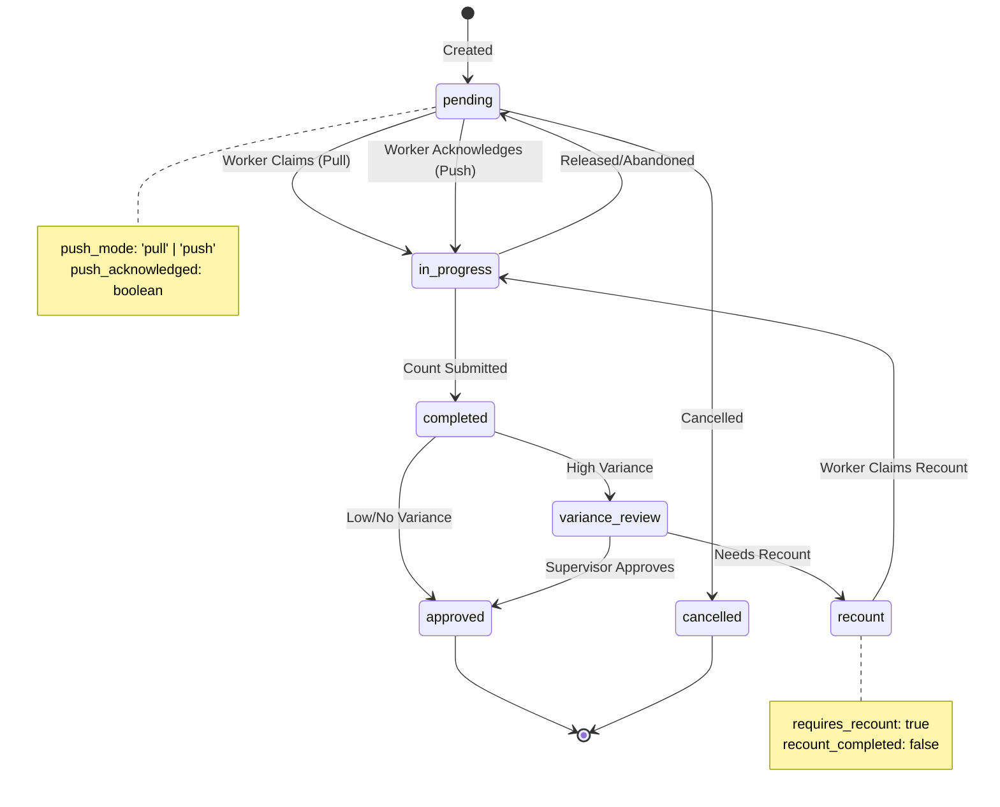
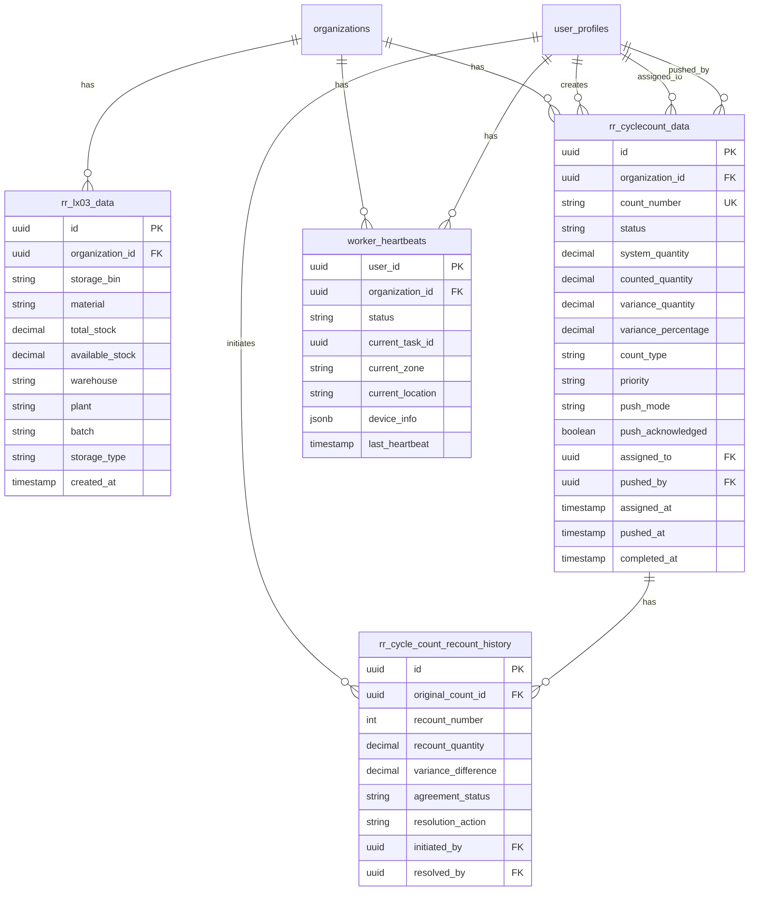
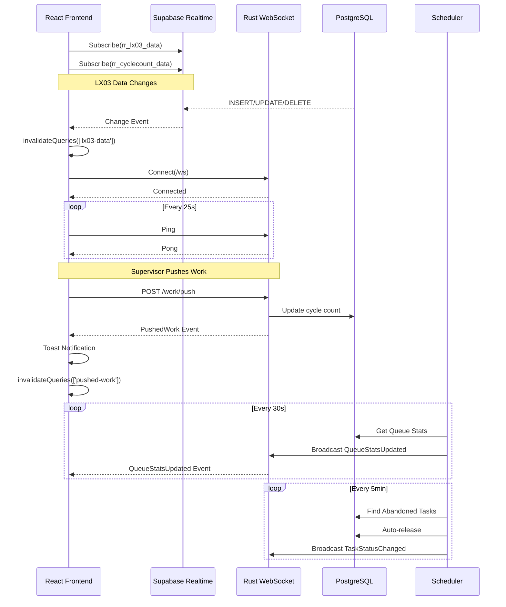
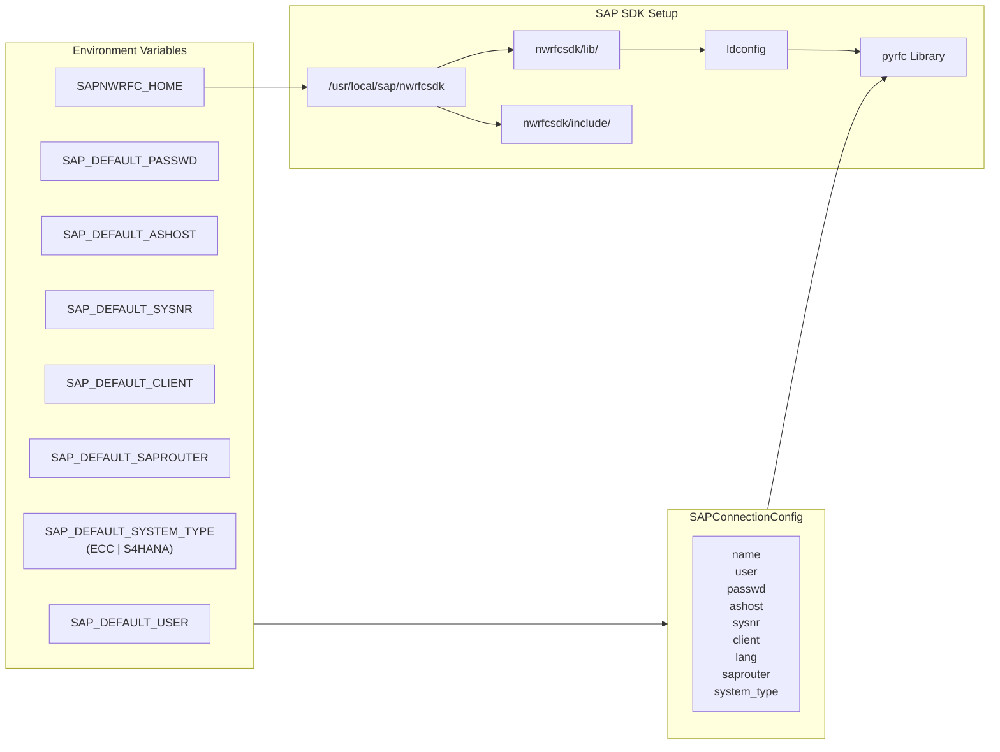
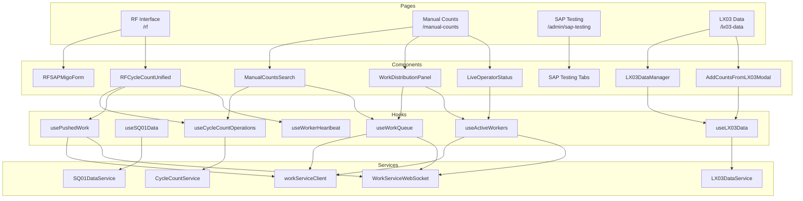

# SAP Integration Architecture - OneBox AI

**Generated:** 2026-02-03  
**Based on:** 10-agent comprehensive codebase investigation

---

## Complete SAP Integration Flow

```mermaid
flowchart TB
    subgraph SAP_SYSTEM["🏢 SAP ERP System"]
        direction TB
        SAP_ECC["SAP ECC<br/>(Classic WM)"]
        SAP_S4["SAP S/4HANA<br/>(EWM)"]
        
        subgraph SAP_TABLES["SAP Tables"]
            T300["T300<br/>Warehouse Master"]
            T301["T301<br/>Storage Types"]
            LQUA["LQUA<br/>Quant/Stock Data"]
            LTAK["LTAK<br/>Transfer Orders"]
            SCWM_T300["/SCWM/T300<br/>EWM Warehouses"]
            SCWM_T301["/SCWM/T301<br/>EWM Storage Types"]
            SCWM_AQUA["/SCWM/AQUA<br/>EWM Quants"]
            SCWM_ORDIM["/SCWM/ORDIM_O<br/>EWM Open TOs"]
        end
        
        subgraph RFC_FUNCS["RFC Functions"]
            RFC_READ["RFC_READ_TABLE"]
            STFC_CONN["STFC_CONNECTION"]
            Z_GR_V2["Z_RFC_GOODS_RECEIPT_V2"]
            Z_GR_V1["Z_RFC_GOODS_RECEIPT"]
            Z_TO_CREATE["Z_RFC_WM_TO_CREATE"]
            Z_TO_CONFIRM["Z_RFC_WM_TO_CONFIRM"]
            BAPI_GM["BAPI_GOODSMVT_CREATE"]
            BAPI_COMMIT["BAPI_TRANSACTION_COMMIT"]
        end
    end
    
    subgraph PYTHON_BACKEND["🐍 Python FastAPI Backend"]
        direction TB
        subgraph SAP_SERVICE["SAP Service Layer"]
            SAPService["SAPService<br/>Singleton"]
            SAPConfig["SAPConnectionConfig<br/>user, passwd, ashost<br/>sysnr, client, saprouter"]
            pyrfc["pyrfc Library<br/>SAP NW RFC SDK"]
        end
        
        subgraph SAP_ROUTER["SAP Router (/api/sap)"]
            EP_HEALTH["/health"]
            EP_TEST["/test-connection"]
            EP_WH["/warehouses"]
            EP_STOCK["/warehouses/{wh}/stock"]
            EP_STORAGE["/warehouses/{wh}/storage-types"]
            EP_OPEN_TO["/open-tos"]
            EP_CREATE_TO["/create-to"]
            EP_CONFIRM_TO["/confirm-to"]
            EP_GR["/goods-receipt"]
        end
        
        subgraph LX03_ROUTER["LX03 Import Router"]
            EP_LX03_IMPORT["/api/lx03/import<br/>POST - Bulk Import"]
            EP_LX03_CLEAR["/api/lx03/clear<br/>DELETE - Clear Data"]
        end
    end
    
    subgraph RUST_CORE["🦀 Rust Core Service (8010)"]
        direction TB
        subgraph LX03_MODULE["LX03 Module"]
            LX03_MODELS["models/lx03.rs<br/>LX03Data, LX03Statistics<br/>LX03Query"]
            LX03_QUERIES["queries/lx03.rs<br/>get_lx03_data()<br/>get_lx03_statistics()<br/>get_warehouses()"]
        end
        
        subgraph QUERY_API["Query API"]
            QUERY_EP["/api/v1/query<br/>POST"]
            Q_LX03_DATA["query: lx03_data"]
            Q_LX03_STATS["query: lx03_statistics"]
        end
    end
    
    subgraph RUST_WORK["🦀 Rust Work Service (8030)"]
        direction TB
        subgraph WORK_API["Work Queue API"]
            WS_CLAIM["/work/claim<br/>Pull Mode"]
            WS_PUSH["/work/push<br/>Push Mode"]
            WS_START["/work/start"]
            WS_COMPLETE["/work/complete"]
            WS_RELEASE["/work/release"]
            WS_ACK["/work/acknowledge"]
        end
        
        subgraph WEBSOCKET["WebSocket Server"]
            WS_ENDPOINT["/ws"]
            WS_EVENTS["Events:<br/>TaskAssigned<br/>TaskStatusChanged<br/>WorkerStatusChanged<br/>QueueStatsUpdated<br/>PushedWork<br/>Heartbeat"]
        end
        
        subgraph SCHEDULER["Background Scheduler"]
            JOB_ABANDON["Abandonment Check<br/>Every 5 min"]
            JOB_STATS["Queue Stats Broadcast<br/>Every 30 sec"]
            JOB_CLEANUP["Worker Cleanup<br/>Every 1 min"]
        end
    end
    
    subgraph DATABASE["🗄️ PostgreSQL/Supabase"]
        direction TB
        subgraph LX03_TABLES["LX03 Tables"]
            TBL_LX03["rr_lx03_data<br/>━━━━━━━━━━━━━<br/>id, organization_id<br/>storage_bin, material<br/>total_stock, available_stock<br/>warehouse, plant, batch"]
        end
        
        subgraph CC_TABLES["Cycle Count Tables"]
            TBL_CC["rr_cyclecount_data<br/>━━━━━━━━━━━━━<br/>count_number, status<br/>system_quantity, counted_quantity<br/>variance_quantity, priority<br/>push_mode, push_acknowledged<br/>assigned_to, pushed_by"]
            TBL_RECOUNT["rr_cycle_count_recount_history<br/>━━━━━━━━━━━━━<br/>recount_number<br/>recount_quantity<br/>agreement_status<br/>resolution_action"]
        end
        
        subgraph WORKER_TABLES["Worker Tables"]
            TBL_HB["worker_heartbeats<br/>━━━━━━━━━━━━━<br/>user_id, status<br/>current_task_id<br/>current_zone<br/>last_heartbeat"]
        end
        
        subgraph RPC_FUNCS["RPC Functions"]
            RPC_GEN["generate_count_number()"]
            RPC_ASSIGN["assign_next_cycle_count()"]
            RPC_PUSH["push_cycle_count_to_user()"]
            RPC_ACK["acknowledge_pushed_count()"]
            RPC_RECOUNT["initiate_recount_with_history()"]
            RPC_STATS["get_cycle_count_statistics()"]
            RPC_LX03_AGG["get_lx03_inventory_by_*()"]
            RPC_WORKERS["get_active_workers()"]
        end
    end
    
    subgraph FRONTEND["⚛️ React Frontend"]
        direction TB
        subgraph DATA_MGMT["Data Management"]
            LX03_MGR["LX03DataManager<br/>View/Import LX03"]
            SQ01_MGR["SQ01DataManager<br/>View/Import SQ01"]
            CC_SEARCH["ManualCountsSearch<br/>Cycle Count Management"]
        end
        
        subgraph RF_INTERFACE["RF Terminal Interface"]
            RF_MIGO["RFSAPMigoForm<br/>Goods Receipt (MIGO)"]
            RF_CC["RFCycleCountUnified<br/>Cycle Count Operations"]
            RF_OUT["RFCycleCountOutForm<br/>Outbound Counts"]
        end
        
        subgraph ADMIN["Admin/Testing"]
            SAP_TEST["SAP Testing Page<br/>Connection Test<br/>Goods Receipt<br/>Transfer Orders"]
            WORK_DIST["WorkDistributionPanel<br/>Push Work to Operators"]
            LIVE_STATUS["LiveOperatorStatus<br/>Real-time Worker View"]
        end
        
        subgraph HOOKS["React Hooks"]
            HOOK_LX03["useLX03Data()"]
            HOOK_SQ01["useSQ01Data()"]
            HOOK_CC["useCycleCountOperations()"]
            HOOK_WORK["useWorkQueue()"]
            HOOK_WORKERS["useActiveWorkers()"]
            HOOK_PUSHED["usePushedWork()"]
        end
        
        subgraph SERVICES["Service Layer"]
            SVC_LX03["LX03DataService"]
            SVC_SQ01["SQ01DataService"]
            SVC_CC["CycleCountService"]
            SVC_WORK["workServiceClient"]
            SVC_WS["WorkServiceWebSocket"]
        end
        
        subgraph REALTIME["Real-time Subscriptions"]
            RT_LX03["lx03-data-changes"]
            RT_CC["cycle-count-changes-{org}"]
            RT_WS["WebSocket /ws"]
        end
    end
    
    %% SAP System Connections
    SAP_ECC --> T300 & T301 & LQUA & LTAK
    SAP_S4 --> SCWM_T300 & SCWM_T301 & SCWM_AQUA & SCWM_ORDIM
    RFC_READ --> T300 & T301 & LQUA & LTAK & SCWM_T300 & SCWM_T301 & SCWM_AQUA & SCWM_ORDIM
    
    %% Python Backend to SAP
    SAPService --> pyrfc
    pyrfc --> RFC_READ & STFC_CONN & Z_GR_V2 & Z_TO_CREATE & Z_TO_CONFIRM
    Z_GR_V2 -.->|fallback| Z_GR_V1
    Z_GR_V1 -.->|fallback| BAPI_GM
    BAPI_GM --> BAPI_COMMIT
    
    SAPConfig --> SAPService
    SAP_ROUTER --> SAPService
    EP_HEALTH & EP_TEST --> STFC_CONN
    EP_WH & EP_STOCK & EP_STORAGE --> RFC_READ
    EP_OPEN_TO --> RFC_READ
    EP_CREATE_TO --> Z_TO_CREATE
    EP_CONFIRM_TO --> Z_TO_CONFIRM
    EP_GR --> Z_GR_V2
    
    %% LX03 Import Flow
    LX03_ROUTER --> TBL_LX03
    
    %% Rust Core Service
    LX03_QUERIES --> TBL_LX03
    LX03_MODELS --> LX03_QUERIES
    QUERY_EP --> Q_LX03_DATA & Q_LX03_STATS
    Q_LX03_DATA --> LX03_QUERIES
    Q_LX03_STATS --> LX03_QUERIES
    
    %% Rust Work Service
    WORK_API --> TBL_CC & TBL_HB
    WS_CLAIM --> RPC_ASSIGN
    WS_PUSH --> RPC_PUSH
    WS_ACK --> RPC_ACK
    WEBSOCKET --> WS_EVENTS
    SCHEDULER --> TBL_CC & TBL_HB
    
    %% Database RPC
    RPC_FUNCS --> TBL_CC & TBL_RECOUNT & TBL_HB & TBL_LX03
    RPC_LX03_AGG --> TBL_LX03
    
    %% Frontend Services
    SVC_LX03 --> EP_LX03_IMPORT & QUERY_EP
    SVC_WORK --> WORK_API
    SVC_WS --> WEBSOCKET
    SVC_CC --> RPC_FUNCS
    
    %% Frontend Hooks
    HOOK_LX03 --> SVC_LX03
    HOOK_CC --> SVC_CC
    HOOK_WORK --> SVC_WORK
    HOOK_WORKERS --> SVC_WORK
    HOOK_PUSHED --> SVC_WORK & SVC_WS
    
    %% Frontend Components
    LX03_MGR --> HOOK_LX03
    CC_SEARCH --> HOOK_CC & HOOK_WORK
    RF_MIGO --> EP_GR
    RF_CC --> HOOK_CC & HOOK_PUSHED
    WORK_DIST --> HOOK_WORK & HOOK_WORKERS
    LIVE_STATUS --> HOOK_WORKERS
    SAP_TEST --> SAP_ROUTER
    
    %% Real-time
    RT_LX03 --> TBL_LX03
    RT_CC --> TBL_CC
    RT_WS --> WEBSOCKET
    HOOK_LX03 --> RT_LX03
    HOOK_CC --> RT_CC
    HOOK_PUSHED --> RT_WS
    HOOK_WORKERS --> RT_WS

    %% Styling
    classDef sapSystem fill:#f9f,stroke:#333,stroke-width:2px
    classDef python fill:#3776AB,stroke:#333,stroke-width:2px,color:#fff
    classDef rust fill:#DEA584,stroke:#333,stroke-width:2px
    classDef database fill:#336791,stroke:#333,stroke-width:2px,color:#fff
    classDef frontend fill:#61DAFB,stroke:#333,stroke-width:2px
    
    class SAP_SYSTEM sapSystem
    class PYTHON_BACKEND python
    class RUST_CORE,RUST_WORK rust
    class DATABASE database
    class FRONTEND frontend
```

---

## Cycle Count Workflow (SAP Data → Completion)

```mermaid
flowchart LR
    subgraph IMPORT["📥 Data Import"]
        SAP_LX03["SAP LX03<br/>Transaction"]
        CLIPBOARD["Clipboard<br/>(Tab-delimited)"]
        IMPORT_UI["LX03DataManager<br/>Import Dialog"]
        API_IMPORT["/api/lx03/import"]
        DB_LX03[("rr_lx03_data")]
    end
    
    subgraph GENERATE["🔢 Count Generation"]
        AGG_FUNCS["Aggregation Functions<br/>by_locations()<br/>by_range()<br/>by_parts()"]
        CREATE_MODAL["AddCountsFromLX03Modal"]
        COUNT_NUM["generate_count_number()<br/>CC-YYYYMMDD-XXXX"]
        DB_CC[("rr_cyclecount_data")]
    end
    
    subgraph ASSIGN["👤 Assignment"]
        PULL["Pull Mode<br/>Worker Claims"]
        PUSH["Push Mode<br/>Supervisor Assigns"]
        RPC_ASSIGN["assign_next_cycle_count()"]
        RPC_PUSH["push_cycle_count_to_user()"]
        WS_NOTIFY["WebSocket<br/>PushedWork Event"]
    end
    
    subgraph COUNT["📋 Counting"]
        RF_UI["RF Terminal<br/>RFCycleCountUnified"]
        SCAN["Scan Location<br/>& Material"]
        ENTER_QTY["Enter Counted<br/>Quantity"]
        CALC_VAR["Calculate<br/>Variance"]
    end
    
    subgraph REVIEW["✅ Review & Resolution"]
        VAR_CHECK{"Variance<br/>> 5%?"}
        APPROVE["Approved"]
        VAR_REVIEW["Variance Review"]
        RECOUNT["Initiate Recount"]
        HISTORY[("recount_history")]
    end
    
    %% Flow
    SAP_LX03 --> CLIPBOARD --> IMPORT_UI --> API_IMPORT --> DB_LX03
    DB_LX03 --> AGG_FUNCS --> CREATE_MODAL --> COUNT_NUM --> DB_CC
    
    DB_CC --> PULL & PUSH
    PULL --> RPC_ASSIGN --> DB_CC
    PUSH --> RPC_PUSH --> WS_NOTIFY --> RF_UI
    
    RF_UI --> SCAN --> ENTER_QTY --> CALC_VAR
    CALC_VAR --> VAR_CHECK
    VAR_CHECK -->|No| APPROVE
    VAR_CHECK -->|Yes| VAR_REVIEW
    VAR_REVIEW --> APPROVE
    VAR_REVIEW --> RECOUNT --> HISTORY --> RF_UI
```

---

## Status Transitions

---

## Data Layer Architecture

---

## Real-time Communication

---

## Error Handling & Fallbacks

```mermaid
flowchart TB
    subgraph GR_FALLBACK["Goods Receipt Fallback Chain"]
        GR1["Z_RFC_GOODS_RECEIPT_V2<br/>(Primary)"]
        GR2["Z_RFC_GOODS_RECEIPT<br/>(V1 Fallback)"]
        GR3["BAPI_GOODSMVT_CREATE<br/>(Standard BAPI)"]
        GR_COMMIT["BAPI_TRANSACTION_COMMIT"]
        
        GR1 -->|FUNCTION_NOT_FOUND| GR2
        GR2 -->|FUNCTION_NOT_FOUND| GR3
        GR3 --> GR_COMMIT
    end
    
    subgraph WH_FALLBACK["Warehouse Data Fallback"]
        WH1["/SCWM/T300<br/>(EWM - S/4HANA)"]
        WH2["T300<br/>(Classic WM - ECC)"]
        WH3["T001L<br/>(Storage Locations)"]
        
        WH1 -->|Not Available| WH2
        WH2 -->|Not Available| WH3
    end
    
    subgraph CONN_ERRORS["Connection Error Handling"]
        ERR_AUTH["RFC_LOGON_FAILURE"]
        ERR_CONN["NIECONN_REFUSED"]
        ERR_FUNC["FUNCTION_NOT_FOUND"]
        
        ERR_AUTH -->|401| AUTH_MSG["Authentication Failed"]
        ERR_CONN -->|503| CONN_MSG["Service Unavailable"]
        ERR_FUNC -->|Try Fallback| FALLBACK["Next Function"]
    end
    
    subgraph WS_RECONNECT["WebSocket Reconnection"]
        WS_CONN["Connected"]
        WS_DISC["Disconnected"]
        WS_RETRY["Exponential Backoff<br/>1s → 2s → 4s → 8s → 16s → 30s"]
        WS_POLL["Fallback: HTTP Polling<br/>(60s interval)"]
        
        WS_CONN -->|Connection Lost| WS_DISC
        WS_DISC --> WS_RETRY
        WS_RETRY -->|Max 5 attempts| WS_POLL
        WS_RETRY -->|Success| WS_CONN
    end
```

---

## Environment Configuration

---

## Component Hierarchy

---

## Summary Statistics

| Component | Count | Details |
|-----------|-------|---------|
| **SAP RFC Functions** | 10+ | Z_RFC_*, BAPIs, RFC_READ_TABLE |
| **SAP Tables** | 8+ | T300, T301, LQUA, LTAK, /SCWM/* |
| **API Endpoints** | 15+ | /api/sap/*, /api/lx03/* |
| **Database Tables** | 4 | rr_lx03_data, rr_cyclecount_data, rr_cycle_count_recount_history, worker_heartbeats |
| **RPC Functions** | 16+ | Aggregation, assignment, recount, worker |
| **React Hooks** | 6+ | useLX03Data, useCycleCountOperations, useWorkQueue, etc. |
| **Real-time Channels** | 3+ | lx03-data-changes, cycle-count-changes, WebSocket |
| **WebSocket Events** | 6 | TaskAssigned, TaskStatusChanged, WorkerStatusChanged, QueueStatsUpdated, PushedWork, Heartbeat |
| **Frontend Components** | 15+ | Data managers, RF forms, admin panels |

---

## Key Architecture Decisions

1. **Dual Real-time System**: Supabase Realtime for database CDC + Rust WebSocket for work service events
2. **Multi-layer Fallback**: EWM → Classic WM tables, Z_RFC_* → BAPIs
3. **Push/Pull Work Assignment**: Supports both supervisor-driven and self-service workflows
4. **Organization Isolation**: RLS policies + organization_id filtering throughout
5. **Hybrid Backend**: Python FastAPI for SAP RFC + Rust for high-performance queries
6. **Clipboard Import**: Tab-delimited paste from SAP transactions (LX03, SQ01)
7. **Graceful Degradation**: System works without SAP SDK (features disabled)

