# SAP Integration - Executive Overview

**OneBox AI Logistics Platform**

---

## 🚀 The Bottom Line: Efficiency Gains

```mermaid
flowchart LR
    subgraph BEFORE["❌ Traditional SAP"]
        B1["7+ Steps per Transaction"]
        B2["2-48 Hour Data Delay"]
        B3["~60% Data Accuracy"]
        B4["5+ T-Codes to Learn"]
    end
    
    subgraph AFTER["✅ With OneBox AI"]
        A1["1-2 Steps per Transaction"]
        A2["Real-Time (<1 second)"]
        A3["99.99% Data Accuracy"]
        A4["Single Unified Interface"]
    end
    
    subgraph IMPACT["📈 Business Impact"]
        I1["⬆️ 30% Productivity"]
        I2["⬇️ 80% Training Time"]
        I3["💰 ROI in <8 Months"]
        I4["⚡ Instant Visibility"]
    end
    
    BEFORE --> AFTER --> IMPACT
    
    style BEFORE fill:#fee2e2,stroke:#ef4444,stroke-width:2px
    style AFTER fill:#d1fae5,stroke:#10b981,stroke-width:2px
    style IMPACT fill:#dbeafe,stroke:#3b82f6,stroke-width:2px
```

---

## 📊 Transaction Step Reduction

### Goods Receipt (MIGO): 7 Steps → 1 Scan

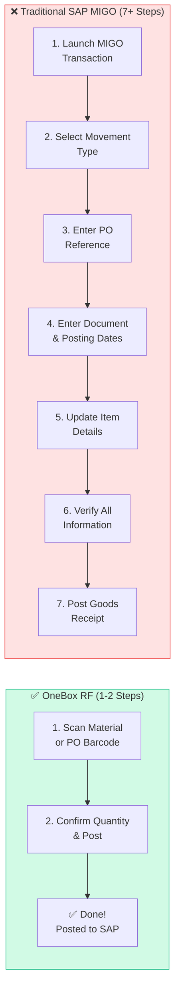

| Metric | Traditional SAP | OneBox AI | Improvement |
|--------|-----------------|-----------|-------------|
| **Steps Required** | 7+ screens/fields | 2 scans | **~70% reduction** |
| **Time per Receipt** | 2-5 minutes | 15-30 seconds | **~85% faster** |
| **Data Entry Errors** | ~40% error rate | <0.01% error rate | **99.9% improvement** |
| **Training Required** | Days/Weeks | Hours | **80% reduction** |

---

### Cycle Counting: 5 Transactions → 1 Workflow

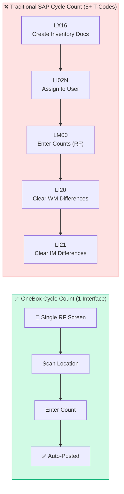

| Metric | Traditional SAP | OneBox AI | Improvement |
|--------|-----------------|-----------|-------------|
| **Transactions Needed** | 5 (LX16, LI02N, LM00, LI20, LI21) | 1 unified workflow | **80% reduction** |
| **Supervisor Involvement** | Required at multiple steps | Only for variances | **~60% less overhead** |
| **Time per Count** | 3-5 minutes | 30-60 seconds | **~80% faster** |
| **Variance Resolution** | Manual review in LI21 | Automated with alerts | **Real-time** |

---

### Transfer Order Confirmation: 3+ Steps → 1 Scan

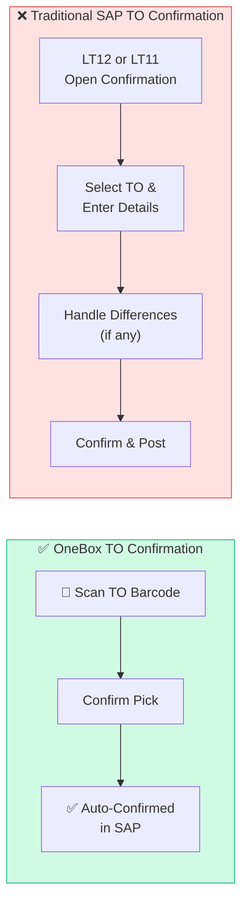

| Metric | Traditional SAP | OneBox AI | Improvement |
|--------|-----------------|-----------|-------------|
| **Transactions Needed** | LT12/LT11 + navigation | 1 scan + confirm | **~65% reduction** |
| **Time per TO** | 1-3 minutes | 10-20 seconds | **~85% faster** |
| **T-Codes to Know** | LT12, LT11, LM03, LM05 | None (menu-driven) | **Zero memorization** |

---

## ⏱️ Time Savings Summary

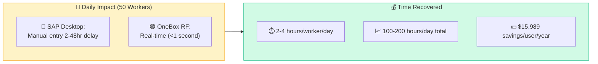

### Per-Transaction Speed Comparison

| Operation | SAP Desktop Time | OneBox RF Time | Time Saved |
|-----------|------------------|----------------|------------|
| **Goods Receipt (MIGO)** | 2-5 minutes | 15-30 seconds | **90% faster** |
| **Cycle Count** | 3-5 minutes | 30-60 seconds | **80% faster** |
| **TO Confirmation** | 1-3 minutes | 10-20 seconds | **85% faster** |
| **Putaway** | 2-4 minutes | 20-40 seconds | **83% faster** |
| **Pick Confirmation** | 1-2 minutes | 10-15 seconds | **88% faster** |

### Annual Productivity Gain (50-Worker Warehouse)

| Metric | Calculation | Result |
|--------|-------------|--------|
| Transactions/Worker/Day | ~100 | 5,000 total |
| Time Saved/Transaction | ~2 minutes | 10,000 min/day |
| Hours Recovered/Day | 10,000 ÷ 60 | **167 hours/day** |
| FTE Equivalent Saved | 167 ÷ 8 | **~21 FTEs worth of time** |

---

## 🔄 Complete Warehouse Operations Flow

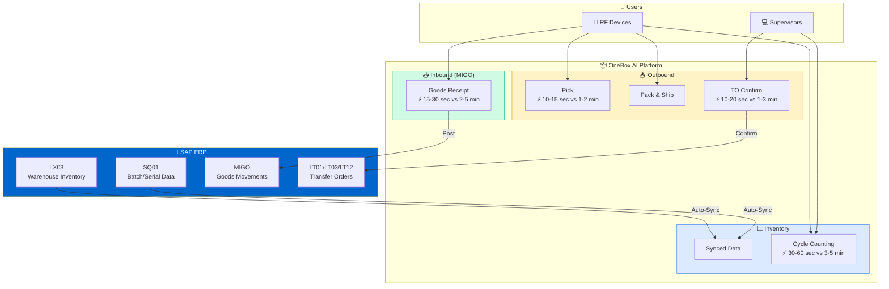

---

## 📥 Inbound: MIGO Goods Receipt

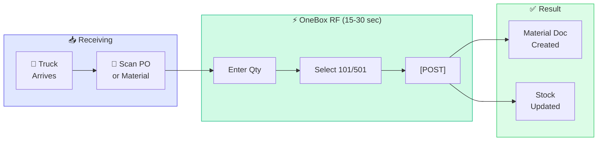

### Movement Types

| Type | Description | Steps in OneBox |
|------|-------------|-----------------|
| **101** | PO-Based Receipt | Scan PO → Qty → Post |
| **501** | Direct Receipt (No PO) | Scan Material → Qty → Post |

---

## 📤 Outbound: Transfer Order Flow

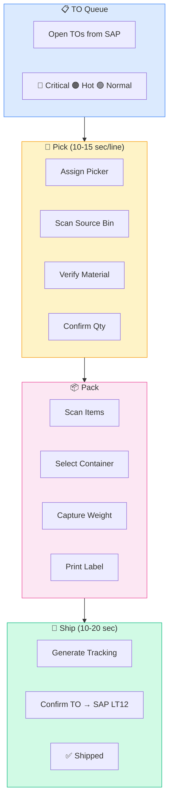

---

## 🔢 Cycle Counting: End-to-End

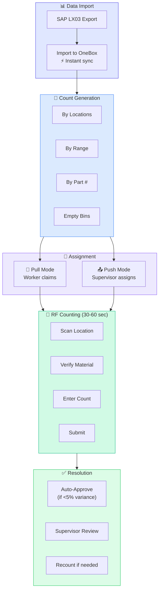

---

## 👥 Real-Time Workforce Visibility

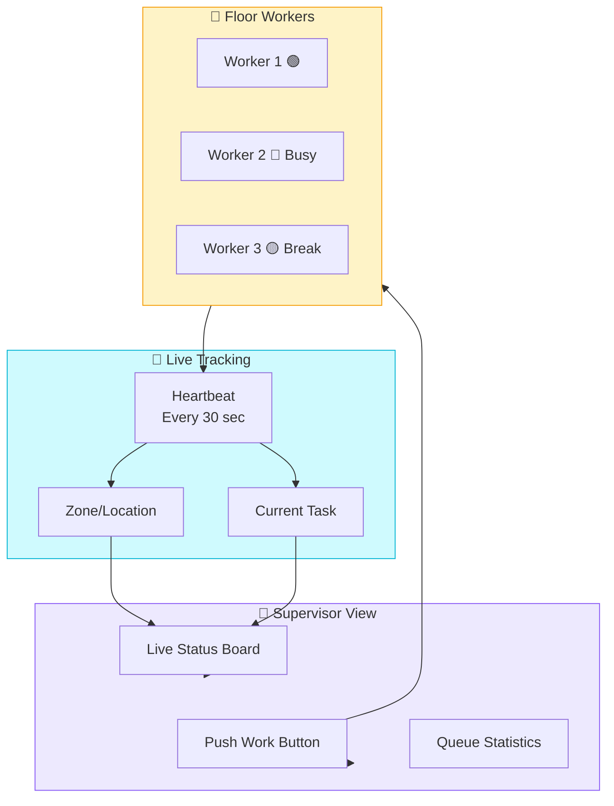

---

## 📱 What Workers See (RF Screens)

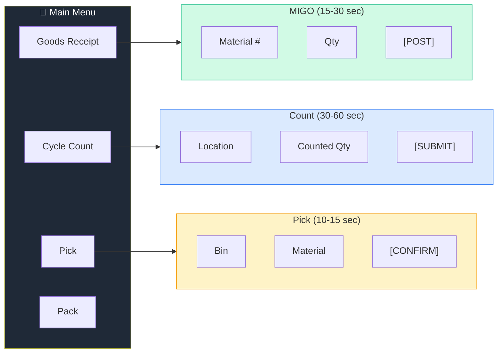

---

## 📈 ROI Summary

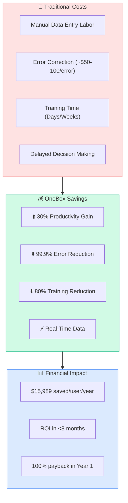

### Key ROI Metrics

| Metric | Value | Source |
|--------|-------|--------|
| **Annual Savings per User** | $15,989 | Wireless LAN Alliance Study |
| **Productivity Increase** | 30% | Industry benchmark |
| **Data Accuracy Improvement** | 60% → 99.99% | Mobile barcoding research |
| **Training Time Reduction** | 80% | RFgen research |
| **Typical ROI Timeline** | <8 months | WMS implementation data |

---

## 🎯 SAP Transaction Elimination Summary

| Operation | SAP T-Codes Eliminated | OneBox Replacement |
|-----------|------------------------|-------------------|
| **Goods Receipt** | MIGO (7 screens) | 1 RF scan + confirm |
| **Cycle Count Setup** | LX16, LI02N | Auto-generated from LX03 |
| **Cycle Count Entry** | LM00, LI20, LI21 | 1 RF workflow |
| **TO Confirmation** | LT12, LT11, LM03, LM05 | 1 scan + confirm |
| **Stock Inquiry** | LX03, MMBE, MB52 | Real-time dashboard |
| **Batch Lookup** | SQ01, MSC3N | Integrated search |

**Total T-Codes Reduced: 15+ → 0 memorization required**

---

## ✅ Summary: Why OneBox AI

| Category | Improvement |
|----------|-------------|
| **Transaction Speed** | 80-90% faster |
| **Steps per Transaction** | 70-80% fewer |
| **Data Accuracy** | 99.99% (vs 60%) |
| **Training Time** | 80% reduction |
| **T-Codes to Learn** | 0 (vs 15+) |
| **Data Delay** | Real-time (vs 2-48 hours) |
| **ROI Timeline** | <8 months |
| **Annual Savings** | ~$16,000/user |

**OneBox AI transforms SAP warehouse operations from complex, multi-step desktop transactions into simple, single-scan mobile workflows—delivering real-time data, near-perfect accuracy, and dramatic productivity gains.**

