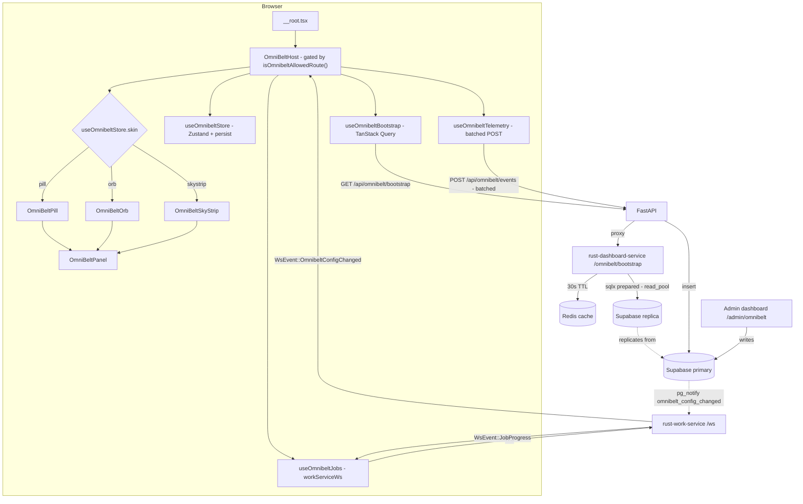
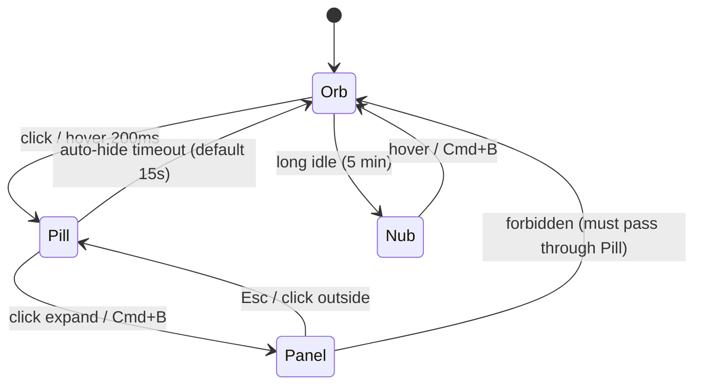

# OmniBelt — Design Specification

**Date:** 2026-05-24  
**Status:** Approved (pending spec review)  
**Owner:** OmniFrame Platform  
**Implementation:** [Implement-OmniBelt-MVP](../../../memorybank/OmniFrame/Implementations/Implement-OmniBelt-MVP.md)  
**ADR:** [ADR-OmniBelt-Site-Chrome](../../../memorybank/OmniFrame/Decisions/ADR-OmniBelt-Site-Chrome.md)  
**Pattern:** [OmniBelt-Floating-Launcher](../../../memorybank/OmniFrame/Patterns/OmniBelt-Floating-Launcher.md)

---

## 1. Goals & Non-goals

### Goals
- A site-wide floating tool launcher (**OmniBelt**) mounted on every authenticated, non-kiosk route.
- Tri-state collapse cycle (Mini-Orb → Pill → Panel) using `framer-motion` `layoutId` morphs for continuous-object feel.
- 12 anchor positions (4 corners + 4 edge midpoints + 4 edge nubs) plus free-float and pinned modes, with magnetic snap, smart collision-avoidance, and per-route position memory.
- Extensible tool registry with hybrid ownership: admin sets per-role default belts and a master allow-list; users customize within constraints.
- Background-job status surface (**Mach 3**) attached to the orb/pill — live progress halo + 4-second auto-expand status tray on new jobs.
- Three user-selectable skins: `pill` (default), `orb`, `skystrip`.
- Three-layer kill switch: env → org setting → per-user hide, plus route allow-list and Capacitor native exclusion.
- Performance designed for 2,000+ concurrent users via Supabase read replica + Rust+Redis caching + workServiceWs-driven invalidation.
- Dedicated admin sidebar entry and 5-tab dashboard at `/admin/omnibelt`.
- Rich v1 analytics derived from a new `omnibelt_tool_events` table + 24h materialized view.

### Non-goals (v1.5+)
- Cross-device preference sync (v1 = localStorage + Supabase write-through is sufficient).
- Tool marketplace / third-party plugins (v1 = bundled at build time).
- Mobile gesture polish beyond default-corner-anchor fallback (long-press drag, multi-touch pin).
- Consolidating the existing dual Cmd+K command palettes (separate effort).
- Showing OmniBelt on RF / timeclock / customer-portal kiosk routes.
- Onboarding tour / first-run animations.

---

## 2. User-Facing Behavior

**On every authenticated, non-kiosk page**, OmniBelt appears as a small floating widget. The user can:

- **Click** the resting widget to expand the launcher panel (search + tabs + tool grid).
- **Drag** it anywhere; release to either free-float at the drop location or snap to one of 12 magnetic zones (32px deadzone).
- **Pin** it to lock the current position (disables drag).
- **Auto-hide** it to a 6px edge-nub sliver after a configurable idle (default 15 seconds), then peek-on-hover.
- **Switch skin** in their profile preferences between Pill (default), Orb (radial fan), and Sky Strip (top-center morph).
- **See background-job progress** as a halo ring around the orb (different accent per job type). When the *user themselves* starts a new job, the status tray auto-expands for 4 seconds.
- **Toggle visibility** with `Cmd/Ctrl+B`.

**Admins** see OmniBelt in their sidebar (Administration → OmniBelt) and can configure everything via a 5-tab dashboard.

---

## 3. Architecture

### 3.1 Mount

OmniBelt mounts in [src/routes/__root.tsx](../../../src/routes/__root.tsx) between `<Outlet />` and `<Toaster />` so it has access to the full provider stack (auth, theme, search, toast settings) but self-gates per-route.

### 3.2 Data flow



### 3.3 Provider stack position

OmniBelt sits **inside** `ToastSettingsProvider` and `SearchProvider` (defined in `__root.tsx`) and **outside** the authenticated layout. This lets it read theme/toast/auth state via hooks but render in its own portal-like layer that survives route changes.

---

## 4. Data Model

### 4.1 New Supabase tables

Migration file: `supabase/migrations/<ts>_omnibelt_core.sql` (next available sequence number; check existing).

```sql
-- Per-role admin-curated default belt
create table omnibelt_role_config (
  id uuid primary key default gen_random_uuid(),
  organization_id uuid not null references organizations(id) on delete cascade,
  role_id uuid not null references roles(id) on delete cascade,
  default_tool_ids text[] not null default '{}',
  default_pinned_ids text[] not null default '{}',
  default_position jsonb not null default '{"anchor":"BR","offset":{"x":24,"y":24}}'::jsonb,
  default_skin text not null default 'pill' check (default_skin in ('pill','orb','skystrip')),
  updated_at timestamptz not null default now(),
  updated_by uuid references auth.users(id),
  unique (organization_id, role_id)
);
create index idx_omnibelt_role_config_org on omnibelt_role_config (organization_id);

-- Per-user customization within role-allowed pool
create table omnibelt_user_prefs (
  user_id uuid primary key references auth.users(id) on delete cascade,
  organization_id uuid not null references organizations(id) on delete cascade,
  pinned_tool_ids text[] not null default '{}',
  hidden_tool_ids text[] not null default '{}',
  tool_order text[] not null default '{}',
  position_by_route jsonb not null default '{}'::jsonb,
  skin text default null check (skin is null or skin in ('pill','orb','skystrip')),
  mach3_behavior text not null default 'halo_plus_autoexpand'
    check (mach3_behavior in ('halo_only','halo_plus_autoexpand','halo_plus_morph','halo_plus_tray_pinned')),
  auto_hide_after_seconds int not null default 15,
  user_hidden boolean not null default false,
  updated_at timestamptz not null default now()
);
create index idx_omnibelt_user_prefs_org on omnibelt_user_prefs (organization_id);
create index idx_omnibelt_user_prefs_updated on omnibelt_user_prefs (updated_at desc);

-- Telemetry events (v1-rich analytics)
create table omnibelt_tool_events (
  id bigserial primary key,
  organization_id uuid not null references organizations(id) on delete cascade,
  user_id uuid not null references auth.users(id) on delete cascade,
  tool_id text not null,
  event_type text not null check (event_type in (
    'tool_launch','tool_pin','tool_unpin','tool_hide',
    'panel_open','panel_close','tray_expand','tray_collapse',
    'skin_change','position_change','belt_visible','belt_hidden'
  )),
  metadata jsonb not null default '{}'::jsonb,
  occurred_at timestamptz not null default now()
);
create index idx_omnibelt_events_org_time on omnibelt_tool_events (organization_id, occurred_at desc);
create index idx_omnibelt_events_tool on omnibelt_tool_events (tool_id, occurred_at desc);

-- 24h aggregation (refreshed every 5 min via pg_cron)
create materialized view omnibelt_tool_events_24h_mv as
select
  organization_id,
  tool_id,
  event_type,
  date_trunc('hour', occurred_at) as bucket_hour,
  count(*) as event_count,
  count(distinct user_id) as user_count
from omnibelt_tool_events
where occurred_at > now() - interval '24 hours'
group by 1,2,3,4;
create unique index on omnibelt_tool_events_24h_mv (organization_id, tool_id, event_type, bucket_hour);

-- NOTIFY trigger drives hot-reload via rust-work-service PgListener
create or replace function notify_omnibelt_config_change()
returns trigger language plpgsql as $$
declare
  payload_org uuid;
begin
  payload_org := coalesce(new.organization_id, old.organization_id);
  perform pg_notify('omnibelt_config_changed', json_build_object('org_id', payload_org)::text);
  return coalesce(new, old);
end $$;

create trigger omnibelt_role_config_notify
  after insert or update or delete on omnibelt_role_config
  for each row execute function notify_omnibelt_config_change();

-- pg_cron job to refresh the MV every 5 min
select cron.schedule(
  'omnibelt-mv-refresh',
  '*/5 * * * *',
  $$refresh materialized view concurrently omnibelt_tool_events_24h_mv;$$
);
```

### 4.2 RLS policies

Org-scoped, mirroring the established pattern in [memorybank/OmniFrame/Patterns/Database-Patterns.md](../../../memorybank/OmniFrame/Patterns/Database-Patterns.md):

```sql
alter table omnibelt_role_config enable row level security;
alter table omnibelt_user_prefs enable row level security;
alter table omnibelt_tool_events enable row level security;

-- omnibelt_role_config: read for any org member; write for admin/superadmin
create policy "role_config_read_org" on omnibelt_role_config for select
  using (organization_id = (select organization_id from user_profiles where user_id = auth.uid()));

create policy "role_config_write_admin" on omnibelt_role_config for all
  using (
    organization_id = (select organization_id from user_profiles where user_id = auth.uid())
    and exists (
      select 1 from user_roles ur join roles r on r.id = ur.role_id
      where ur.user_id = auth.uid() and r.role_key in ('admin','superadmin')
    )
  );

-- omnibelt_user_prefs: read/write own row only
create policy "user_prefs_self" on omnibelt_user_prefs for all
  using (user_id = auth.uid()) with check (user_id = auth.uid());

-- omnibelt_tool_events: insert own events; admins read org-wide
create policy "events_insert_self" on omnibelt_tool_events for insert
  with check (user_id = auth.uid()
    and organization_id = (select organization_id from user_profiles where user_id = auth.uid()));

create policy "events_read_admin" on omnibelt_tool_events for select
  using (
    organization_id = (select organization_id from user_profiles where user_id = auth.uid())
    and exists (
      select 1 from user_roles ur join roles r on r.id = ur.role_id
      where ur.user_id = auth.uid() and r.role_key in ('admin','superadmin')
    )
  );
```

### 4.3 Reused `settings` table keys (no schema change)

| Key | Scope | Shape | Purpose |
|---|---|---|---|
| `system.omnibelt.enabled` | org | `{ "enabled": boolean }` | Master org-wide kill switch |
| `system.omnibelt.allow_list` | org | `{ "tool_ids": string[] }` | Org-wide allow-list of which TOOL_REGISTRY ids are usable |

### 4.4 New permission resource

Add `omnibelt` as a permission resource in the existing RBAC system. Default-grant `(action='manage', resource='omnibelt')` to `admin` and `superadmin` roles.

---

## 5. Backend

### 5.1 `rust-dashboard-service` — new endpoint + read pool

**Read pool wiring** (P0; mirrors `rust-core-service` / `rust-work-service` migration documented in [memorybank/OmniFrame/Patterns/Supabase-Read-Replica-Routing.md](../../../memorybank/OmniFrame/Patterns/Supabase-Read-Replica-Routing.md)):

- Add `database_read_pooler_url: Option<String>` to `rust-dashboard-service/src/config/mod.rs` reading `DASHBOARD_SERVICE_DATABASE_READ_POOLER_URL` or `DATABASE_READ_POOLER_URL`.
- Add `read_pool: PgPool` to `AppState`, built lazily with `application_name = "rust-dashboard-service-read"`. Fall back to `db_pool.clone()` when env unset.

**New endpoint** `GET /omnibelt/bootstrap` (`rust-dashboard-service/src/handlers/omnibelt.rs`):

```rust
// Auth: JWT validated via existing rust-core-service middleware
// Returns: OmnibeltBootstrap {
//   kill_switch: { enabled: bool, source: 'env'|'org'|'none' },
//   role_config: OmnibeltRoleConfig,
//   user_prefs: OmnibeltUserPrefs,
//   allow_list: string[],
//   tool_registry_version: u32,
//   initial_active_jobs: ActiveJob[],
// }
// Cache: Redis 30s, key "omnibelt:bootstrap:{org_id}:{user_id}"
// Invalidation: subscribes to "omnibelt_config_changed" pg channel via existing PgListener;
//               DEL keys matching pattern "omnibelt:bootstrap:{org_id}:*" on event
```

All reads route through `state.read_pool`. Writes are not allowed on this endpoint (mutations go via FastAPI proxy → primary).

### 5.2 `api/routers/omnibelt.py` — FastAPI proxies

```python
@router.get("/api/omnibelt/bootstrap")
async def bootstrap_proxy(current_user = Depends(get_current_user)):
    # Proxies to rust-dashboard-service with JWT forwarding.
    # Falls back to direct Supabase read on Rust outage (degraded mode).

@router.post("/api/omnibelt/prefs")
async def write_prefs(payload: OmnibeltPrefsUpdate, current_user = Depends(get_current_user)):
    # Writes to omnibelt_user_prefs via current_user.supabase_client (primary).

@router.post("/api/omnibelt/events")
async def write_events(payload: list[OmnibeltEventInput], current_user = Depends(get_current_user)):
    # Batched insert into omnibelt_tool_events via primary; rate-limited per user (Redis sliding window).

@router.post("/api/admin/omnibelt/role-config")
async def write_role_config(payload: OmnibeltRoleConfigUpdate, current_user = Depends(require_admin)):
    # Admin-gated; writes to omnibelt_role_config; pg_notify fires automatically.

@router.post("/api/admin/omnibelt/kill-switch")
async def write_kill_switch(payload: KillSwitchUpdate, current_user = Depends(require_admin)):
    # Writes settings.system.omnibelt.enabled = {...}; triggers manual rust-work-service broadcast.
```

### 5.3 `rust-work-service` — new WsEvent variant

```rust
// rust-work-service/src/ws/events.rs
pub enum WsEvent {
    // ... existing variants
    OmnibeltConfigChanged { org_id: Uuid },
}
```

- New PgListener subscribes to `omnibelt_config_changed` channel.
- On event, broadcasts `OmnibeltConfigChanged` to all subscribers in that org and DELs Redis cache keys matching `omnibelt:bootstrap:{org_id}:*`.
- Matching frontend `WsEventType` entry in [src/lib/work-service/types.ts](../../../src/lib/work-service/types.ts).

### 5.4 Per-tool background job emission

Existing `JobProgress` events in `workServiceWs` cover the long-running pipelines (SAP imports, agent jobs, scheduled reports). No new event types needed for v1 — OmniBelt subscribes to the existing stream and filters by `org_id + visibility rules`.

---

## 6. Frontend

### 6.1 File layout

```
src/features/omnibelt/
├── index.ts                              # public exports (OmniBeltHost only)
├── OmniBeltHost.tsx                      # mount point + skin router + route gate
├── store/
│   ├── omnibeltStore.ts                  # Zustand + persist (per-user key)
│   └── selectors.ts                      # memoized selectors
├── hooks/
│   ├── useOmnibeltBootstrap.ts           # TanStack Query → /api/omnibelt/bootstrap
│   ├── useOmnibeltJobs.ts                # workServiceWs subscription (JobProgress)
│   ├── useOmnibeltConfigInvalidator.ts   # workServiceWs → invalidate bootstrap
│   ├── useOmnibeltKeyboard.ts            # Cmd/Ctrl+B handler
│   ├── useOmnibeltPosition.ts            # drag/snap/clamp logic
│   ├── useOmnibeltVisibility.ts          # kill-switch evaluation
│   ├── useOmnibeltTelemetry.ts           # batched event emitter
│   └── useOmnibeltCollisionAvoidance.ts  # NotificationsPanel + Toaster ghost-zones
├── skins/
│   ├── pill/
│   │   ├── OmniBeltPill.tsx
│   │   ├── PillMiniOrb.tsx               # tri-state collapse target
│   │   └── PillEdgeNub.tsx               # 6px sliver
│   ├── orb/
│   │   ├── OmniBeltOrb.tsx               # Mockup 1 radial fan
│   │   └── RadialFan.tsx
│   └── skystrip/
│       ├── OmniBeltSkyStrip.tsx          # Mockup 3 morph
│       └── StripStatusSurface.tsx
├── panel/
│   ├── OmniBeltPanel.tsx                 # shared expanded panel
│   ├── PanelSearch.tsx
│   ├── PanelTabs.tsx                     # Pinned / All / Recent / Running
│   ├── ToolTile.tsx
│   └── PanelMenu.tsx                     # Lock to corner / Auto-hide / Skin picker
├── tray/
│   ├── OmniBeltStatusTray.tsx            # Mach 3 status surface
│   ├── HaloRings.tsx                     # SVG progress rings around orb/pill
│   └── JobRow.tsx
├── tools/
│   ├── registry.ts                       # central registry + ToolDef type
│   ├── definitions/
│   │   ├── quick-pick.ts
│   │   ├── sap-status.ts
│   │   ├── inventory-lookup.ts
│   │   ├── background-jobs.ts
│   │   ├── quick-note.ts
│   │   ├── build-info.ts
│   │   ├── settings-shortcut.ts
│   │   └── help-docs.ts
│   └── shells/
│       ├── QuickNoteShell.tsx
│       ├── BuildInfoShell.tsx
│       └── ...
├── lib/
│   ├── anchors.ts                        # 12 anchor zones + snap math
│   ├── collision.ts                      # NotificationsPanel + Toaster avoidance
│   ├── routeGate.ts                      # isOmnibeltAllowedRoute()
│   ├── routeClass.ts                     # routeClass(pathname) → 'admin'|'ops'|...
│   ├── motion.ts                         # easing/spring constants
│   └── telemetry-client.ts               # batched POST helper
└── __tests__/                            # vitest unit tests
```

### 6.2 Zustand store

[src/features/omnibelt/store/omnibeltStore.ts](../../../src/features/omnibelt/store/omnibeltStore.ts) — Tier 1 (global UI) per [State-Management-Patterns](../../../memorybank/OmniFrame/Patterns/State-Management-Patterns.md). No middleware beyond `persist + partialize`. Per-user localStorage key: `omniframe.omnibelt.${userId}.v1`.

Persisted fields:
- `collapseState: 'orb' | 'pill' | 'panel' | 'nub'`
- `positionByRoute: Record<routeClass, AnchorPosition>`
- `skin: 'pill' | 'orb' | 'skystrip'`
- `pinnedToolIds: string[]`
- `mach3Behavior: 'halo_only' | 'halo_plus_autoexpand' | 'halo_plus_morph' | 'halo_plus_tray_pinned'`
- `autoHideAfterSeconds: number`
- `userHidden: boolean`

Non-persisted (derived/runtime):
- `activeJobs: ActiveJob[]` (sourced from `useOmnibeltJobs`)
- `panelOpen: boolean`
- `trayOpen: boolean`
- `dragging: boolean`

Bootstrap query hydrates the store on mount, then debounced (500 ms) writes propagate back to Supabase via `POST /api/omnibelt/prefs`.

---

## 7. Skin System

```tsx
// OmniBeltHost.tsx (sketch)
const SKIN_REGISTRY = {
  pill: lazy(() => import('./skins/pill/OmniBeltPill')),
  orb: lazy(() => import('./skins/orb/OmniBeltOrb')),
  skystrip: lazy(() => import('./skins/skystrip/OmniBeltSkyStrip')),
} as const;

export function OmniBeltHost() {
  const { visible } = useOmnibeltVisibility();
  if (!visible) return null;

  const skin = useOmnibeltStore(s => s.skin);
  const Skin = SKIN_REGISTRY[skin];

  return (
    <MotionConfig reducedMotion='user'>
      <LayoutGroup id='omnibelt'>
        <Suspense fallback={null}>
          <Skin />
        </Suspense>
        <OmniBeltPanel />
        <OmniBeltStatusTray />
      </LayoutGroup>
    </MotionConfig>
  );
}
```

Every skin component renders a `<motion.div layoutId='omnibelt-host'>` so cross-skin transitions (when a user changes their preference) animate as continuous morphs, not crossfades. The Panel and Tray are skin-agnostic shared components.

---

## 8. Position & Anchor System

### 8.1 12 anchor positions + 2 modes

The widget rests at one of **12 anchor positions** (4 corners + 4 edge midpoints + 4 edge nubs) or in one of **2 modes** (FREE-float anywhere, or PINNED-locked drag-disabled).

```
┌─[TL]──────[TC]──────[TR]─┐    Positions (12):
│                          │      4 corners:  TL, TR, BL, BR
[ML]                    [MR]      4 edges:    TC, BC, ML, MR
│                          │      4 nubs:     NUB_L, NUB_R, NUB_T, NUB_B
│                          │                  (auto-hide endpoints)
└─[BL]──────[BC]──────[BR]─┘
                                Modes (2):
                                  FREE     - user dragged to arbitrary point
                                  PINNED   - current position locked
```

### 8.2 Drag/snap implementation

- Drag via `framer-motion`'s `drag` + `dragConstraints={viewportRef}`.
- `onDragEnd` evaluates the nearest snap zone within 32px deadzone using `lib/anchors.ts`.
- House spring `{ stiffness: 420, damping: 28, mass: 0.85 }` (per [Cinematic-Tab-Rotation](../../../memorybank/OmniFrame/Patterns/Cinematic-Tab-Rotation.md)) snaps it into place.
- House easing `[0.22, 1, 0.36, 1]` for non-spring transitions.

### 8.3 Per-route memory

Position is stored keyed by **route class**, not exact path, to bound the persisted state:

```ts
// lib/routeClass.ts
export function routeClass(pathname: string): RouteClass {
  if (pathname.startsWith('/_authenticated/admin')) return 'admin';
  if (pathname.startsWith('/_authenticated/operations')) return 'ops';
  if (pathname.startsWith('/_authenticated/hr')) return 'hr';
  if (pathname.startsWith('/_authenticated/inventory')) return 'inventory';
  if (pathname.startsWith('/_authenticated/outbound')) return 'outbound';
  if (pathname.startsWith('/_authenticated/reports')) return 'reports';
  return 'default';
}
```

Bounded set of ≤10 route classes — no drift across hundreds of dynamic paths.

### 8.4 Collision avoidance

On every drag-end and on every `window.resize`:
- Reads `NotificationsPanel` bell bounding rect from the authenticated layout's action bar.
- Reads `Sonner` toaster position from `useToastSettings()`.
- If the OmniBelt resting rect overlaps either with ≥4px, offsets 56px in the closest free direction.
- All overlap math in `lib/collision.ts` (pure functions; unit-tested).

---

## 9. Tri-state Collapse



Each transition is a single `<motion.div layoutId='omnibelt-host'>` reshape — framer interpolates size, border-radius, and position. This is the same primitive that powers iOS Dynamic Island.

---

## 10. Background-Job Status (Mach 3)

### 10.1 Active job model

```ts
type ActiveJob = {
  id: string;
  type: 'sap_import' | 'sap_export' | 'agent_job' | 'report' | 'scheduled' | 'other';
  label: string;
  progress: number;        // 0..1
  startedAt: number;
  startedByCurrentUser: boolean;
  cancelable: boolean;
  cancelUrl?: string;      // optional: backend route for cancel mutation
};
```

### 10.2 Default behavior: `halo_plus_autoexpand`

1. Every active job adds a `<HaloRing />` SVG arc around the orb/pill: `pathLength={progress}`, stroke color by `type`.
2. Multiple jobs stack concentric rings with 2px spacing.
3. When a new job appears with `startedByCurrentUser === true`, the Status Tray auto-expands for 4 seconds, then auto-collapses to halo-only.
4. Clicking the halo (or `Cmd+B` while a job is running) toggles the tray manually.

### 10.3 Color tokens by job type

Defined in [src/index.css](../../../src/index.css) `@theme` block:
- `--omnibelt-job-sap_import: oklch(...)`  — teal
- `--omnibelt-job-sap_export: oklch(...)`  — blue
- `--omnibelt-job-agent_job: oklch(...)`   — violet
- `--omnibelt-job-report: oklch(...)`      — amber
- `--omnibelt-job-scheduled: oklch(...)`   — rose
- `--omnibelt-job-other: oklch(...)`       — indigo

### 10.4 Realtime path

Subscribes to existing `workServiceWs` singleton — **no new Supabase channels** per [Realtime Policy](../../../.cursor/rules/realtime-policy.mdc). If a future job source isn't already emitting via `workServiceWs`, we extend its `WsEvent` enum upstream (don't reach into Supabase realtime directly).

---

## 11. Tool Registry

### 11.1 Definition

```ts
// src/features/omnibelt/tools/registry.ts
export type ToolDef = {
  id: string;
  label: string;
  description?: string;
  icon: LucideIcon;
  accent: 'teal' | 'blue' | 'violet' | 'amber' | 'rose' | 'lime' | 'cyan' | 'indigo';
  permission?: { action: string; resource: string };  // gated via usePermissionStore
  category: 'operations' | 'admin' | 'self' | 'help';
  // EITHER navigationUrl (routes via TanStack Router) OR shell (lazy panel UI)
  navigationUrl?: string;
  shell?: ComponentType<ToolShellProps>;
  searchable: boolean;
  badge?: () => { count: number; tone: 'info'|'warn'|'error' } | null;
};

export const TOOL_REGISTRY: ToolDef[] = [
  quickPickTool,
  sapStatusTool,
  inventoryLookupTool,
  backgroundJobsTool,
  quickNoteTool,
  buildInfoTool,
  settingsShortcutTool,
  helpDocsTool,
];
```

### 11.2 v1 tool roster (8)

| ID | Label | Category | Routes to / opens | Permission |
|---|---|---|---|---|
| `quick_pick` | Quick Pick | operations | `/operations/pick/quick` | `view:operations` |
| `sap_status` | SAP Status | operations | panel shell showing agent + RFC state | `view:sap_status` |
| `inventory_lookup` | Inventory Lookup | operations | panel shell with search-by-bin/part | `view:inventory` |
| `background_jobs` | Background Jobs | self | panel shell — full job list w/ cancel | (none — gated by job ownership) |
| `quick_note` | Quick Note | self | panel shell — markdown scratchpad (localStorage) | (none) |
| `build_info` | Build Info | self | panel shell — git SHA, build hash, timestamps | (none) |
| `settings_shortcut` | Settings | self | `/settings` | (none) |
| `help_docs` | Help & Docs | help | `/help` (or external docs URL) | (none) |

Unknown tool IDs in `omnibelt_role_config.default_tool_ids` or `omnibelt_user_prefs.pinned_tool_ids` are dropped client-side so admins can roll new tools out gradually.

---

## 12. Admin Dashboard

### 12.1 Sidebar entry

Add to [src/components/layout/data/sidebar-data.ts](../../../src/components/layout/data/sidebar-data.ts) under the `Administration` group, sibling to `Role Management`, `Testing`, and `System Settings`:

```ts
{
  title: 'OmniBelt',
  url: '/admin/omnibelt',
  icon: IconCompass,    // alternates: IconCircuitGrip / IconLayoutGrid
  requiredPermission: { action: 'manage', resource: 'omnibelt' },
},
```

### 12.2 Route + dashboard structure

```
src/routes/_authenticated/admin/omnibelt/
└── index.tsx                # uses TanStack Router search params for ?section=...

src/features/admin/omnibelt-dashboard/
├── OmniBeltDashboard.tsx       # shell + tab strip
├── sections/
│   ├── OverviewSection.tsx     # status + live KPIs + recent admin changes
│   ├── ToolsSection.tsx        # allow-list + tool registry meta + per-tool flags
│   ├── RoleDefaultsSection.tsx # per-role default belt editor
│   ├── AnalyticsSection.tsx    # rich v1 — sparklines + heatmaps + funnels
│   └── AuditSection.tsx        # admin change log
├── components/
│   ├── KillSwitchPanel.tsx
│   ├── ToolAllowGrid.tsx       # 4-col checkbox grid by category
│   ├── RoleBeltEditor.tsx      # @dnd-kit; drag tools into role belt; preview skin/position
│   ├── UsageSparkline.tsx
│   ├── EventHeatmap.tsx
│   ├── UsageFunnel.tsx
│   ├── SkinDistributionPie.tsx
│   └── AuditLogTable.tsx
├── hooks/
│   ├── useOmnibeltAdminBootstrap.ts  # routes to supabaseRead
│   ├── useUpdateKillSwitch.ts
│   ├── useUpdateAllowList.ts
│   └── useUpdateRoleConfig.ts
└── services/
    └── omnibelt-admin.service.ts     # supabaseRead for queries, supabase for mutations
```

### 12.3 Tab list

1. **Overview** — kill switch state, env-override status, hot-reload health, active OmniBelt users (last 5 min), top tools sparkline, recent admin changes (last 5).
2. **Tools & Allow-list** — checkbox grid of `TOOL_REGISTRY` items by category, with per-tool description and current org-wide pin count.
3. **Role Defaults** — drag-and-drop editor per role: belt arrangement, default skin, default position. Preview pane shows what the belt looks like with current settings.
4. **Analytics** — sparklines per top tool over 24h, heat map of panel-open frequency by hour-of-day, skin distribution pie + 7d trend, funnel (`belt_visible → panel_open → tool_launch`).
5. **Audit** — paginated table of admin changes with diff column, timestamps, actor.

All section data fetched via `supabaseRead`; all mutations via primary `supabase`.

---

## 13. Kill-Switch Layers

Evaluated in order; first hit wins. Implemented in [src/features/omnibelt/hooks/useOmnibeltVisibility.ts](../../../src/features/omnibelt/hooks/useOmnibeltVisibility.ts):

```ts
function useOmnibeltVisibility(): { visible: boolean; reason?: string } {
  if (import.meta.env.VITE_OMNIBELT_DISABLED === 'true')
    return { visible: false, reason: 'env_disabled' };
  if (Capacitor.isNativePlatform())
    return { visible: false, reason: 'native_excluded' };
  if (!isOmnibeltAllowedRoute(location.pathname))
    return { visible: false, reason: 'route_excluded' };
  if (!isAuthenticated)
    return { visible: false, reason: 'unauthenticated' };

  const { data: orgEnabled } = useOmnibeltOrgEnabled();  // from settings.system.omnibelt.enabled
  if (orgEnabled === false)
    return { visible: false, reason: 'org_disabled' };

  const userHidden = useOmnibeltStore(s => s.userHidden);
  if (userHidden)
    return { visible: false, reason: 'user_hidden' };

  return { visible: true };
}
```

Each `reason` logs at `debug` level for forensic clarity.

---

## 14. Route Exclusion

[src/features/omnibelt/lib/routeGate.ts](../../../src/features/omnibelt/lib/routeGate.ts):

```ts
const OMNIBELT_EXCLUDED_PATTERNS: readonly RegExp[] = [
  /^\/rf-interface(\/|$)/,
  /^\/rf-signin(\/|$)/,
  /^\/timeclock(app)?(\/|$)/,
  /^\/customer-portal(\/|$)/,
  /^\/sign-in(\/|$)/,
  /^\/sign-up(\/|$)/,
  /^\/forgot-password(\/|$)/,
  /^\/reset-password(\/|$)/,
  /^\/4(0[13]|04)(\/|$)/,
  /^\/500(\/|$)/,
];

export function isOmnibeltAllowedRoute(pathname: string): boolean {
  return !OMNIBELT_EXCLUDED_PATTERNS.some(re => re.test(pathname));
}
```

Mirrors the regex shape in [src/lib/presence/constants.ts](../../../src/lib/presence/constants.ts) `PRESENCE_KIOSK_ROUTE_PATTERNS`.

---

## 15. Performance at Scale

### 15.1 Concurrent-user load model (2,000 active users target)

| Event | Per-user rate | 2k aggregate | Read replica? | Primary? |
|---|---|---|---|---|
| Bootstrap (mount + invalidation) | 1 / 5 min | ~6.7 req/s | Yes (on Rust cache miss) | No |
| User pref write (drag/pin/skin) | 1 / 30 s peak | ~67 req/s | No | Yes |
| Event telemetry batch | 1 batch / 10 s peak | ~200 req/s aggregated | No | Yes |
| Job halo / status frame | 0 | 0 | n/a (workServiceWs push) | n/a |
| Tool launch | varies; routes to other endpoints | n/a | n/a | n/a |
| Admin config change | <1 / day org-wide | negligible | No | Yes |

### 15.2 Three-layer cache

1. **Browser** — TanStack Query with `staleTime: 5 * 60_000`, `gcTime: 30 * 60_000`. Refetched on `WsEvent::OmnibeltConfigChanged`.
2. **Rust + Redis** — 30s TTL on `omnibelt:bootstrap:{org_id}:{user_id}`. DEL'd by `rust-work-service` PgListener on `omnibelt_config_changed`.
3. **Postgres replica** — serves all SELECTs; primary owns writes only.

### 15.3 Write throttling

- Pref writes debounced 500 ms; batched (one PATCH per debounce window).
- Optimistic Zustand updates with rollback on mutation error.
- Writes paused while `dragging === true`; flushed on `onDragEnd`.
- Hard cap: 2 writes/sec/user (client-side rate limiter).
- Telemetry batched 10s rolling window, flushed on `visibilitychange` and `beforeunload`. Hard cap 50 events/user/min (server-side Redis sliding window backs this up).

### 15.4 Connection pool deltas

| Pool | Δ steady | Δ peak (2k) |
|---|---|---|
| `rust-dashboard-service.read_pool` (new) | +0 | ~10 |
| `rust-dashboard-service.db_pool` | +0 | +1-2 |
| FastAPI write path | 0 | +267 req/s (prefs + events combined, ≤8% of PostgREST authenticator pool with PgBouncer) |
| `rust-work-service` WS | 0 | 0 (piggybacks existing) |
| Realtime publication | 0 | 0 (no new channels) |

### 15.5 Polling discipline

OmniBelt adds **zero new `setInterval` / `refetchInterval` callsites**. Bootstrap query staleTime is event-driven via `OmnibeltConfigChanged`. This aligns with the polling-reduction posture in [ADR-Scaling-Roadmap-To-100k-Concurrent](../../../memorybank/OmniFrame/Decisions/ADR-Scaling-Roadmap-To-100k-Concurrent.md).

### 15.6 Client runtime perf

- `manualChunks: { 'feature-omnibelt': [...] }` in [vite.config.ts](../../../vite.config.ts). Target: < 60 KB gzipped.
- Alt skins lazy-loaded on first switch (~15 KB each).
- Each tool shell lazy-loaded on first open.
- Halo SVG uses `transform` only; no layout thrash.
- `<MotionConfig reducedMotion='user'>` wraps the whole subtree.
- `useOmnibeltJobs` diffs `JobProgress` payloads and only re-renders the halo if values changed by ≥1%.

---

## 16. Read-Replica Routing

Follows [Patterns/Supabase-Read-Replica-Routing.md](../../../memorybank/OmniFrame/Patterns/Supabase-Read-Replica-Routing.md).

| Query | Layer | Client | Routes to |
|---|---|---|---|
| Bootstrap (cold) | Rust | `read_pool` | Replica |
| Bootstrap (cached) | Rust | Redis | n/a |
| Admin dashboard reads | Frontend | `supabaseRead` | Load balancer (replica preferred) |
| Analytics MV read | Frontend | `supabaseRead` | Replica |
| Audit log read | Frontend | `supabaseRead` | Replica |
| User pref write | Frontend | `supabase` | Primary |
| Admin config write | Frontend | `supabase` | Primary |
| Event telemetry insert | FastAPI | `db.client` | Primary |
| Direct fallback on Rust outage | FastAPI | `db.read_client` | Load balancer |

The pattern doc is updated as part of P9 to log OmniBelt's read paths.

---

## 17. Telemetry (v1-rich Analytics)

### 17.1 Frontend emitter

[src/features/omnibelt/hooks/useOmnibeltTelemetry.ts](../../../src/features/omnibelt/hooks/useOmnibeltTelemetry.ts):

```ts
type OmnibeltEvent = {
  tool_id?: string;             // optional for non-tool events
  event_type: OmnibeltEventType;
  metadata?: Record<string, unknown>;
  occurred_at?: string;         // defaults to now()
};

// Usage from anywhere in OmniBelt:
const emit = useOmnibeltTelemetry();
emit({ event_type: 'tool_launch', tool_id: 'quick_pick' });
```

- 10-second rolling batch queue.
- Flushed on `visibilitychange` (`hidden`), `beforeunload`, and every 10s while open.
- Hard cap 50 events/user/min — overflow drops with debug log.
- `navigator.sendBeacon` fallback on unload for in-flight batches.

### 17.2 Backend insert

`POST /api/omnibelt/events` accepts a batched array. Server-side rate limit via Redis sliding window (mirrors the existing rate-limiter pattern in [api/lib/cache/redis_service.py](../../../api/lib/cache/redis_service.py)). Inserts to `omnibelt_tool_events` via primary.

### 17.3 Materialized view refresh

`pg_cron` refreshes `omnibelt_tool_events_24h_mv` concurrently every 5 minutes. Admin dashboard reads the MV via `supabaseRead`.

---

## 18. Keyboard

- `Cmd/Ctrl+B` — toggles OmniBelt visibility / panel state.
- `Esc` — closes panel; collapses to pill.
- `/` (when panel open) — focuses search.
- `Tab` / `Shift+Tab` — cycle tool tiles in panel.
- `Enter` — launch focused tool.

Does NOT bind `Cmd+K` (already double-bound by `SearchProvider`'s `CommandMenu` and `AuthenticatedLayout`'s `CommandPalette` — see [memorybank/OmniFrame/Components/Layout - App Shell.md](../../../memorybank/OmniFrame/Components/Layout%20-%20App%20Shell.md)).

---

## 19. Accessibility

- `<MotionConfig reducedMotion='user'>` honors `prefers-reduced-motion`.
- All interactive controls have visible focus rings using the app's `--ring` token.
- Orb / pill exposes `role='button'`, `aria-expanded`, `aria-label='OmniBelt — open tool launcher'`.
- Panel uses `role='dialog'` + `aria-modal='false'` (non-blocking).
- Tool tiles are buttons in a grid (`role='grid'` with `role='gridcell'`).
- Halo rings have a non-decorative `<title>` per ring with job label + percent.
- Status tray announces job completion via `aria-live='polite'` region.
- Pinned/locked state announced via `aria-pressed` on the pin toggle.
- Keyboard-only operation never requires drag (right-click menu provides "Move to corner" submenu).
- Tested against the existing `accessibility` skill checklist.

---

## 20. Testing Strategy

### 20.1 Unit (vitest, jsdom)

- `anchors.test.ts` — snap-zone math, deadzone, magnet pull.
- `routeGate.test.ts` — every excluded pattern.
- `useOmnibeltVisibility.test.ts` — kill-switch ordering, all six early-return paths.
- `omnibeltStore.test.ts` — persist/hydrate, partialize, debounce.
- `useOmnibeltJobs.test.ts` — diff threshold, multi-job stacking, color mapping.
- `useOmnibeltTelemetry.test.ts` — batching, rate cap, sendBeacon fallback.
- `collision.test.ts` — bell + toaster + multi-overlap.
- `routeClass.test.ts` — exhaustive route → class mapping.
- Tool registry — every tool's permission gate.
- Tri-state collapse — state machine transitions.

### 20.2 Integration (vitest, node, `INTEGRATION_MODE=infra`)

- `omnibelt-bootstrap.integration.test.ts` — exercises Rust endpoint, Redis cache hit/miss, replica fall-back, `OmnibeltConfigChanged` invalidation.
- `omnibelt-events.integration.test.ts` — batched POST, rate-limit kick-in, MV refresh.

Gracefully skips when Redis/Postgres unreachable.

### 20.3 Quality gate

`pnpm quality:check` must pass after every phase. New bundle slice `feature-omnibelt` validated against the 60 KB target in [scripts/check-bundle-budget.mjs](../../../scripts/check-bundle-budget.mjs).

---

## 21. Rollout Phases

| Phase | Branch | Scope | Est. days |
|---|---|---|---|
| P0 | `feat/omnibelt-rust-readpool` | `rust-dashboard-service` `read_pool` wiring + `application_name = "rust-dashboard-service-read"` | 0.5 |
| P1 | `feat/omnibelt-foundation` | Migration (tables + RLS + trigger + MV + pg_cron) + `omnibelt` permission resource + frontend route gate + kill-switch hooks | 2 |
| P2 | `feat/omnibelt-rust-bootstrap` | Rust endpoint + Redis caching + `OmnibeltConfigChanged` WsEvent + FastAPI proxy | 2 |
| P3 | `feat/omnibelt-pill` | OmniBeltHost + Pill skin + tri-state collapse + Panel shell + tool registry (no tools) | 2 |
| P4 | `feat/omnibelt-v1-tools` | 8 v1 tool definitions + lazy shells + permission gating | 1.5 |
| P5 | `feat/omnibelt-mach3` | `useOmnibeltJobs` + halo rings + auto-expand tray + 4 Mach3 behaviors | 1.5 |
| P6 | `feat/omnibelt-anchors` | 12 anchor zones + snap math + collision avoidance + per-route memory | 1.5 |
| P7 | `feat/omnibelt-skins` | Orb + SkyStrip skins + skin picker in profile prefs | 2 |
| P8 | `feat/omnibelt-admin` | Sidebar entry + 5-tab dashboard + v1-rich analytics + audit log | 3 |
| P9 | `feat/omnibelt-polish` | Memory bank notes update + reduced-motion audit + bundle check + telemetry rate-limit hardening + `quality:ci` | 1 |

**Total: ~17 dev-days** (single dev). Phases mostly independent after P1+P2.

After each phase: `pnpm quality:check` must pass before merge.

---

## 22. Risks & Mitigations

| Risk | Mitigation |
|---|---|
| `layoutId` morph performance on low-end devices | Profile with React DevTools; `useReducedMotion()` falls back to crossfade |
| Collision logic fragility against future chrome | Define `<ChromeSlot />` registry in P6 — any new floating chrome registers; OmniBelt subtracts those rects |
| Sonner default position is bottom-right (overlaps default `BR` anchor) | OmniBelt's default anchor is `BR` for the orb, panel opens up-and-leftward; resting Orb sits 24px in-from-corner, Sonner toasts sit 16px in — coexist. Collision logic offsets up by 56px on overlap. |
| Cmd+K already double-bound | OmniBelt uses Cmd+B only; separate ticket to consolidate the two existing Cmd+K palettes |
| Rust bootstrap cold-start | Rust caches 30s; first user in org hits Postgres, subsequent hits Redis. Worst case <200ms. |
| Bundle size on tools that drag heavy deps | Every tool shell lazy-loaded; bundle budget check catches regressions per chunk |
| Per-user position drift across many routes | Position keyed by route class (≤10 classes, bounded) |
| Telemetry insert storm | Server-side Redis sliding window + client-side hard cap + drops with debug log |
| Replication lag affects admin dashboard freshness | Acceptable: dashboard is for configuration, not real-time ops. MV refreshes every 5 min anyway. |
| Admin opens dashboard the moment kill switch flips | TanStack Query `OmnibeltConfigChanged` invalidator handles this in <1s |

---

## 23. Out of Scope (v1.5 candidates)

- Cross-device preference sync via Supabase realtime channel.
- Tool marketplace / dynamic registry (currently bundle-time).
- Mobile gesture polish (long-press drag, two-finger pin) — v1 falls back to default corner on touch devices.
- Consolidating the existing dual Cmd+K command palettes.
- OmniBelt on RF / timeclock — separate design effort if requested.
- Onboarding tour / first-run hint animations.
- A/B-testable Mach 3 default behaviors.
- Per-tool "deep link" support (e.g., `?omnibelt-open=quick_note`).

---

## 24. Memory Bank Capture (Phase 3 of Master Rule)

- New ADR: [ADR-OmniBelt-Site-Chrome](../../../memorybank/OmniFrame/Decisions/ADR-OmniBelt-Site-Chrome.md)
- New Pattern: [OmniBelt-Floating-Launcher](../../../memorybank/OmniFrame/Patterns/OmniBelt-Floating-Launcher.md)
- New Component: [OmniBelt - Site Tool Launcher](../../../memorybank/OmniFrame/Components/OmniBelt%20-%20Site%20Tool%20Launcher.md)
- New Implementation: [Implement-OmniBelt-MVP](../../../memorybank/OmniFrame/Implementations/Implement-OmniBelt-MVP.md) (populated progressively per phase)
- Index updates: `_Index/Components.md`, `_Index/Patterns.md`, `_Index/Decisions.md`, `_Index/Implementations.md`
- Session log: `Sessions/2026-05-24.md` (appended)
- Pattern doc update: [Supabase-Read-Replica-Routing](../../../memorybank/OmniFrame/Patterns/Supabase-Read-Replica-Routing.md) "Files touched" log gets `rust-dashboard-service` entry

---

## 25. References

### Vault

- [Layout - App Shell](../../../memorybank/OmniFrame/Components/Layout%20-%20App%20Shell.md)
- [AppProviders - Provider Stack](../../../memorybank/OmniFrame/Components/AppProviders%20-%20Provider%20Stack.md)
- [NotificationsPanel](../../../memorybank/OmniFrame/Components/NotificationsPanel.md)
- [State-Management-Patterns](../../../memorybank/OmniFrame/Patterns/State-Management-Patterns.md)
- [Sidebar-Pin-Lock](../../../memorybank/OmniFrame/Patterns/Sidebar-Pin-Lock.md)
- [Cinematic-Tab-Rotation](../../../memorybank/OmniFrame/Patterns/Cinematic-Tab-Rotation.md)
- [Realtime-Presence-Browser-Hardening](../../../memorybank/OmniFrame/Patterns/Realtime-Presence-Browser-Hardening.md)
- [Supabase-Read-Replica-Routing](../../../memorybank/OmniFrame/Patterns/Supabase-Read-Replica-Routing.md)
- [ADR-Scaling-Roadmap-To-100k-Concurrent](../../../memorybank/OmniFrame/Decisions/ADR-Scaling-Roadmap-To-100k-Concurrent.md)
- [ADR-Dispatcher-Shell-WS-Handler](../../../memorybank/OmniFrame/Decisions/ADR-Dispatcher-Shell-WS-Handler.md)
- [ADR-WsEvent-Typed-vs-Envelope](../../../memorybank/OmniFrame/Decisions/ADR-WsEvent-Typed-vs-Envelope.md)
- [Roadmap-Rust-WS-Unlocks](../../../memorybank/OmniFrame/Decisions/Roadmap-Rust-WS-Unlocks.md)
- [Implement-Sidebar-Pin-Lock-Feature](../../../memorybank/OmniFrame/Implementations/Implement-Sidebar-Pin-Lock-Feature.md)
- [Implement-Notifications-Panel-Tier2-2](../../../memorybank/OmniFrame/Implementations/Implement-Notifications-Panel-Tier2-2.md)

### Code

- [src/routes/__root.tsx](../../../src/routes/__root.tsx) — mount point
- [src/components/layout/data/sidebar-data.ts](../../../src/components/layout/data/sidebar-data.ts) — admin sidebar entry
- [src/lib/supabase/client.ts](../../../src/lib/supabase/client.ts) — `supabase` + `supabaseRead`
- [src/lib/presence/constants.ts](../../../src/lib/presence/constants.ts) — kiosk-route regex template
- [src/lib/work-service/types.ts](../../../src/lib/work-service/types.ts) — WsEventType enum
- [src/lib/services/settings-service.ts](../../../src/lib/services/settings-service.ts) — settings table read/write pattern
- [src/components/layout/command-palette.tsx](../../../src/components/layout/command-palette.tsx) — RBAC-filtered tool list precedent
- [api/config/database.py](../../../api/config/database.py) — `db.client` + `db.read_client`
- [api/routers/sap.py](../../../api/routers/sap.py) — FastAPI proxy shape precedent
- [rust-core-service/src/config/database.rs](../../../rust-core-service/src/config/database.rs) — `read_url` pattern to mirror
- [rust-work-service/src/config/mod.rs](../../../rust-work-service/src/config/mod.rs) — `database_read_pooler_url` pattern
- [vite.config.ts](../../../vite.config.ts) — `manualChunks` slice

### Mockups

- `~/.cursor/projects/Users-jaisingh-Documents-Projects-OneBoxFullStack/assets/omnibelt-mockup-1-compass-orb.png`
- `~/.cursor/projects/Users-jaisingh-Documents-Projects-OneBoxFullStack/assets/omnibelt-mockup-2-pill-dock.png`
- `~/.cursor/projects/Users-jaisingh-Documents-Projects-OneBoxFullStack/assets/omnibelt-mockup-3-sky-strip.png`
