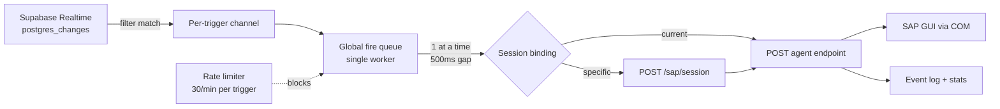
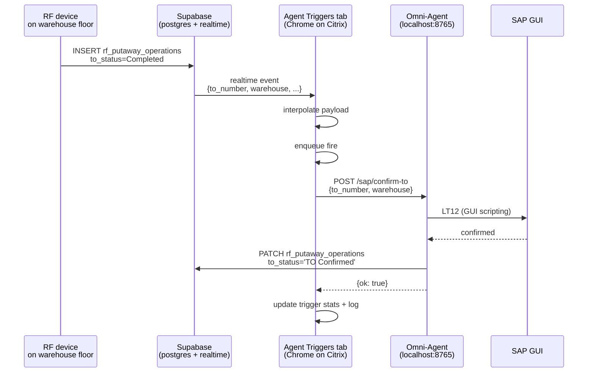

# Agent Triggers — Realtime Automation

## Purpose
A management UI + runtime engine that turns Supabase Realtime events into automated SAP transactions fired through the [[Omni-Agent - Headless SAP Agent]]. Lives as the **Agent Triggers** tab in the SAP Testing admin page (after One Click Ship).

Expands the Omni-Agent pattern from "user clicks button → SAP fires" into "database event → SAP fires automatically."

## Location
| File | Purpose |
|---|---|
| `src/features/admin/sap-testing/components/agent-triggers-tab.tsx` | Tab component: UI for managing triggers, KPI tiles, shared SAP Console, test fire |
| `src/features/admin/sap-testing/hooks/use-agent-trigger-runtime.ts` | Runtime engine: Supabase subscriptions, fire queue, rate limiting, session binding |
| `src/features/admin/sap-testing/components/sap-console-card.tsx` | Shared SAP Console component (also used by Inventory Management) |
| `src/features/admin/sap-testing/lib/console-helpers.ts` | TO# detection + handoff to TO History tab |
| `src/features/admin/sap-testing/index.tsx` | Tab registration |

## Data Model

### `AgentTrigger`
```ts
{
  id: string              // uuid
  name: string
  description?: string
  enabled: boolean
  source: {
    type: 'supabase-realtime' | 'supabase-poll' | 'manual'
    table?: string          // e.g. 'rf_putaway_operations'
    events?: ('INSERT' | 'UPDATE' | 'DELETE')[]
    filter?: string         // PostgREST syntax, e.g. 'to_status=eq.Completed'
  }
  action: {
    endpoint: '/sap/confirm-to' | '/sap/process-shipment'
    payloadTemplate: Record<string, string>  // values like '${row.to_number}'
  }
  sessionBinding: {
    type: 'current' | 'specific'
    connIdx?: number
    sessIdx?: number
  }
  stats: { lastFired?, fireCount, errorCount, lastError? }
  createdAt: string
}
```

### `EventLogEntry`
```ts
{ id, timestamp, triggerId, triggerName,
  status: 'received' | 'fired' | 'success' | 'error' | 'skipped',
  message: string
}
```

## Persistence
Triggers, event log, and console history persist in **localStorage** (v1):
- `omniframe.agent_triggers.v1` — trigger configs
- `omniframe.agent_triggers.log.v1` — structured event log (kept for KPI computation, ≤200 entries)
- `omniframe.agent_triggers_console.v1` — shared SAP Console history (≤200 entries) — written via `useSapConsole` from `sap-console-card.tsx`

> The visible UI is the SAP Console (right column). The structured event log is no longer rendered as its own card; it stays in memory + localStorage purely as the data source for the KPI tiles (Fires today / Errors today / Avg latency 1h).

**TODO**: Migrate to Supabase so triggers survive across devices + users.

## Runtime Engine Architecture



## Key Runtime Behaviors

### Serialized fire queue
SAP GUI is single-threaded per session. The runtime uses a single global queue processed by one worker. If 10 events arrive at once, 10 fires execute sequentially with a 500ms gap between them.

### Rate limiting
Per-trigger cap of 30 fires/minute (configurable via hook prop). Excess fires log as `skipped` with reason. Prevents runaway loops from poorly-configured filters.

### Session binding
- `type: 'current'` — fires against whatever SAP session the agent currently has selected (the one shown in the unified status bar)
- `type: 'specific'` — worker POSTs to `/sap/session` first to switch agent to the bound `(connIdx, sessIdx)`, then fires the endpoint

### Payload interpolation
`${row.fieldName}` placeholders in the payload template are replaced with the triggering row's column values. Missing fields resolve to empty string.

```
Template: { to_number: '${row.to_number}', warehouse: '${row.warehouse}' }
Row:      { to_number: '1048898', warehouse: 'DMC', ... }
Resolved: { to_number: '1048898', warehouse: 'DMC' }
```

### Defense-in-depth filter
Supabase's channel filter is authoritative, but the hook also re-checks filters client-side (`rowMatchesFilter`) in case events leak through network-level filtering. Mismatches log as `skipped`.

### MCA skip guard (`/sap/confirm-to` + `rf_putaway_operations`)
In `enqueueFire`, before rate-limit accounting, any row with `is_mca_workflow === true` is skipped with a clear log entry. Rationale: LT12 auto-confirm only handles non-MCA putaways — MCA-flagged rows go through a separate manual review path. The skip is hard-coded (not configurable per trigger) because:
- Supabase realtime `postgres_changes` only supports a single equality filter per channel, so `to_status=eq.Completed` cannot be combined with `is_mca_workflow=eq.false` server-side.
- It applies to ANY trigger pointed at `/sap/confirm-to` + `rf_putaway_operations` (built-in templates and user-created custom ones).
- It also applies to **test fires** — a synthetic row with `is_mca_workflow: true` is skipped, so users see the production behavior in dry runs.

Added 2026-04-27. See [[Fix-Agent-Trigger-Skip-Pending-MCA]].

### Agent offline handling
Runtime watches `agentConnected` flag. If agent is unreachable when a fire is processed, the fire is skipped with a log entry. Subscriptions stay open — triggers resume firing as soon as the agent comes back.

## UI Components (inside `agent-triggers-tab.tsx`)

### `AgentStatusBar`
Unified card showing agent connection, SAP GUI status, Citrix info, and binding target session. Similar to [[Omni-Agent - Headless SAP Agent]]'s status bar in One Click Ship.

### `StatCard` × 3
Overview: Configured Triggers, Enabled / Listening, Recent Events (24h).

### `TriggerCard` (one per trigger)
- Real-time subscription status badge (`paused` / `subscribing` / `listening` / `subscribe error` / `closed` / `agent offline`)
- Enable/disable Switch
- Meta rows: Source, Filter, Action, Session binding
- Stats: fire count, error count, last fired, last error
- Action buttons: **Test Fire** (flask icon, opens `TestFireDialog`), **Edit**, **Delete**

### `TemplatePickerDialog`
- 3 starter templates:
  1. Auto-Confirm Completed Putaways (INSERT on `rf_putaway_operations` where `to_status=eq.Completed`)
  2. Auto-Confirm Pending TO Updates (UPDATE variant for legacy rows)
  3. Queued Shipment Processor (INSERT on `shipment_queue`, full 6-step)
- Blank Trigger option for custom setup

### `EditTriggerDialog`
- Name, description
- Event source: table, INSERT/UPDATE/DELETE toggles, PostgREST filter
- Action: endpoint dropdown (only `/sap/confirm-to` and `/sap/process-shipment` — both use SAP GUI scripts), payload template JSON editor
- Session binding: `current` or `specific` with session dropdown

### `TestFireDialog`
- Auto-populates a synthetic row based on `${row.X}` references in the payload template
- User edits JSON and clicks **Fire Now**
- Bypasses Supabase subscription; goes straight to the fire queue
- Requires trigger to be enabled

### `EventLogCard`
Scrollable list (latest first) of the last 200 events. Color-coded by status. Shows timestamp, trigger name, and message.

## Important: GUI Scripts vs RFC
The trigger's `action.endpoint` refers to **the agent's endpoint at `localhost:8765`**, not the backend API. The agent endpoints use **SAP GUI scripting via COM** (translated from VBS recordings like `FullTestAAAA2.vbs` and `Confirming TO's.vbs`).

There is a separate `/api/sap/confirm-to` on the Railway FastAPI backend that uses pyrfc. **It is not wired into these triggers.** This is intentional: GUI scripts are the route that actually works today.

## Lifecycle Notes

### Subscriptions are tab-scoped
Subscriptions start when the tab mounts and stop when it unmounts. To make automation run regardless of which tab is open, a future version should move the runtime into an app-level provider. For v1, users should keep the Agent Triggers tab open during automated operation.

### Event log vs `sap_transaction_logs`
The local event log in this tab is **display-only** for the user's current session. Successful agent fires that hit `/sap/confirm-to` or `/sap/process-shipment` also get logged to the Supabase `sap_transaction_logs` table server-side by the agent itself (for audit). Those two logs are complementary.

## Example: Auto-Confirm Putaways Flow



## Open Items / Future Work
1. **Supabase-backed trigger storage** — share triggers across sessions and teammates
2. **App-level runtime provider** — keep listening when tab is not focused
3. **Trigger Approval workflows** — require manager sign-off before high-value fires
4. **Test Fire history** — remember last-used sample rows per trigger
5. **Supabase poll source type** — for tables without realtime or with rare events (check every N minutes)
6. **Retry policy per trigger** — auto-retry on agent errors with exponential backoff
7. **Dead-letter handling** — failed fires after N retries move to a review queue
8. **Webhook source type** — external systems POST to a Supabase Edge Function that writes a row to trigger the workflow

## Related
- [[Omni-Agent - Headless SAP Agent]] — the service this feature drives
- [[Implement-Agent-Triggers]] — implementation details
- [[Implement-One-Click-Ship]] — the manual-trigger version of this flow
- [[Sessions/2026-04-16]]


## 2026-05-02 — Layout polish (frontend-only)

Two changes shipped on 2026-05-02 — see [[Implement-SAP-Testing-Layout-Polish]] for the full notes.

1. **`<AgentHealthCard />` and `<AgentsFleetCard />` now live here** — between the KPI tile row and the violet `agentSideTriggersActive` banner. They were moved out of Inventory Management because the trigger runtime is the only surface that fundamentally depends on multi-agent fleet awareness (the violet banner cross-references the specific fleet agent that owns the rf_putaway_operations subscription).
2. **"SAP Agent Not Detected" full amber card replaced** with the new shared `AgentNotDetectedBanner` (`src/features/admin/sap-testing/components/agent-not-detected-banner.tsx`). Same component is used on Inventory Management. The Agent Triggers tab passes a custom `message` prop so the copy still carries the "triggers can be configured but won't fire until the agent is running" nuance. The local `AgentStatusBar`'s `missing` branch now returns `null`; the banner renders at the very top of the tab content when `agentStatus === 'missing'`.

No trigger semantics, runtime, or capability gating touched. No agent rebuild, no migrations.


## 2026-05-02 round 2 — Enterprise control-center redesign

Same-day continuation of the layout polish above — see [[Implement-SAP-Testing-Layout-Polish]] § Round 2 and the new [[Unified-Workbench-Card-Layout]] pattern. User asked for "a true enterprise grade control center" treatment; the entire tab was restructured.

1. **KPI strip — 5 floating cards collapsed into 1 unified bar**. Replaced `KpiTile` (each its own `<Card className='h-20'>` with rounded icon box + value + sub) with `KpiCell` (plain `<div>` with `hover:bg-accent/30`). Outer wrapper is a single `<Card className='gap-0 overflow-hidden p-0 shadow-sm'>` with an inner `divide-x lg:divide-y-0` grid. Larger 20px value with `tabular-nums`. Reads as one continuous status bar instead of 5 floating boxes with 8px gutters.
2. **Observability stack — Health + Fleet, neutral chrome**. Dropped the loud `border-blue-500/30` (Health) and `border-emerald-500/30` (Fleet) borders that competed for visual attention. Both cards now use neutral chrome (`gap-0 py-0 shadow-sm`) with eyebrow CardTitles (`text-[11px] font-semibold tracking-[0.08em] uppercase`). The activity-blue and server-emerald color is preserved on the icon only. Both cards are wrapped in a `<div className='space-y-2'>` group so they read as paired observability panels (vs the 16px gap the parent gives every other section). Their internal collapse/expand behavior is unchanged — only header chrome.
3. **Workbench panel — Triggers list + Console combined**. Previously a 5-col grid with `<div className='space-y-3 lg:col-span-3'>` for triggers + `<div className='lg:col-span-2'><SapConsoleCard /></div>`. Now wrapped in one outer `<Card className='gap-0 overflow-hidden p-0 shadow-sm lg:h-[calc(100vh-260px)] lg:min-h-[480px]'>` with an internal `divide-x` split. Triggers section: clean header bar with eyebrow title + count badge + Test Fire + Add Trigger. Console embedded with `gap-3 rounded-none border-0 py-4 shadow-none lg:h-full` to strip its own chrome.

Trigger semantics, runtime, KPI computation, capability gating, and rate-limiting all UNCHANGED. Pure layout shell. `npx tsc --noEmit --skipLibCheck` passes between every step.


## 2026-05-03 — Mission Control + Fleet & Diagnostics consolidation (round 3)

Following the [[Implement-SAP-Testing-Layout-Polish]] round-1+2 work, the layout was further consolidated from **5 vertical sections** to **3** by fusing pairs of Cards that already belonged together. See [[Sessions/2026-05-03]] for the full session log.

### New top-down structure
1. **Conditional alert banners** (only when applicable): Agent-not-detected · Session-expired · Agent-side-triggers-active. All grouped at the very top so the user sees actionable state before any data.
2. **Mission Control Header** (always): single bordered Card with a `<StatusStrip />` row (env pill, version, SAP GUI badge, Connect Account, refresh) above a 5-cell KPI grid (Triggers · Fires Today · Errors Today · Avg Latency · Online Agents). Border colour reflects agent state (emerald connected · amber unauthenticated · red missing · none checking). Replaces the previous separate `AgentStatusBar` + `KpiRow`.
3. **Fleet & Diagnostics** (always): single bordered Card with the existing `AgentHealthCard` and `AgentsFleetCard` rendered side-by-side via a `lg:grid-cols-2 lg:divide-x` divider. Both child cards now accept a `className` prop and are passed `gap-0 rounded-none border-0 py-0 shadow-none` so the parent Card owns the chrome — same pattern the round-2 workbench used for `SapConsoleCard`.
4. **Trigger Runtime Workbench** (always): Triggers list + Console — unchanged from round 2.

### Files
- `src/features/admin/sap-testing/components/agent-triggers-tab.tsx` — new `MissionControlHeader` + `StatusStrip` components; removed `AgentStatusBar` + `KpiRow`.
- `src/features/admin/sap-testing/components/agent-health-card.tsx` — added `className?: string` prop.
- `src/features/admin/sap-testing/components/agents-fleet-card.tsx` — added `className?: string` prop.

### Why this consolidation
- The empty-state screenshot showed Health card with a near-empty header when agent was disconnected (no metrics to display) — putting it side-by-side with the Fleet card means even when one panel is sparse, the other carries the row.
- Connection status and runtime metrics are read together in practice; merging them into one Mission Control header eliminated the visual discontinuity between two stacked status-flavoured Cards.
- Kept all functionality (env pill, Connect Account, Recheck CTA, refresh, all 5 KPIs, fleet purge/show-all controls) — purely a chrome consolidation.
