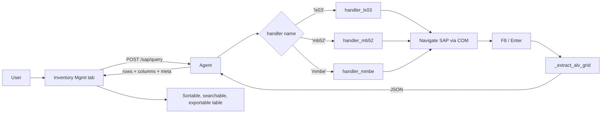

# Inventory Management — SAP Query Framework

## Purpose
A realtime inventory viewer that pulls structured data from any SAP transaction (LX03, MB52, MMBE, and extensible to more) without the user having to navigate through SAP GUI screens manually. Lives as the **Inventory Management** tab in the SAP Testing admin page.

Generalizes the Omni-Agent pattern: where [[Omni-Agent - Headless SAP Agent]] executes *mutations* (confirm TO, process shipment), this feature executes *queries* — navigate to a transaction, enter inputs, execute, scrape ALV grid, return JSON.

## Location
| File | Purpose |
|---|---|
| `src/features/admin/sap-testing/components/inventory-management-tab.tsx` | Tab UI: query picker, dynamic inputs, results table with sort/search/export |
| `omni_agent/agent.py` (handlers section) | Query registry + per-transaction handlers (`handler_lx03`, `handler_mb52`, `handler_mmbe`) + `/sap/query` endpoint + ALV grid extraction helper |

## Architecture



## Agent-Side: Query Framework

### `POST /sap/query`
```json
{
  "handler": "lx03",
  "params": { "material": "23087914", "warehouse": "PDC" }
}
```
Response:
```json
{
  "ok": true,
  "columns": [{"id": "MATNR", "title": "Material"}, ...],
  "rows": [{"MATNR": "23087914", "LGPLA": "RK-63-A-01", ...}, ...],
  "total": 14,
  "meta": {"transaction": "LX03", "material": "23087914", "warehouse": "PDC"}
}
```

### `GET /sap/query-handlers`
Lists registered handler names. Lets frontend discover what's available without hardcoding.

### Registry
```python
QUERY_HANDLERS = {
    "lx03": handler_lx03,
    "mb52": handler_mb52,
    "mmbe": handler_mmbe,
}
```
Add a new entry to register a new handler. That's the only agent-side change needed to support a new transaction.

### Helpers
- **`_extract_alv_grid(sess, candidate_ids=None)`** — Tries common SAP ALV grid shell IDs until one responds. Reads `ColumnOrder`, `RowCount`, iterates `GetCellValue(row, col_id)`. Returns `{columns, rows, total}`.
- **`_extract_table_control(sess, table_id, field_ids)`** — For older GuiTableControl widgets (not ALV). Handles scrolling to read beyond the visible viewport.
- **`_safe_get(obj, attr, default)`** — Safely reads COM attributes that may not exist.

## Handlers (Initial Set)

### `handler_lx03` — Display Bin Stock per Material
- **Inputs:** `material` (required), `warehouse` (required), `plant` (optional)
- **Flow:** `/nLX03` → set `S_LGNUM-LOW` / `S_MATNR-LOW` (tries multiple ID variants) → F8 → ALV grid scrape
- **Output:** All storage bins containing the material with quantity, unit, etc.

### `handler_mb52` — List Warehouse Stocks on Hand
- **Inputs:** `material`, `plant`, `storage_location` (all optional — returns wider scope if blank)
- **Flow:** `/nMB52` → set selection screen fields → F8 → ALV grid scrape

### `handler_mmbe` — Stock Overview (Single Material)
- **Inputs:** `material` (required), `plant` (optional)
- **Flow:** `/nMMBE` → enter material → F8 → tree widget extraction with fallback to ALV
- **Note:** MMBE output is hierarchical (a tree), not flat rows. Handler traverses the tree and flattens to rows for display.

## Frontend Components

### `InventoryManagementTab`
Root component with 2-column layout: query library sidebar (320px) + main panel.

### `QueryLibraryCard`
Groups queries by category (`warehouse`, `inventory`, `custom`). Click a query to load its input panel.

### Input panel
Dynamically rendered from `selectedQuery.inputs`. Each field is an `<Input>` with label, placeholder, required marker. Enter key submits the query.

### `ResultsCard`
- Row count badge + filtered count badge
- In-table search (filters across all columns)
- CSV export button
- Meta badges (e.g. `transaction: LX03`, `material: 23087914`)
- Sticky header table with per-column sort (click column header to toggle asc/desc/clear)
- Numeric-aware sort: detects number columns and sorts numerically
- Max-height 600px with sticky-header scroll

### `AgentStatusBar`
Reused pattern from One Click Ship and Agent Triggers.

## Query Definition Model (frontend)

```ts
interface QueryDefinition {
  id: string                    // unique: 'lx03-bin-stock'
  name: string                  // display: 'Bin Stock by Material'
  description: string
  transaction: string           // 'LX03' (badge)
  handler: string               // 'lx03' (matches agent registry)
  category: 'inventory' | 'warehouse' | 'custom'
  icon: React.ComponentType<{ className?: string }>
  inputs: QueryInputField[]
  defaultColumns?: string[]
  hiddenColumns?: string[]
}
```

`QUERY_LIBRARY` is a hardcoded constant in the tab. To add a query, add an entry here (frontend) + a handler in the agent.

## Persistence
**`omniframe.inventory_query_inputs.v1`** — last-used input values per query, saved to `localStorage`. Re-loaded when user switches back to a query they've run before.

## Workflow for Adding a New Query

Recommended split-ownership workflow (see [[Implement-Inventory-Management]]):

1. **User records** the navigation in SAP GUI (transcode, enter inputs, execute, apply desired layout). Save as `.vbs`.
2. **Engineer translates** the recording into a Python handler:
   - Copy the element IDs from VBS into `findById()` calls
   - Add the `_extract_alv_grid()` call after execution
   - Add parameter validation and error handling
   - Register in `QUERY_HANDLERS`
3. **Engineer adds query config** to `QUERY_LIBRARY` on the frontend (metadata only — name, inputs, default columns)
4. **Rebuild + deploy:** agent .zip re-uploaded to Supabase, frontend auto-deploys via Railway

This split means users get accurate SAP integration (from recording) without learning Python, while engineers don't have to guess at element IDs.

## Extraction Strategy

SAP GUI has multiple grid widgets and no single API covers all. The framework tries in order:
1. **ALV Grid** (`GuiGridView`) — Modern. `GetCellValue(row, col_id)`. Most reports use this.
2. **Table Control** (`GuiTableControl`) — Older. Need to scroll the vertical scrollbar to read all rows.
3. **Tree** (`GuiShell` with tree columns) — MMBE, RM07DOCS, etc. `GetAllNodeKeys()` + `GetNodeTextByKey()`.
4. **List output** (raw text) — Fallback. Screen scrape.

## Security
- Handlers run synchronously in the agent request thread — no auth beyond what the SAP GUI session already has
- Queries are read-only: no writes to SAP
- The agent shares the user's SAP session, so all queries are audited server-side by SAP under the user's SAP account

## Limitations
- **No streaming for large result sets** — entire result is loaded into memory. For >10k rows, pagination via layout filters is recommended.
- **Layout-sensitive** — if the user has a custom layout applied, column IDs may differ. Handlers can pass `candidate_ids` to `_extract_alv_grid()` to try multiple.
- **No automatic layout selection** — handler doesn't click "Choose Layout" yet. Runs with whatever layout is the default.

## Future Enhancements
- **Auto-apply layout** — handler accepts `layout` param and navigates Goto → Layout → Choose
- **Paginated / incremental results** — stream rows back as SAP returns them
- **Saved queries** — user-created presets stored in Supabase (currently localStorage)
- **Multi-transaction queries** — chain outputs (LX03 material → MB52 detail per plant)
- **Compare mode** — run same query twice with different inputs side-by-side
- **Scheduled refresh** — auto-run query every N minutes, highlight changes
- **Chart mode** — visualize numeric columns instead of tabular
- **Favorites** — pin frequently-used queries to the top of the library

## Related
- [[Omni-Agent - Headless SAP Agent]] — service that executes queries
- [[Implement-Inventory-Management]] — implementation details
- [[Agent-Triggers - Realtime Automation]] — automation counterpart (writes, not reads)
- [[Implement-One-Click-Ship]] — form-driven SAP writes
- [[Sessions/2026-04-16]]


## 2026-05-02 — Layout polish (frontend-only)

Three changes shipped on 2026-05-02 — see [[Implement-SAP-Testing-Layout-Polish]] for the full notes.

1. **Health/Fleet cards moved out**. The `<AgentHealthCard />` and `<AgentsFleetCard />` mounts that used to render between the Auto-update banner and the Query Library row were removed from this tab and added to the Agent Triggers tab (between KpiRow and the violet `agent-side-triggers` banner). Inventory Management still imports `useOnlineSapAgents` for the `BatchModePanel` "Pin to agent" picker, but no longer renders the cards themselves. Rationale: the trigger runtime is the only surface that fundamentally depends on multi-agent fleet awareness; queries from this tab always run against the locally-attached agent.
2. **Bulky "SAP Agent Not Detected" amber card replaced** with the new shared `AgentNotDetectedBanner` (`src/features/admin/sap-testing/components/agent-not-detected-banner.tsx`, ~50 LOC). The new banner is a 32px-tall amber strip with a text-button Retry. The `AgentStatusBar`'s `missing` branch now returns `null` and the banner renders at the very top of the tab content when `agentStatus === 'missing'`. Same component is used on Agent Triggers (with a slightly different `message` prop).
3. **Active query Card got a compact crumb header**. Replaced the big icon + name + transaction-badge + description block with a two-row crumb (`Warehouse / LT10`) + name + smaller description, plus a new `categoryLabel()` helper that's reused inside `QueryLibraryCard` so the sidebar category section headers also pick up proper casing (`Master Data` instead of `master-data`).

No handler / SAP / batch-mode / dialog logic touched. No agent rebuild, no migrations, no `LATEST_AGENT_VERSION` bump.


## 2026-05-02 round 2 — Workbench unification + section polish

Same-day continuation of the layout polish above — see [[Implement-SAP-Testing-Layout-Polish]] § Round 2 and the new [[Unified-Workbench-Card-Layout]] pattern.

1. **Three Cards → one bordered workbench**. Library / Form / Console previously rendered as three independent `<Card>` siblings inside a `lg:grid-cols-[280px_1fr_1fr]` grid with a 24px gutter between them. They now sit inside a single outer `<Card className='gap-0 overflow-hidden p-0 shadow-sm'>` with an internal `lg:divide-x` between columns. Each child Card uses `gap-3 rounded-none border-0 py-4 shadow-none lg:h-full` to strip its own chrome — only the outer rounded border + shadow shows.
2. **Query Library button redesign — fixed truncation**. Names like "List Warehouse Stocks on Hand" and "Material Master — Storage Bin" were truncating with ellipsis because the inline `truncate` class was fighting the right-aligned transaction badge for horizontal space in a 260px column. New layout stacks the name (free to wrap multi-line via `leading-snug`) on top + transaction code mono small below. Active state is now `bg-accent` + 2px primary accent bar on the left edge instead of an outlined-border box. Header switched to small uppercase eyebrow with a count badge.
3. **Form header modernized**. Three-tier hierarchy: small uppercase eyebrow with category icon → 15px bold title with right-aligned transaction badge → `line-clamp-2` description. Replaces the round-1 crumb `Warehouse / LT10` pattern with a layout that better separates category, name, and transcode without stacking them on one line.
4. **Console terminal area no longer a black square**. The shared `SapConsoleCard`'s dark terminal area was running edge-to-edge inside the new flush container. Fix: CardContent gets `px-3 pb-3` inset padding and the terminal `<div>` becomes a floated panel (`rounded-lg border border-zinc-800/40 bg-zinc-950/40 shadow-inner`). Reads as "panel within a panel."

`QueryLibraryCard` gained an optional `className?: string` prop so the parent passes embedded-mode chrome overrides without forking the component. No agent / SAP / handler changes; pure layout shell.


## 2026-05-07 round 4 — Two-pane redesign + console drawer

Round-4 layout pass — see [[Implement-Inventory-Mgmt-Two-Pane-Redesign]] for the full diff. Replaced the round-2/3 fixed-height 3-column unified workbench (`lg:grid-cols-[260px_1fr_1fr] lg:h-[440px]`) with a flexible **two-pane layout**:

1. **Left rail** (`lg:sticky lg:top-3`, max-height `calc(100vh-180px)`, 400px wide) stacks Query Library (capped at 42vh) + the active query Form Card. Sticks while results scroll long.
2. **Right pane** is results-first — always rendered, shows new `<ResultsEmptyState />` when no query has run yet (icon halo + category eyebrow + last-run meta + agent-status callout).
3. **Console drawer** decoupled from the workbench. Toggle button right-aligned in the new `<AgentStatusBar />` strip; drawer state persisted to `omniframe.inv-mgmt.console-open.v1`.

`AgentStatusBar` collapsed from a `py-3` Card to a `h-10` strip in all four states (`checking` / `missing` / `unauthenticated` / `connected`). Three new props pipe through the Console toggle (`consoleOpen` / `onToggleConsole` / `consoleMessageCount`).

`QueryLibraryCard` gained a header filter input (case-insensitive `name + transaction`) plus subtle category accent stripes — every library button now has a 2px coloured stripe on its left edge (faded when inactive, full saturation when active). `CATEGORY_ACCENT` map: warehouse=blue, inventory=emerald, master-data=amber, tools=violet, custom=slate.

No agent / handler / SAP / migration / capability changes. `pnpm build` passes; chunk size `feature-admin-sap` 427 kB / 115 kB gzip.


## 2026-05-07 — LT01 form expansion + LT10 column add

### LT10 grid — new `Special Stock Number` column

`LT10_COLUMNS` in `inventory-management-tab.tsx` gained a new entry inserted between `Special Stock` and `Last Inventory`:

```ts
{ title: 'Special Stock Number', match: 'Special Stock Number' },
```

The smart-header parser (`_parse_attempt_b_tab_delimited` in `agent.py`) is column-count agnostic, so older LT10 exports without the column simply render an empty cell — no parser change needed. The 2026-05-07 `UpdatedLT10` reference export confirms the SAP layout order: `Sl Typ Plnt SLoc StorageBin Material Stock Avail.stck PutawayStk Pick qty S S Last inv. Batch IA PB RB Special Stock Number`.

Project-stock rows (`SOBKZ=Q`) populated in the new export show the WBS / handling-unit id (e.g. `I.LJL83A`).

### LT01 dialog — new "Stock attributes" section

`TransferInventoryDialog` gained a dashed-border section below the editable target block with three optional inputs:

| Field | SAP Control | Validation |
|---|---|---|
| Stock Category (BESTQ) | `ctxtLTAP-BESTQ` | 1 char, auto-uppercased |
| Special Stock (SOBKZ) | `ctxtLTAP-SOBKZ` | 1 char, auto-uppercased |
| Special Stock No. (LSONR) | `txtRL03T-LSONR` | variable, **disabled until SOBKZ is non-empty** |

Gated on `hasCapability(agentHealth, 'lt01-stock-fields')` — older agents render the inputs disabled with a `Requires agent v2.0.1+` badge so users aren't confused about why their values disappear. All three default to blank so the standard own-stock unrestricted flow keeps working unchanged.

The payload sent to `/sap/transfer-inventory` adds `stock_category`, `special_stock_indicator`, `special_stock_number`. The agent's Pydantic `TransferInventoryRequest` defaults each to `""` and the handler skips the SAP control when empty (so old agents that don't yet declare the capability silently no-op via Pydantic's `extra='ignore'` default).

### Persistence

LT10 results remain a pure in-memory query/display path — no `inventory_grid` Supabase table exists. The only `special_stock_number` Supabase column lives on `lx03_data` (a separate LX03-import flow used by the kit-build planner), already shipped previously.

See [[2026-05-07]] § "LT01 form expansion + LT10 parser column add" for the full implementation arc.


### Follow-up (later 2026-05-07) — Print Destination (LDEST) added to the same dialog

Fourth input added to the existing "Stock attributes" dashed-section in `TransferInventoryDialog`. No new visual treatment introduced.

| Field | SAP Control | Validation |
|---|---|---|
| Print Destination (LDEST) | `ctxtLTAP-LDEST` | Up to 4 chars, auto-uppercased, **always editable** when capability present (independent of SOBKZ chain) |

Layout: spans `sm:col-span-3` on the 3-up grid so it visually pairs as a full-width row below BESTQ/SOBKZ/LSONR. Helper text reads: "(LDEST) — optional, overrides default printer (e.g. `PG44`)". The capability gate (`hasCapability(agentHealth, 'lt01-stock-fields')`) still controls all four fields jointly — the LDEST input was intentionally folded into the same capability ID so the FE keeps a single gate.

Payload sent to `/sap/transfer-inventory` adds `print_destination: printDestination.trim().toUpperCase()`. Old agents that don't yet declare the capability still receive the key but silently ignore it via Pydantic `extra='ignore'`.


### UX polish (late 2026-05-07) — autoprefill + label cleanup

- `TransferInventoryPrefill` interface extended with three optional fields (`sourceStockCategory`, `sourceSpecialStockIndicator`, `sourceSpecialStockNumber`) so the LT10 row action can carry the source-row attributes through to the dialog without a second lookup.
- The `TransferInventoryDialog` prefill `useEffect` consumes them: BESTQ + SOBKZ are trimmed and uppercased before being seeded; LSONR keeps original casing (mixed-case ids like `I.LJL83A` for project-stock handling units), and is only seeded when SOBKZ is non-empty (rows from older LT10 layouts that lack the `Special Stock Number` column trim to blank and fall through). LDEST is intentionally NOT prefilled — it's a per-action printer override.
- Label parentheticals removed across all four inputs to reduce visual clutter (`Stock Category (BESTQ)` → `Stock Category`, etc). Section heading and helper text unchanged.


## 2026-05-07 — Inventory Adjustment workflow

New end-to-end feature shipped same day as the LT01 form expansion above. See [[Implement-Inventory-Adjustment-Workflow]] for the full design. Highlights:

- New agent endpoint `POST /sap/zmm60/lookup` (capability `zmm60-price-lookup`) reads the ZMM60 unit `Price` column for a material/plant. Implementation lives in `omni_agent/zmm60_lookup.py` (sibling pattern to `material_master_read.py`); reuses the agent's existing `_extract_via_pc_export()` for the bulk-export parse so the multi-format parser + banner penalty + pre/post-commit error taxonomy are inherited.
- New Supabase table `public.inventory_adjustment_staging` (migration 288) with `extended_value` as a `GENERATED ALWAYS AS (total_stock * unit_value) STORED` column and the full ZMM60 row in `zmm60_raw JSONB`. Org-scoped RLS; not in the supabase_realtime publication (per [[realtime-policy]]).
- New `+ Add to Inv. Adjust` action on `LT10_COLUMNS.rowActions`, gated on `zmm60-price-lookup`. Calls the agent, INSERTs the row, invalidates the TanStack Query cache `['inventory-adjustment-staging', orgId]`.
- New **Inventory Adjustment** entry in the Query Library (category `inventory`, icon `Wallet`, `kind: 'tool'`). Renders `<InventoryAdjustmentView />` (`src/features/admin/sap-testing/components/inventory-adjustment-view.tsx`) with three stat cards (Net Value / Gross Gains / Gross Losses), a sortable staging table with per-row Remove (with confirm dialog), and an `Export to Excel` button (filename `inventory_adjustment_YYYYMMDD_HHmm.xlsx`, lazy-imports `exceljs`).
- Stat-card semantics with negative-stock data: Gains = `SUM(extended_value WHERE total_stock > 0)`; Losses = `SUM(ABS(extended_value) WHERE total_stock < 0)`; Net = sign-aware `SUM(extended_value)`. Mixed-currency rows trigger a `Mixed currencies` hint and per-row Intl formatting.
- AGENT_VERSION stays at 2.0.0 — additive capability, no version bump. `feature-admin-sap` chunk: 446 KB / 120 KB gzip (was 427 KB / 115 KB).


## 2026-05-09 round 5 — Unified Detail Pane

Round-5 polish on the same tab. Round 4 (see [[Implement-Inventory-Mgmt-Two-Pane-Redesign]]) introduced a sticky two-pane layout with the Library + active query Form Card stacked in the left rail. User feedback flagged that selecting a query scrolled the Library out of view to surface the form below it, AND that the description (in the right-pane empty state) was visually divorced from the form fields (in the left rail) — forcing a down-and-left eye trip every time.

Round 5 lifts the Form Card out of the left rail and into the **right pane** as a **unified Query Detail Card** that composes identity → description → status row → inputs → Run CTA → Batch panel in one scannable column. See [[Implement-Inventory-Mgmt-Detail-Pane-Redesign]].

1. **Layout**. `lg:grid-cols-[400px_1fr]` (round 4) → `lg:grid-cols-[320px_1fr]` (round 5). Left rail is the Library alone, sticky, capped at `viewport-180px`. Right pane is a flex column: Detail Card on top, ResultsCard (or compact placeholder) below.
2. **Query Detail Card** (new). 3-band visual hierarchy without nesting Cards: header band (`px-6 pt-5 pb-3`, eyebrow + name + transcode badge + line-clamp description) → status band (`bg-muted/30 border-y px-6 py-2 text-[11px]` — last-run / input count / agent-gating callout) → content band (`px-6 py-4` — inputs grid + actions + BatchModePanel). Outer Card uses `gap-0 py-0` so the bands sit flush against each other.
3. **Status strip is always visible**. The agent-offline message used to live inside the empty-state Card (`'Start the SAP agent to enable this query.'`) and disappeared after the first query ran. Now it lives in the Detail card's status band on every page state, including post-run with stale results loaded.
4. **Inputs grid widened**. `md:grid-cols-2` → `md:grid-cols-2 lg:grid-cols-3`. The 3-input LT10 form (Material / Warehouse / Storage Type) fits on one line at `lg`+ instead of wrapping.
5. **LT01 demoted to a chip**. The "Transfer Inventory (LT01)" button changed from a `w-full` full-width row beneath the form to an `sm` outline chip in the same flex row as Run + Batch Mode. Same capability gate (`transfer-inventory`), same prefill payload (`manual: true`), same dialog.
6. **Run-button tooltip mirrors the status strip**. `disabledReason` now covers BOTH capability-missing AND offline-agent cases (`Start the SAP agent…` / `Reconnect the agent account…` / `Checking agent…`) so the disabled button is self-explanatory on hover even when the inline strip is scrolled off.
7. **`ResultsEmptyState` compacted**. Props collapsed from `{ query, lastRunAt, agentStatus }` to `{ query }`. Body shrunk from a 400px Card with duplicate identity (icon halo + eyebrow + name + description + last-run + agent gating) to a 64px dashed-border row (`<Layers />` icon + "No results yet" + "Run `{transcode}` from the form above to populate this area."). Identity now lives in the Detail card directly above; no duplication.
8. **Inventory-adjustment tool branch** column aligned to 320px (was 400px) for visual consistency. Recorder + Reversal-Engine branches keep their existing 360px column since they replace the whole workspace.

No handler logic, capability gate, persistence key, or dialog touched. No agent rebuild, no migration, no `LATEST_AGENT_VERSION` bump. Pure layout shell.

`pnpm exec tsc -b` clean. ESLint clean (0 errors, 1 pre-existing `pollRef.current` cleanup warning at line 1199). Repo-wide warning count unchanged before/after this edit.


## 2026-05-09 round 6 — Local / Fleet routing toggle

Same-day follow-up to the round-5 unified detail pane above. New tab-level toggle that flips every in-scope inventory action between two execution modes:

- **Local Agent** (default) — browser → `localhost:8765` direct fetch (today's behaviour).
- **Fleet Agent** — browser → `sap_agent_jobs` queue claim-pinned to a picked Citrix agent → result returns via `WsEvent::SapJobStatusChanged`.

Mirrors the SmartImportButton's LT22-import fleet-routing pattern ([[Patterns/Fleet-Aware-Smart-Routing]]) but generalised so the WHOLE tab follows one knob instead of each surface deciding individually via `bestAgentFor()`. See [[Implement-Inventory-Management-Fleet-Routing]] for the full design.

### What landed

- New hook `useExecutionMode()` (`src/features/admin/sap-testing/hooks/use-execution-mode.ts`, ~340 LOC) owns the routing decision + persists to `localStorage` (`omniframe.sap-testing.inventory.executionMode` / `…fleetAgentId`). Single `dispatch(endpoint, payload, opts)` entry-point routes BOTH paths to the same `NormalizedDispatchResult<T>` envelope.
- New toggle UI `<InventoryExecutionModeToggle />` (`src/features/admin/sap-testing/components/inventory-execution-mode-toggle.tsx`, ~165 LOC) renders just below `<AgentStatusBar />`. Segmented Local | Fleet button group + (when fleet) agent picker dropdown + capability warning when the picked agent doesn't advertise the active query's required cap.
- Per-query call-site migration in `inventory-management-tab.tsx`: `runQuery`, `runMutation`, `runBatch`, `handleAddToInventoryAdjustment`, `TransferInventoryDialog.handleSubmit`, and `BinBlocksDialog.handleSubmit` all swap `agentFetch(endpoint, ...)` for `executionMode.dispatch(endpoint, payload, {capability})`. The Phase 5 Material Master path keeps `postMaterialMasterMutation(...)` but now passes `executionMode.getAssignedAgentId() ?? pinnedAgentId` so the toggle's pick wins.
- SAP Recorder + Reversal Engine bypass the toggle entirely — they keep `agentFetch` direct because they need the LIVE local SAP GUI session. Library entries gain a `Local-only` pill + 50% opacity in fleet mode; opening either entry surfaces a `<LocalOnlyToolBanner />` in the right pane.
- Agent registration delta in `omni_agent/agent.py`: one-line registration of `Zmm60LookupRequest` in `_JOB_ENDPOINT_MODELS` so `_dispatch_job` correctly instantiates the Pydantic model on a queue-claimed `/sap/zmm60/lookup` job. **No `AGENT_VERSION` bump** — additive registration.

### Capability map (query → required cap)

| Query | Endpoint | Required cap |
|---|---|---|
| LT10 / MB52 / MMBE | `/sap/query` | `lt10` / `mb52` / `mmbe` |
| ZMM60 (`+ Add to Inv. Adjust`) | `/sap/zmm60/lookup` | `zmm60-price-lookup` |
| LT01 (Transfer Inventory) | `/sap/transfer-inventory` | `transfer-inventory` |
| LS02N (Bin Blocks) | `/sap/bin-blocks` | `bin-blocks` |
| MM02 (Storage Bin) | `/sap/material-master-bin` (Phase 5 wrapped) | `mm02-bin` |
| MM02 (Storage Types) | `/sap/material-master-storage-types` (Phase 5 wrapped) | `mm02-storage-types` |
| LS01N (Create Storage Bin) | `/sap/create-storage-bin` | `create-bin` |

Recorder + Reversal Engine: bypass.

### Constraint compliance

- ✅ No new `supabase.channel(...)` callsites — fleet path uses the singleton `workServiceWs` via the shared `useJobQueue`.
- ✅ No new dependencies; no `manualChunks` change.
- ✅ `AGENT_VERSION` stays at `2.0.0`; rust-work-service version stays at `0.1.35`.
- ✅ `pnpm exec tsc -b` clean. `pnpm build` clean. `feature-admin-sap` chunk: 451.46 → 454.51 KB raw / 121.41 → 122.43 KB gzip (+3.05 KB raw, +1.02 KB gzip).

### Persistence

| Key | Type | Default |
|---|---|---|
| `omniframe.sap-testing.inventory.executionMode` | `'local' \| 'fleet'` | `'local'` |
| `omniframe.sap-testing.inventory.fleetAgentId` | string \| null | `null` (auto-pick first online on first flip) |


## 2026-05-09 — LT24 TO History query (custom result renderer)

A new pattern was introduced for queries that need a **custom result rendering** (not the standard `<ResultsCard />` table). The `lt24-history` entry under WAREHOUSE keeps the standard form / dispatch / capability gating BUT replaces the result panel with `<TransferOrderHistoryView />` based on a single `selectedQuery.id === 'lt24-history'` branch in the rendering tree.

This is distinct from `kind: 'tool'` (which replaces the ENTIRE workspace, form included — used by Recorder, Reversal Engine, Inventory Adjustment). Use this `id` branch when the query benefits from the standard form + dispatch but needs a richer-than-table result display.

When adding the next custom-result query:
1. Add the entry to `QUERY_LIBRARY` as a normal query (handler / requiredCapability / inputs).
2. Optionally add an "at least one of" gate keyed off the new id in `runQuery`.
3. In the rendering tree, add a `selectedQuery.id === '...'` branch BEFORE the `result ?` ternary so it wins over the default `<ResultsCard />`.
4. Pass the existing `result`, `isRunning`, current inputs, and a `queryKey` (use `${id}|${lastRunAt}`) so the custom view can reset its internal state on re-run.

See [[Implementations/Implement-LT24-History-Trail]] for the canonical example.


## 2026-05-10 — LX25 Inventory Completion (5-warehouse fan-out)

New **Inventory Completion** entry under the WAREHOUSE category (next to LT10 / LT24). Uses the same custom-result-renderer pattern documented in the LT24 section above (`selectedQuery.id === 'lx25-inventory-completion'` branch swaps in `<InventoryCompletionView />` instead of the default `<ResultsCard />`), plus a NEW pattern for **multi-warehouse fan-out** behind a single click. See [[Implementations/Implement-LX25-Inventory-Completion]] for the full design.

### What landed

- New agent endpoint `POST /sap/lx25/inventory-completion` (capability `lx25-inventory-completion`) loops through 5 warehouses sequentially in a single SAP COM session, runs LX25 with each warehouse's dedicated SAP variant, and returns one envelope: `{ ok, warehouses: [...], totals: {...}, meta: {...} }`. Per-warehouse failures are captured inline and DO NOT abort the rest of the fan-out. Implementation lives in `omni_agent/lx25_inventory_completion.py` (sibling pattern to `zmm60_lookup.py` / `material_master_read.py` / `lt22_import.py`).
- New custom result renderer `<InventoryCompletionView />` (`src/features/admin/sap-testing/components/inventory-completion-view.tsx`) — aggregate stat card + 5 per-warehouse cards in a `grid-cols-1 sm:grid-cols-2 lg:grid-cols-5` grid + searchable/sortable detail table with warehouse chip filter row + CSV export. Uses [[Patterns/Elevated-KPI-Stat-Cards]] for the cards (multi-stop shadow stack, top accent line, radial hover glow, reduced-motion safe).
- New shared types + constants file `inventory-completion-types.ts` — `LX25_WAREHOUSES` constant + result type definitions. Lives in its own `.ts` (NOT inline in the `.tsx` view) so the view stays a pure component file (avoids the `react-refresh/only-export-components` warning that would fire on a mixed-export `.tsx`).
- The hardcoded variant mapping (`LX25_WAREHOUSES`) is duplicated in both Python (`lx25_inventory_completion.py`) and TypeScript (`inventory-completion-types.ts`) so each side falls back to the same default list when its caller doesn't override. Adding/removing a warehouse needs both updated.
- Read-only **Variants Summary** panel renders in the Detail Card above the Run button (only when this query is selected) so the user sees exactly which 5 warehouses + variants will run before clicking. Replaces the standard inputs grid (this query has zero inputs).
- Per-call `timeoutMs: 8 * 60 * 1000` on the dispatch (the 5-warehouse loop typically takes 30-60s; bump from the 5min default avoids a Citrix VDA cliff).

### Pattern: multi-warehouse server-side fan-out

For a future query that needs the same shape (multi-N fan-out, hardcoded list of inputs, custom dashboard renderer):

1. **Agent**: write a new sibling module under `omni_agent/` (mirror to `MacWindowsBridge/Omni-Agent/`). Define a Pydantic request with an `Optional[list[X]]` field that defaults to a module-level `XX_DEFAULTS` constant. Mount via the lazy `app.include_router(...)` block at the bottom of `agent.py`. Register the model in `_JOB_ENDPOINT_MODELS` so fleet-mode queue dispatch builds the model from the JSON body.
2. **Capability**: add a `xx-fan-out` id to `AGENT_CAPABILITIES`. The FE gates the Run button on it.
3. **FE constants/types**: extract the default list + result types into a `.ts` file (NOT in the `.tsx`) so the view file stays a pure component file. Keep the FE list in lockstep with the Python constant — they're the source of truth on each side.
4. **FE view**: write a custom result renderer component. Don't try to fit a multi-warehouse / multi-row-per-entity result into the flat-table `<ResultsCard />` shape; aggregate cards + nested detail table reads better.
5. **FE dispatch branch**: in `runQuery`, add a `selectedQuery.id === '...'` early branch that posts to the new endpoint, stores into a separate state slot (because the response shape is structurally different), and short-circuits the standard `/sap/query` dispatch.
6. **FE rendering branch**: in the result panel area, add a `selectedQuery.id === '...'` branch that swaps in the custom view BEFORE the `result ?` ternary.

This keeps the form/dispatch/capability infrastructure shared while letting the renderer + the agent endpoint be wholly bespoke. See [[Implement-LX25-Inventory-Completion]] for the canonical example of this pattern.
