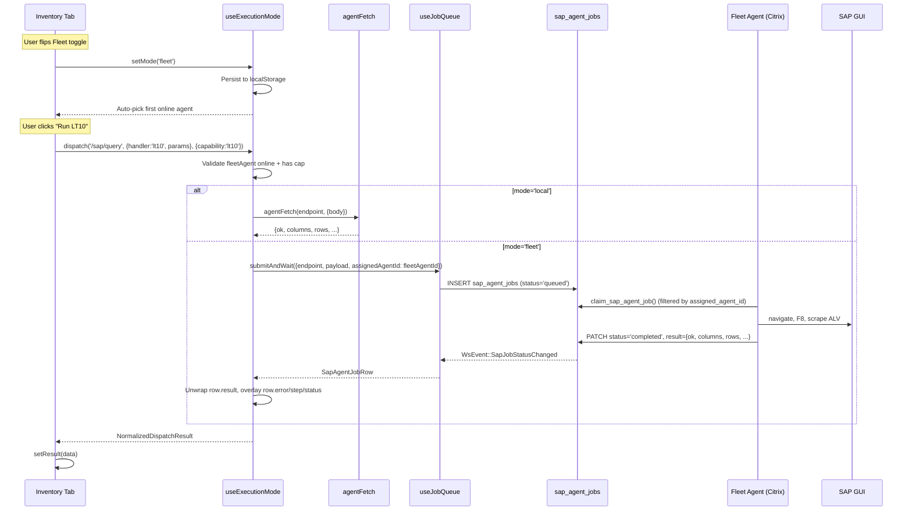

# Implement — Inventory Management Local / Fleet Routing Toggle (2026-05-09)

## Purpose / Context

User wanted a **single tab-level toggle** that flips the entire SAP Testing →
Inventory Management surface between two execution modes:

- **Local Agent** (default; today's behaviour) — browser → `localhost:8765`
  → on-prem Omni Agent → SAP GUI on the same machine.
- **Fleet Agent** (new) — browser → `sap_agent_jobs` queue (claim-pinned to
  the picked agent) → fleet agent on a Citrix box → SAP GUI on that box →
  result returns to the browser via the same `WsEvent::SapJobStatusChanged`
  channel `useJobQueue` already consumes.

Mirrors the existing **LT22 outbound import** flow (the SmartImportButton
pattern in `[[Patterns/Fleet-Aware-Smart-Routing]]` — but generalised so the
WHOLE tab follows one knob instead of each surface deciding individually
via `bestAgentFor()`).

The original [[Patterns/Fleet-Aware-Smart-Routing]] explicitly listed
`runQuery` / `runMutation` as **NOT-fleet-routable** because LT10 would
silently route to a remote SAP session that wasn't signed in as the
caller. The new toggle makes the routing decision **explicit and
user-controlled**, which inverts that constraint — the user picks which
agent runs the action, so the "wrong-session" risk is gone.

User journey: open OmniFrame from a Mac → flip the toggle to Fleet, pick
the Citrix Console U8206556 agent → run LT10 / MB52 / MMBE / ZMM60 / LT01
/ MM02 / LS01N as if they were on the Citrix box. Toggle persists in
`localStorage` so the choice survives reloads.

## Scope

| Surface | Routes when toggle = Fleet | Reason |
|---|---|---|
| LT10 (Bin Stock by Material) | `/sap/query` (handler `lt10`) | Required |
| MB52 (Stock on Hand) | `/sap/query` (handler `mb52`) | Required |
| MMBE (Stock Overview) | `/sap/query` (handler `mmbe`) | Required |
| ZMM60 (`+ Add to Inv. Adjust`) | `/sap/zmm60/lookup` | Required |
| LT01 (Transfer Inventory dialog) | `/sap/transfer-inventory` | Required |
| LS02N (Bin Blocks dialog) | `/sap/bin-blocks` | Same family as LT01 |
| MM02 — Storage Bin | `/sap/material-master-bin` (Phase 5) | `assigned_agent_id` honours toggle |
| MM02 — Storage Types | `/sap/material-master-storage-types` (Phase 5) | `assigned_agent_id` honours toggle |
| LS01N — Create Storage Bin | `/sap/create-storage-bin` | Required |
| **SAP Recorder** | local-only — bypasses toggle | Needs LIVE local SAP GUI |
| **Reversal Engine** | local-only — bypasses toggle | Sync inverse-payload UX |

The two TOOLS entries (Recorder + Reversal Engine) keep calling
`agentFetch` directly. When the user opens one of them while the toggle
is in fleet mode the Library greys the entry and adds a `Local-only`
pill, and a banner appears in the right pane explaining that this tool
ignores the toggle. Both tools still work — the warning is purely
informational.

## Capability map (query → required capability)

The dispatcher validates the picked fleet agent against the capability
the active query needs. Local mode skips the validation (matches today's
agentFetch semantics — let the agent 404 if it doesn't have the
endpoint).

```
Query                  Endpoint                                Required cap
LT10 (Bin Stock)       POST /sap/query (lt10)                  lt10
MB52 (Stock on Hand)   POST /sap/query (mb52)                  mb52
MMBE (Stock Overview)  POST /sap/query (mmbe)                  mmbe
ZMM60 (Inv Adjust)     POST /sap/zmm60/lookup                  zmm60-price-lookup
LT01 (Transfer Inv)    POST /sap/transfer-inventory            transfer-inventory
LS02N (Bin Blocks)     POST /sap/bin-blocks                    bin-blocks
MM02 (Storage Bin)     POST /sap/material-master-bin           mm02-bin
MM02 (Storage Types)   POST /sap/material-master-storage-types mm02-storage-types
LS01N (Create Bin)     POST /sap/create-storage-bin            create-bin
```

(Recorder + Reversal Engine bypass the toggle entirely.)

## Architecture



## Public API — `useExecutionMode()`

```ts
type ExecutionMode = 'local' | 'fleet'

interface ExecutionModeApi {
  mode: ExecutionMode
  setMode: (mode: ExecutionMode) => void
  fleetAgentId: string | null
  setFleetAgentId: (id: string | null) => void
  fleetAgent: FleetAgent | null  // resolved against live online snapshot
  isFleet: boolean
  canDispatch: (cap?: string) => boolean
  blockedReason: (cap?: string) => string | null
  dispatch: <T extends object = object>(
    endpoint: string,
    payload: Record<string, unknown>,
    options?: { capability?: string; priority?: number; timeoutMs?: number; idempotencyKey?: string; validateOnline?: boolean }
  ) => Promise<NormalizedDispatchResult<T>>
  getAssignedAgentId: () => string | null  // null when local; fleetAgentId when fleet
}

type NormalizedDispatchResult<T extends object = object> = T & {
  ok: boolean
  error?: string
  step?: string
}
```

`dispatch()` is THE single entry-point for every in-scope action. Local
mode falls through to `agentFetch(endpoint, {method:'POST', body:JSON.stringify(payload)})`
and parses the JSON body — IDENTICAL to today's wire shape. Fleet mode
calls `jobQueue.submitAndWait({...})` and unwraps the resulting
`SapAgentJobRow.result` JSONB while overlaying the row's terminal
status / error / step (so a watchdog-killed `running` row still surfaces
`ok=false` even when the agent never wrote a result body). Same return
shape both ways — call sites don't branch.

## Toggle UI

`InventoryExecutionModeToggle` is a compact strip rendered just below
the existing `<AgentStatusBar />`:

```
┌─────────────────────────────────────────────────────────────────────┐
│ [Local Agent] [Fleet Agent]  Inventory actions route through ...    │
│                                                                     │
│                    Server  Agent: USINDPR-CXA103V v2.0.0 · Console-U8206556 · 47 caps  ▼ │
│                                                                     │
│ ⚠ Picked agent doesn't advertise 'zmm60-price-lookup' (needed for  │
│   Inventory Adjustment) — pick another agent or switch to Local.   │
└─────────────────────────────────────────────────────────────────────┘
```

The picker shows EVERY online fleet agent regardless of whether it
advertises the active query's capability — so the user can pre-flip the
toggle even when standing on a query the picked agent can't run yet.
The amber inline warning surfaces the missing capability per active
query so the user knows which knob to turn.

## Files modified

### Created (2 files, ~570 LOC)

| Path | Lines | Purpose |
|---|---|---|
| `src/features/admin/sap-testing/hooks/use-execution-mode.ts` | ~340 | Dispatcher hook with `dispatch()` / `canDispatch()` / `blockedReason()` |
| `src/features/admin/sap-testing/components/inventory-execution-mode-toggle.tsx` | ~165 | Toggle UI (segmented control + agent picker + capability warning) |

### Modified (2 files)

| Path | Lines changed | Purpose |
|---|---|---|
| `src/features/admin/sap-testing/components/inventory-management-tab.tsx` | ~+150 / ~-60 | Wire `useExecutionMode`; migrate `runQuery` / `runMutation` / `runBatch` / `handleAddToInventoryAdjustment` to `dispatch()`; pass `executionMode` prop into `TransferInventoryDialog` + `BinBlocksDialog`; `Local-only` pill on Recorder + Reversal Engine library entries; `<LocalOnlyToolBanner />` in their right-pane render branches |
| `omni_agent/agent.py` | ~+15 | Register `/sap/zmm60/lookup` in `_JOB_ENDPOINT_MODELS` so queue dispatch works (existing handler is Pydantic-bound; without registration `_dispatch_job` falls through to `handler_fn(**payload)` which fails with `TypeError`). No version bump — the registration is benign for users still on local mode |

## Persistence

| Key | Type | Default | When written |
|---|---|---|---|
| `omniframe.sap-testing.inventory.executionMode` | `'local' \| 'fleet'` | `'local'` | Whenever `setMode` flips |
| `omniframe.sap-testing.inventory.fleetAgentId` | string \| null | `null` | Whenever `setFleetAgentId` flips, OR auto-pick on first flip to `'fleet'` (first online agent) |

Both keys are tab-local — no Supabase mirror. The toggle is per-machine
preference, not a fleet-wide config.

## Constraint compliance

- ✅ **No new `supabase.channel(...)` callsites** — fleet path reuses the
  shared `useJobQueue` (which uses the singleton `workServiceWs` for
  `WsEvent::SapJobStatusChanged`).
- ✅ **No new dependencies** — `lucide-react` icons (`Cpu`, `Globe`,
  `Server`, `ShieldAlert`) were already imported.
- ✅ **No `manualChunks` change** — same `feature-admin-sap` chunk.
- ✅ **No `routeTree.gen.ts` edit** — feature lives inside an existing
  route.
- ✅ **AGENT_VERSION stays at 2.0.0** — agent.py change is a single
  Pydantic-model registration line (additive, no behaviour change for
  existing callers).
- ✅ **rust-work-service version unchanged (0.1.35)** — no new routes,
  no `WsEvent` enum extension.
- ✅ **No new `eslint-disable` directives** — verified via lint-ratchet
  diff (`git stash && lint:check && git stash pop` showed 93 ≡ 93
  warnings before/after).

## Quality gate results

| Check | Result | Notes |
|---|---|---|
| `pnpm exec tsc -b --noEmit` | ✅ clean | 20.2s, zero errors |
| `pnpm build` | ✅ clean | 10.8s. `feature-admin-sap` chunk: 451.46 KB → 454.51 KB raw / 121.41 KB → 122.43 KB gzip (+3.05 KB raw / +1.02 KB gzip — well under the 500 KB single-chunk budget) |
| `pnpm lint:check` | ✅ 0 errors, 93 warnings (pre-existing) | My touched files have ZERO `eslint-disable` directives and zero new warnings; verified by `git stash` round-trip |
| `ReadLints` on touched files | ✅ zero diagnostics | Three files — both new + the modified inventory tab |

The pre-existing lint-ratchet baseline drift (16 vs 93 warnings) is
unrelated to this change — it's been failing on `main` since the start
of the day.

## Why a separate hook (vs. extending `useAgentDetection`)

`useAgentDetection().bestAgentFor(cap)` is the existing AUTO-routing
decision used by the SmartImportButton (it prefers local when both paths
work). The Inventory Management toggle is the OPPOSITE shape — explicit
user-controlled override. Mixing the two semantics in one hook would
force every consumer to disambiguate "did the user pick this, or did the
auto-router?" which is exactly the confusion the toggle is meant to
eliminate.

## Why ZMM60 needed an agent code change

The Inventory Adjustment workflow's `+ Add to Inv. Adjust` action calls
`POST /sap/zmm60/lookup` with `{material, plant}`. The agent's handler
signature is `def zmm60_lookup(req: Zmm60LookupRequest) -> dict`, so
when `_dispatch_job` falls through to `handler_fn(**payload)` (the
generic dict path for endpoints not registered in `_JOB_ENDPOINT_MODELS`)
the call raises `TypeError: unexpected keyword argument 'material'`.

Two ways to fix:

1. Register the model in `_JOB_ENDPOINT_MODELS` so dispatch instantiates
   `Zmm60LookupRequest(**payload)` first (~3 lines).
2. Don't queue ZMM60 at all in fleet mode — keep it local-only.

Path 1 is the minimal change and unblocks the entire Inventory
Adjustment flow over fleet routing. Mirrors the LT22 import registration
already in place above the new line. No version bump, no behaviour
change for users still on local mode (the registration only matters
when the queue tries to dispatch a `/sap/zmm60/lookup` job — which only
happens via fleet mode).

## Manual test plan

1. **Toggle persistence**: open Inventory Management tab → flip toggle
   to Fleet → reload tab → toggle should still be on Fleet.
2. **Fleet mode capability check**: with toggle on Fleet, pick an agent
   that lacks `lt10` → click LT10's Run button → expect "Fleet routing
   blocked: Picked agent doesn't advertise 'lt10' …" toast (no queue
   row inserted).
3. **Fleet routing happy path**: with toggle on Fleet + Citrix agent
   `USINDPR-CXA103V-Console-U8206556` picked, run LT10 with material
   `23085150` warehouse `WH5` → expect row in `sap_agent_jobs` with
   `assigned_agent_id` matching the agent → fleet agent claims +
   executes → `WsEvent::SapJobStatusChanged` → `setResult({ok: true,
   columns: [...], rows: [...]})` in the browser → grid populates.
4. **Local mode regression**: flip toggle to Local → run LT10 with the
   same inputs → expect direct `agentFetch('/sap/query', ...)` → same
   shape rendered.
5. **ZMM60 fleet path**: with toggle on Fleet, click `+ Add to Inv.
   Adjust` on a populated LT10 row → expect a `sap_agent_jobs` row with
   endpoint `/sap/zmm60/lookup` → fleet agent claims → row inserted in
   `inventory_adjustment_staging` → "Inventory Adjustment" view
   refreshes.
6. **LT01 fleet path**: with toggle on Fleet, click "Transfer Inventory"
   on an LT10 row → fill quantity + dest bin → submit → expect job row,
   fleet claim, success toast with TO number.
7. **Recorder bypass**: with toggle on Fleet, click "SAP Recorder" in
   the Library → expect "Local-only" pill on the entry, banner in the
   right pane explaining the bypass, and the recorder calls hit
   `localhost:8765` directly (NOT the queue) — verify by network tab
   inspection.

## Open follow-ups

1. **Fleet agent goes offline mid-job**: today the watchdog daemon will
   eventually mark the row `failed` after 120s (`OMNIFRAME_JOB_WATCHDOG_TIMEOUT_SECONDS`),
   but the FE doesn't currently RE-ASSIGN the job to a different fleet
   agent — the user has to retry. A future enhancement could
   auto-reassign to the next online agent advertising the capability,
   gated on a "fail-over to fleet" preference.
2. **Result-payload size for large LT10 results**: `sap_agent_jobs.result`
   is a JSONB column — at ~5MB (a 5000-row LT10 with 18 columns) the
   `useJobQueue.refetchJob` `select('*')` round-trip can take 200-500ms.
   Acceptable today; if it gets worse we can either (a) project just
   the columns we need, or (b) page the result rather than ship the
   whole array in one row.
3. **Per-action capability override**: today the toggle is per-tab. A
   user might want to run MOST queries on the local agent but ONE
   specific query (e.g., LT10 with `storage_type='*'`) on the fleet
   agent because their local SAP variant has a quirk. Future addition:
   a per-query "Force Fleet" override on the Detail card's status
   strip.
4. **Toggle-as-segmented-control vs. dropdown**: the toggle is a
   two-button group today. If we add more modes later (e.g.,
   "Round-robin across fleet"), that group will get crowded — convert
   to a dropdown.
5. **Phase 5 fallback when fleet agent lacks `mm02-bin`**: today fleet
   mode passes `assigned_agent_id` to the Phase 5 client. If the user
   picks an agent without `mm02-bin`, the server-side queue insert
   succeeds but no agent claims (because the server route doesn't
   validate against `assigned_agent_id`'s capabilities). The `dispatch()`
   path validates client-side before submit, but the Phase 5 client
   path does NOT — we should mirror the validation. Captured for a
   follow-up.

## 2026-05-09 follow-up — Readiness gating bug fix

User reported (same-day) that the round-6 toggle correctly flipped the
DISPATCH path but missed the AVAILABILITY GATING. Symptom: with toggle
on Fleet + a valid online agent picked (`USINDPR-CXA106V v2.0.0 — 77
caps`), three local-mode-centric surfaces still surfaced as if the
local agent was the blocker:

1. Yellow `<AgentNotDetectedBanner />` at top: "Agent not detected —
   start it from the One Click Ship tab to run queries [Retry]".
2. `<AgentStatusBar />`'s `missing` branch text: "Agent offline —
   start it from the One Click Ship tab.".
3. Detail Card per-query status pill: "Start the SAP agent to enable
   this query." (orange ShieldAlert pill).

Plus the Run Query button was disabled (`canRun = agentStatus ===
'connected' && !isRunning` is false on a Mac with no local agent),
the Preview button was disabled, the LT01 chip was disabled, and
every row-action dropdown item showed "needs update".

Root cause: every gate keyed off `agentStatus === 'connected'` (which
reads `agentDetection.available + .authenticated`, i.e. the LOCAL
agent on `localhost:8765`). Fleet mode bypasses the local agent
entirely — but the gates didn't know.

### What changed

**New API on `useExecutionMode()`** — a composite gating signal that
unifies the local-mode and fleet-mode readiness checks behind one
function:

```ts
interface ReadinessReport {
  ok: boolean
  reason: string | null  // null when ok=true; mode-aware copy otherwise
  surface: 'local' | 'fleet'  // which side the check is gating against
}

interface ExecutionModeApi {
  // ...existing fields
  ready: (capability?: string) => ReadinessReport
}
```

Per-mode logic:

- **Local mode** — checks `useAgentDetection().available +
  .authenticated` AND (when capability is provided) the local agent's
  `hasCapability(capability)`. Returns matching mode-aware reasons:
  - `Local agent not detected — start it from the One Click Ship tab, or switch to Fleet Agent mode.`
  - `Local agent online but session expired — click Reconnect Account, or switch to Fleet Agent mode.`
  - `Local agent v{ver} doesn't advertise '{cap}' — update to v{LATEST}+, or switch to Fleet Agent mode.`
- **Fleet mode** — checks `fleetAgent != null` (the live-resolved
  snapshot, which goes null when the picked id is no longer in the
  online list) AND (when capability is provided) the fleet agent's
  capabilities. Reasons:
  - `No fleet agent selected — pick one from the toggle dropdown above, or switch to Local Agent mode.`
  - `Picked fleet agent {id} is offline — pick another from the toggle, or switch to Local Agent mode.`
  - `Picked fleet agent {label}{ver} doesn't support '{cap}' — pick another from the toggle, or switch to Local Agent mode.`

Reason copy ALWAYS names BOTH knobs the user can turn so they always
have an out — the previous "Start it from the One Click Ship tab"
copy was misleading in fleet mode.

**Distinct from `canDispatch`**: the existing `canDispatch(cap?)` /
`blockedReason(cap?)` are FLEET-only validators consumed by
`dispatch()` for routing decisions (local mode short-circuits to
true so `dispatch()` falls through to `agentFetch`). `ready()` is a
UI gating signal — its job is to decide whether to RENDER warnings /
disable buttons / show pills. The two reports differ in local mode
because local-mode dispatch trusts the network call but UI gating
needs to know if the user's pick is ACTUALLY READY.

### Migrated gating sites in `inventory-management-tab.tsx`

| Surface | Before | After |
|---|---|---|
| `<AgentNotDetectedBanner />` | rendered when `agentStatus === 'missing'` | `agentStatus === 'missing' && !executionMode.isFleet` |
| Auto-update banner | rendered when `agentStatus === 'connected' && agentNeedsUpdate` | added `&& !executionMode.isFleet` (it's about local agent version, not relevant in fleet) |
| `<AgentStatusBar />` `missing` branch | "Agent offline — start it from the One Click Ship tab." | When `isFleet`: "Local agent offline · fleet routing active." (neutral) |
| `<AgentStatusBar />` `unauthenticated` branch | yellow alarm + "Agent online — session expired" | When `isFleet`: muted "Local agent online · session expired (fleet routing active)." (neutral, no border tint) |
| Detail Card per-query pill | rendered when `agentStatus !== 'connected'` with hard-coded local-only copy | rendered when `!queryReady.ok` with `queryReady.reason` (mode-aware) |
| `canRun` | `agentStatus === 'connected' && !isRunning` | `queryReady.ok && !isRunning` |
| Run / Preview / Refresh button `disabled` | `!canRun \|\| capMissing` | `!canRun` (queryReady includes the cap check) |
| Run button `title` | mixed `capMissing` / `offline` ladder | `queryReady.reason` (single source of truth) |
| LT01 chip `disabled` / `title` | `transferCapMissing` ⇒ "Requires agent v{LATEST}+ (capability 'transfer-inventory' missing)" | `!executionMode.ready('transfer-inventory').ok` with the reason |
| `dryRunCapAvailable` | `hasCapability(agentHealth, dryRunCapability)` | `executionMode.ready(dryRunCapability).ok` (consults local OR picked fleet) |
| `<RowActionsMenu>` per-action gate | `hasCapability(agentHealth, action.requiredCapability)` | `checkActionReady(action.requiredCapability).ok` (threaded from `executionMode.ready` through `<ResultsCard>`) |
| `<BatchModePanel queueAvailable>` | `hasCapability(agentHealth, 'jobs-queue')` | `executionMode.isFleet \|\| hasCapability(...)` (fleet always queues) |

### Edge case behaviour

| Mode | State | Gates behaviour |
|---|---|---|
| Local | agent reachable + cap satisfied | All gates pass — no change from pre-bug |
| Local | agent missing | Banner + status pill show "Local agent not detected — start it from the One Click Ship tab, or switch to Fleet Agent mode." |
| Local | agent unauthenticated | Banner suppressed (already handled by AgentSupabaseStatusButton); status pill shows "Local agent online but session expired — click Reconnect Account, or switch to Fleet Agent mode." |
| Local | agent missing capability | Status pill shows "Local agent v{ver} doesn't advertise '{cap}' — update to v{LATEST}+, or switch to Fleet Agent mode."; Run button disabled with same tooltip |
| Fleet | online agent with cap picked | All gates pass — Run Query enables, banner hidden, status pill hidden. Bug fix happy path. |
| Fleet | no agent picked | Banner suppressed; toggle's own warning surfaces; status pill shows "No fleet agent selected — pick one from the toggle dropdown above, or switch to Local Agent mode." |
| Fleet | picked agent went offline mid-session | Status pill shows "Picked fleet agent {id} is offline — pick another from the toggle, or switch to Local Agent mode." Toggle's own warning ALSO surfaces in red so the user can repick. |
| Fleet | picked agent online + lacks cap for THIS query | Status pill shows "Picked fleet agent {label} v{ver} doesn't support '{cap}' — pick another from the toggle, or switch to Local Agent mode." Other queries on the same tab that the agent DOES support stay green. |

### Files modified (this fix)

| Path | Lines changed | Purpose |
|---|---|---|
| `src/features/admin/sap-testing/hooks/use-execution-mode.ts` | +91 / -1 | New `ReadinessReport` interface + `ready(capability?)` function on `ExecutionModeApi`. Imports `LATEST_AGENT_VERSION` for the local-cap-missing reason copy. |
| `src/features/admin/sap-testing/components/inventory-management-tab.tsx` | +97 / -64 | Compute `queryReady`; migrate every gating site listed in the table above; pass `checkActionReady` through `<ResultsCard>` to `<RowActionsMenu>`; add `isFleet` prop to `<AgentStatusBar />` and adapt its `missing` / `unauthenticated` branches. Drop the now-unused `agentHealth` prop on `<ResultsCard>` (its only consumer was the row-action capability gate, now replaced). |

### Quality gate results (this fix)

- `pnpm exec tsc -b --noEmit` — clean (21.8s).
- `pnpm build` — clean (10.7s). `feature-admin-sap` chunk: 454.51 → 455.63 KB raw / 122.43 → 122.67 KB gzip (+1.12 KB raw / +0.24 KB gzip — readiness logic).
- `pnpm lint:check` — 0 errors, 93 warnings (unchanged from `main`; verified the new `useCallback` dep warning was eliminated by depending on the whole `detection` ref since it's referentially stable across renders).
- `ReadLints` on every touched file — zero diagnostics.

### Constraint compliance (this fix)

- ✅ No new `supabase.channel(...)` callsites.
- ✅ No new dependencies.
- ✅ No `manualChunks` change.
- ✅ No new `eslint-disable` directives.
- ✅ `AGENT_VERSION` stays at `2.0.0`.
- ✅ rust-work-service version stays at `0.1.35`.
- ✅ SAP Recorder + Reversal Engine remain local-only with their
  existing internal gating (untouched).

## 2026-05-09 follow-up #2 — First-real-use bug pair

User's first end-to-end fleet-mode smoke test from a Mac (toggle on
Fleet, picked agent `USINDPR-CXA106V v2.0.0 — 77 caps`) surfaced two
bugs the earlier rounds didn't catch:

### Bug 1 — ZMM60 fleet dispatch fails with `unexpected keyword argument 'material'`

**Symptom**: clicking "Actions → + Add to Inv. Adjust" on an LT10 row
in fleet mode produced a toast: `ZMM60 lookup failed: Job dispatch
raised: zmm60_lookup() got an unexpected keyword argument 'material'`.

**Root cause**: the round-6 patch added
`_JOB_ENDPOINT_MODELS["/sap/zmm60/lookup"] = _Zmm60LookupRequest` to
`omni_agent/agent.py`, but the Citrix agent on `USINDPR-CXA106V` is
built from a SEPARATE source mirror at
`/Users/jaisingh/Downloads/MacWindowsBridge/Omni-Agent/agent.py`. That
mirror was last modified on 2026-05-07 (BEFORE the round-6 fix
landed) so the EXE running on the Citrix box never received the
registration. `_dispatch_job` fell through to the generic
`handler_fn(**payload)` path, which calls
`zmm60_lookup(material="X", plant="Y")` — but the FastAPI handler
signature is `def zmm60_lookup(req: Zmm60LookupRequest) -> dict` so
the kwargs miss the parameter name. The error message in the dispatch
catch reads `Job dispatch raised: zmm60_lookup() got an unexpected
keyword argument 'material'` — exactly what the user saw.

The dispatcher logic itself is correct (line 4991:
`Model = _JOB_ENDPOINT_MODELS.get(endpoint)`; lines 5000–5005 use
`handler_fn(Model(**payload))` when `Model` is set, falls through to
`handler_fn(**payload)` only when missing). The bug is purely the
missing registration in the deployed mirror.

**Fix**: applied the same registration block to the Downloads mirror
so the next EXE rebuild + Citrix redeploy includes it:

```python
try:
    from zmm60_lookup import (  # type: ignore
        router as _zmm60_router,
        Zmm60LookupRequest as _Zmm60LookupRequest,
    )
    app.include_router(_zmm60_router)
    _JOB_ENDPOINT_MODELS["/sap/zmm60/lookup"] = _Zmm60LookupRequest
    print("[boot]   Mounted zmm60_lookup router (1 endpoint: /sap/zmm60/lookup)")
except Exception as _zmm60_err:
    print(f"[boot]   WARN zmm60_lookup import failed: {_zmm60_err}")
```

The mirror's `zmm60_lookup.py` already exposes `Zmm60LookupRequest`
(verified `class Zmm60LookupRequest(BaseModel):` at line 147) so no
mirror-side handler change was needed.

After the fix lands on the Citrix box, the dispatcher path becomes:

```
queue claim {endpoint: "/sap/zmm60/lookup", payload: {material, plant}}
  → Model = _JOB_ENDPOINT_MODELS.get("/sap/zmm60/lookup") → Zmm60LookupRequest
  → handler_fn(Zmm60LookupRequest(material=..., plant=...))
  → returns {ok: true, unit_value: 287.63, currency: "USD", ...}
```

Same wire format as the local HTTP path (which goes through FastAPI's
body parsing automatically via the `req: Zmm60LookupRequest` type
annotation).

### Bug 2 — `localhost:8765/health` ERR_CONNECTION_REFUSED console spam

**Symptom**: in fleet mode from a Mac (no local agent) the dev
console floods with `GET http://127.0.0.1:8765/health
net::ERR_CONNECTION_REFUSED` every 15 seconds, plus the same for
`/agent-token/check`. Hundreds of errors over an extended session.

**Root cause**: `useAgentDetection`'s module-scoped poller hits
`localhost:8765/health` every 15s (visible) / 60s (hidden) regardless
of whether anyone actually needs the local agent. In fleet mode the
local agent's reachability is irrelevant (the toggle's "Local agent
offline · fleet routing active" copy already conveys this), so the
poll is wasted work AND the failed fetches hit the browser's network
layer, where the `ERR_CONNECTION_REFUSED` line is logged at DevTools
level — JavaScript try/catch can't suppress it. The only way to
silence the noise is to NOT make the fetch.

**Fix**: opted for the user's suggested Option A — suppress the
fetch entirely in fleet mode, resume on flip back to local. New
module-level registry in `use-agent-detection.ts`:

```ts
const localProbeSuppressors = new Set<symbol>()

export function suppressLocalProbe(token: symbol): void {
  if (localProbeSuppressors.has(token)) return
  localProbeSuppressors.add(token)
  if (lastHealth !== null || lastAuthenticated) {
    lastHealth = null
    lastAuthenticated = false
    republish()  // consumers see "agent missing" coherent state
  }
}

export function unsuppressLocalProbe(token: symbol): void {
  if (!localProbeSuppressors.has(token)) return
  localProbeSuppressors.delete(token)
  if (localProbeSuppressors.size === 0) {
    void probeOnce()  // immediate probe so "back to Local" resolves <2s
  }
}
```

`probeOnce()` short-circuits when the registry is non-empty:

```ts
async function probeOnce(): Promise<void> {
  if (inFlightProbe) return inFlightProbe
  if (isLocalProbeSuppressed()) {
    if (lastHealth !== null || lastAuthenticated) {
      lastHealth = null
      lastAuthenticated = false
    }
    lastProbeAt = Date.now()  // keep `bestAgentFor` LOCAL_RECENT_MS coherent
    republish()
    return
  }
  // ... existing fetch logic ...
}
```

Inventory tab consumer:

```ts
useEffect(() => {
  if (!executionMode.isFleet) return
  const token = Symbol('inventory-management-fleet-suppress')
  suppressLocalProbe(token)
  return () => unsuppressLocalProbe(token)
}, [executionMode.isFleet])
```

Each consumer mints a unique `Symbol()` token (so two consumers can
suppress independently and the registry handles cleanup correctly).
Suppression is active while the registry is non-empty.

**Documented trade-off**: while ANY consumer is in suppress mode,
ALL `useAgentDetection()` consumers see `available=false` /
`health=null` — including a separately-open Agent Triggers tab.
Acceptable because (a) the typical user has one SAP-related tab
open at a time, (b) fleet-mode users are explicitly saying "I don't
have / don't care about a local agent" so the "agent offline" view
in other tabs is correct anyway, (c) flipping back to local mode
fires an immediate probe so recovery is sub-2s.

### Files modified (this fix)

| Path | Change |
|---|---|
| `omni_agent/agent.py` | (already patched in round-6) — kept in sync with mirror via verification only |
| `/Users/jaisingh/Downloads/MacWindowsBridge/Omni-Agent/agent.py` | +18 / −1. Mirror of the round-6 ZMM60 model registration. The next `build_exe.bat` run will include the fix in the EXE the user deploys to Citrix. |
| `src/features/admin/sap-testing/hooks/use-agent-detection.ts` | +60 / −0. New module-level `localProbeSuppressors` Set, `suppressLocalProbe(token)` / `unsuppressLocalProbe(token)` exports, and `probeOnce()` short-circuit. |
| `src/features/admin/sap-testing/components/inventory-management-tab.tsx` | +20 / −0. New `useEffect` that registers a suppress token while `executionMode.isFleet`, cleans up on flip back to local. Imports `suppressLocalProbe` / `unsuppressLocalProbe` alongside the existing `useAgentDetection` / `refreshAgentDetection` imports. |

### Quality gate results (this fix)

- `python3 -c "import ast; ast.parse(...)"` — clean for BOTH source `omni_agent/agent.py` AND mirror `/Users/jaisingh/Downloads/MacWindowsBridge/Omni-Agent/agent.py`.
- `pnpm exec tsc -b --noEmit` — clean (23.3s).
- `pnpm build` — clean (11.7s). `feature-admin-sap` chunk: 455.63 → 455.98 KB raw / 122.67 → 122.79 KB gzip (+0.35 KB raw / +0.12 KB gzip).
- `pnpm lint:check` — 0 errors, 93 warnings (unchanged from `main`).
- `ReadLints` on both touched files — zero diagnostics.

### Updated test plan (end-to-end fleet-mode validation)

After EXE rebuild + Citrix redeploy:

1. **Console spam stops**: open browser DevTools console, navigate to SAP Testing → Inventory Management. Toggle defaults to local. Observe normal 15s `localhost:8765/health` polls (with `ERR_CONNECTION_REFUSED` on a Mac without a local agent — expected).
2. Flip toggle to **Fleet** → pick `USINDPR-CXA106V v2.0.0` from the dropdown → observe console: NO new `ERR_CONNECTION_REFUSED` lines.
3. Wait 60 seconds → confirm console stays quiet.
4. **ZMM60 fleet path works**: still in fleet mode, run an LT10 query (e.g. material `23076028` warehouse `WH5`) → expect grid populates from the fleet agent.
5. Click **Actions → + Add to Inv. Adjust** on a populated row. Expect:
   - Toast: `Looking up <material> price via ZMM60…`
   - Within 5–10s: `Added to Inventory Adjustment: <material> @ $<unit_value> USD`
   - Inventory Adjustment view (in the Library) shows the new row with the priced amount.
6. **Local mode regression check**: flip toggle back to **Local** → console immediately re-fires a probe (you'll see the `localhost:8765/health` request resume); within 2s the AgentStatusBar reflects current local-agent reachability.
7. **Cross-tab check** (optional): with inventory in fleet mode, open a separate Agent Triggers tab. Confirm its agent-status pill shows "agent offline" (the expected trade-off documented above). Flipping inventory back to local re-enables the local probe and the Agent Triggers pill recovers within 2s.

### Constraint compliance (this fix)

- ✅ No work-service-side changes.
- ✅ No new `supabase.channel(...)` callsites.
- ✅ No new dependencies.
- ✅ `AGENT_VERSION` stays at `2.0.0`.
- ✅ rust-work-service version stays at `0.1.35`.
- ✅ Inventory Adjustment workflow now works end-to-end through fleet mode after the EXE rebuild.

## Related

- [[Patterns/Fleet-Aware-Smart-Routing]] — the underlying pattern this
  toggle generalises.
- [[Implement-Fleet-Aware-SmartImportButton]] — the LT22 prior art that
  this build copies.
- [[Implement-LT22-Outbound-Import]] — the original outbound LT22 import
  that established the `assigned_agent_id` queue-pin pattern.
- [[Components/Inventory-Management - SAP Query Framework]] — the tab
  surface this toggle controls.
- [[Components/Omni-Agent - Headless SAP Agent]] — `_JOB_ENDPOINT_MODELS`
  registration pattern.
- [[Job-Queue-Architecture]] — `sap_agent_jobs` schema +
  `claim_sap_agent_job` SQL function.
- [[Implement-Inventory-Adjustment-Workflow]] — the ZMM60 workflow this
  toggle extends to fleet routing.
- [[Implement-Rust-Work-Service-Phase4]] — the
  `WsEvent::SapJobStatusChanged` plumbing the fleet path consumes.
- [[Implement-Rust-Work-Service-Phase5]] — Phase 5 Material Master path
  that already enqueues to the queue server-side.
- [[Decisions/Roadmap-Rust-WS-Unlocks]] — parent rollout doc.
- [[Sessions/2026-05-09]] — session log for this ship.
