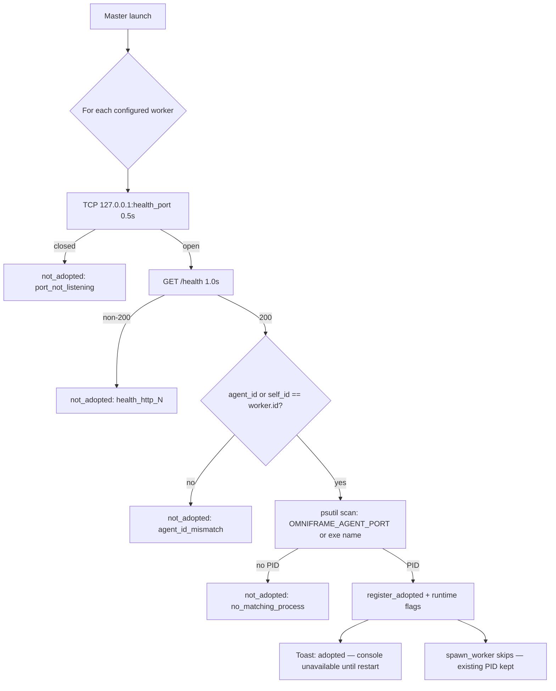

# Implement Phase F — Persistence, Orphan Adoption, Settings

## Purpose / Context

Phase F of [[Plan-Multi-Session-Agent-Master]] closes the config-persistence gap left by Phase E: operators can edit `master_config.yaml` from the master GUI, hot-apply safe fields without recycling workers, and survive master restarts without spawning duplicate agent processes. Builds on [[Implement-Phase-E-Setup-Wizard]] `write_master_config()` and reuses Phase D fix/console seams from [[Implement-Phase-C-Console-Streaming]] and [[Implement-Phase-D-Fix-State-Machine]].

Sub-slices documented separately: [[Implement-Phase-F2-Orphan-Adoption]], [[Implement-Phase-F3-Settings-Context-Menu]].

## Details

### Files added

| Module | Role |
|--------|------|
| `settings_logic.py` | Pure validation, hot/restart diffing, workers-count resize, key cleanup (F1) |
| `orphan_adoption.py` | TCP + `/health` + psutil probe; `AdoptionResult` dataclasses (F2) |
| `settings_dialog.py` | `MasterSettingsDialog` CTk modal; browse paths; decrement-policy UI (F3) |
| `tile_context_menu.py` | `ContextMenuCommand` enum, `commands_for_state`, `mount_context_menu` (F3) |

### Files changed

| Module | Change |
|--------|--------|
| `config.py` | `MasterSettings.workers_decrement_policy` (`keep` \| `delete`); `apply_config_diff()` delegates to `settings_logic`; YAML round-trip |
| `master_gui.py` | Settings menu → dialog; `_run_orphan_adoption()` before main UI; tile context menus; `_on_settings_saved` auto-restart ladder |
| `supervisor.py` | `register_adopted`, `kill_adopted`, `restart_adopted`, `ManagedWorker.is_adopted`; spawn skips console pipes for live adopted PID |
| `state.py` | `is_adopted`, `adopted_pid`, `console_available` on `WorkerRuntimeState` |
| `tile.py` | Amber **ADOPTED** badge; `[C]` disabled when adopted / console unavailable |
| `fix_actions.py` | Tile **Rst** / fix paths route adopted workers through `restart_adopted` |

### Tests (`omni_agent/master/tests/`)

| File | Cases | Focus |
|------|-------|-------|
| `test_settings_logic.py` | 12 | Clamps, form validation, `detect_restart_required`, `HOT_APPLY_FIELDS` parity |
| `test_master_workers_count_change.py` | 8 | Increase/decrease, keep vs delete policy, key cleanup |
| `test_orphan_adoption.py` | 6 | Port closed, identity mismatch, self_id fallback, multi-worker mix |
| `test_supervisor_orphan_kill.py` | 4 | Register, kill ladder, spawn skip, restart_adopted |
| `test_tile_context_menu_logic.py` | 10 | Command enablement, rename/toggle persist |

Full suite after Phase F: **175 passed** (2026-05-21).

### Hot-apply vs restart-required

Changes in the **hot-apply** set take effect in the running master immediately after Save (probe interval, UI tick, labels, etc.). **Restart-required** fields need a worker recycle; the Settings dialog shows a two-step Confirm panel listing affected paths and an optional **Auto-restart affected workers** checkbox.

| Hot-apply (no worker restart) | Restart-required (worker recycle) |
|-------------------------------|-----------------------------------|
| `workers[].label` | `workers[].health_port` |
| `workers[].auto_start` | `workers[].sap_conn_idx` |
| `master.ui_refresh_ms` | `workers[].sap_session_index` |
| `master.health_probe_interval_ms` | `workers[].extra_env` |
| `master.fix_admin_confirm_required` | `master.workers` (count change — **master restart** to refresh tile grid) |
| `master.log_retention_days` | `master.agent_exe_path` |
| `master.sap_logon_path` | |
| `master.parallel_spawn_concurrency` | |
| `master.workers_decrement_policy` | |

Tile context-menu **Rename label** and **Toggle auto-start** write hot-apply fields via `write_master_config()` and update runtime state / tile chrome without opening Settings.

Settings Save with restart fields + auto-restart checked: background thread calls `restart_adopted` for adopted workers or `kill_and_respawn` for spawned workers.

### Orphan adoption flow

Runs once after wizard completion and on every normal master launch (`_init_runtime_services` → `_run_orphan_adoption`).

Probe implementation: `orphan_adoption.adopt_running_workers()` → `apply_adoptions_to_supervisor()`.

Console stdout/stderr pipes are **not** attached to adopted processes; live console streaming resumes only after **Restart** (`restart_adopted` → kill + fresh `Popen` with Phase C readers).

### Workers decrement policy

When Settings **master.workers** decreases, a confirmation dialog asks how to treat removed slots:

| Policy | YAML behaviour | Service keys (`~/.omniframe/agents/<id>/agent_service_key.txt`) |
|--------|----------------|----------------------------------------------------------------|
| **keep** (default) | Dropped worker rows remain in the `workers:` array beyond the active count (preserves labels/ports for later re-expansion) | Files left on disk |
| **delete** | Worker rows trimmed to new count | `cleanup_removed_worker_keys()` unlinks keys for removed ids |

Policy persisted as `master.workers_decrement_policy` in `master_config.yaml`. Increasing count uses `apply_workers_count_change()` — new slots get default W\<N\> pairing from [[Implement-Phase-E-Setup-Wizard]] `pair_sessions_logic`.

**Master restart required** after worker-count change to rebuild the tile grid (toast: *"Worker count changed — restart master to refresh tiles"*).

### Adopted worker UX

| Surface | Behaviour |
|---------|-----------|
| Tile badge | Slate **ADOPTED** pill visible while `snap.is_adopted` |
| Console `[C]` | Disabled; toast *"Console available after Restart — adopted workers cannot stream live output."* |
| Context menu | Same commands as spawned workers; **Restart** / **Stop** enabled when `process_alive` |
| Fix **Rst** | `FixActionDispatcher` → `restart_adopted` + clears adopted runtime flags |
| Settings auto-restart | Prefers `restart_adopted` over `kill_and_respawn` for adopted ids |
| Launch toast | Per adopted worker: *"Adopted {id} (pid {n}) — console unavailable until restart"* |

Health probe loop continues against the adopted worker's existing `/health` endpoint — no duplicate spawn.

### Exit criteria checklist

- [x] `MasterSettingsDialog` edits master globals + per-worker rows (1–12 workers); validates ports, SAP pairs, labels, `extra_env` JSON.
- [x] Save writes `~/.omniframe/master_config.yaml` via `write_master_config` / `write_master_config_with_policy`.
- [x] Hot-apply fields reflected without worker restart; restart-required fields gated behind Confirm + optional auto-restart.
- [x] Workers decrease prompts **Keep keys** vs **Delete keys**; policy persisted and honoured on save.
- [x] Worker count increase adds default-paired rows; decrease triggers master-restart toast for tile grid.
- [x] Orphan adoption on launch registers live PIDs; no duplicate spawn when port + identity match.
- [x] Adopted tiles show badge; console disabled until restart; `restart_adopted` restores full console pipes.
- [x] Tile right-click: rename label, toggle auto-start (hot persist), repair/restart/stop wired to Phase D actions.
- [x] Settings **[Re-run Setup Wizard]** delegates to Phase E wizard (unchanged entry point).
- [x] Strict service-key notice in Settings (`OMNIFRAME_AGENT_REQUIRE_SERVICE_KEY=1` cannot be lowered from GUI).
- [x] Pure-logic pytest coverage for settings diff, workers policy, adoption probe, context-menu enablement.
- [ ] Phase G — PyInstaller `AgentMaster.exe` packaging (explicitly out of scope).

## Related

- [[Plan-Multi-Session-Agent-Master]]
- [[Implement-Phase-A-Worker-Hardening]]
- [[Implement-Phase-B-Master-GUI-Skeleton]]
- [[Implement-Phase-C-Console-Streaming]]
- [[Implement-Phase-D-Fix-State-Machine]]
- [[Implement-Phase-E-Setup-Wizard]]
- [[Implement-Phase-F2-Orphan-Adoption]]
- [[Implement-Phase-F3-Settings-Context-Menu]]
- [[Omni-Agent-System-Topology]]
